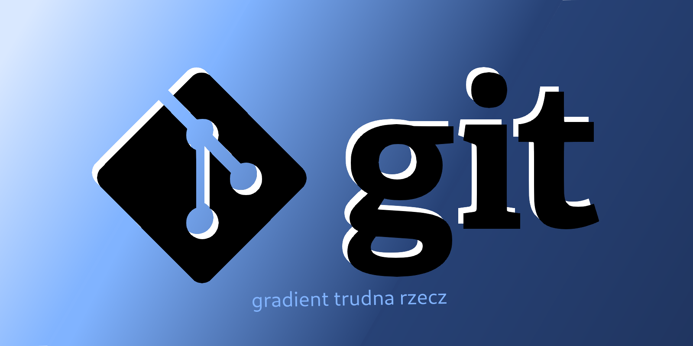

Ten poradnik jest dla osób, które chcą nauczyć się lub odświeżyć swoją wiedzę z podstaw gita lub GitHuba. Omówimy tu ich podstawowe funkcje.

- Git jest to **System Kontroli Wersji** (ang. Version Control System) - must-have, jeżeli pracujesz w zespole oraz nieoceniona pomoc w jednoosobowych projektach.
- GitHub natomiast to platforma, która pozwala tworzyć, dzielić się z innymi i zarządzać repozytoriami git, co ułatwia współpracę z innymi oraz stanowi swoiste portfolio dla programisty.

import { Aside } from "@astrojs/starlight/components";

<Aside type="tip" title="Disclaimer">
  Jeżeli potrafisz już używać tych narzędzi, a chcesz zobaczyć jak udzielać się
  na GitHubie KN Solvro to zajrzyj tutaj: [Jak używać githuba?](/github)
</Aside>

### Inne, przydatne zasoby

- [Oficjalne dokumentacje gita](https://git-scm.com/doc)
  - Dostępne są strony manpage dla poszczególnych komend, jak również cała książka poświęcona gitowi, częściowo przetłumaczona na polski.
  - linuxiarze zapewne mają wszystkie manpage gita dostepne lokalnie na ich systemach 😎
- [Dokumentacja GitHuba](https://docs.github.com/en/get-started)
  - 90% dokumentacji GitHuba zapewnie dotyczy tylko ich serwisu, ale można tam też znaleźć trochę informacji o samym gitcie i jak używać go razem z GitHubem

#### Spis treści

1. [Github vs Git](/git-github/intro/1-intro)
2. [Teoria gita](/git-github/intro/2-git)
3. [Kampania jednoosobowa](/git-github/intro/3-singleplayer)
4. [Współpraca z innymi](/git-github/intro/4-multiplayer)
5. [Jak korzystać z GitHuba (Podstawy)](/git-github/intro/5-github)
