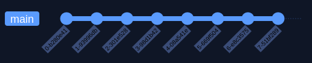
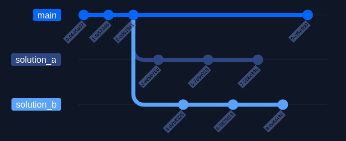
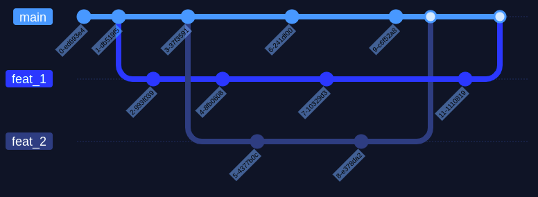
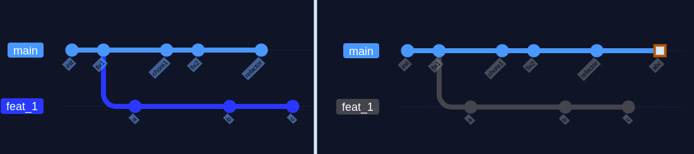
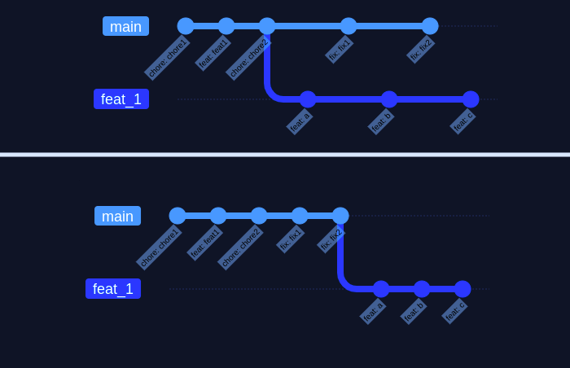
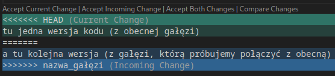

W tym artykule opiszę, po co jest nam git i jak używać jego głównych funkcjonalności.

### Co to właściwie jest System Kontroli Wersji?

Wyobraź sobie, że wprowadziłeś zmiany w projekcie. Okazało się, że nie działają tak, jak chciałeś i próbujesz je cofnąć.

- Bez gita klikasz CTRL+Z i liczysz na to, że buffer w IDE wystarczy na odwrócenie wszystkich zmian. Narazie jest nieźle.
- Teraz wyobraź sobie, że zmiany są porozrzucane po plikach, a IDE dla każdego ma osobną historię. Robi się mniej wygodnie.
- Dodaj do tego, że współtworzysz projekt z innymi osobami - nie możecie pracować jednocześnie w obawie, że zmiany będą niekompatybilne, a jeżeli będziesz chciał coś poprawić, nie masz łatwego sposobu na przekazanie zmian innym bez zakłócania ich pracy.

Co możesz zrobić, żeby rozwiązać ten problem?

Na myśl przychodzi regularne tworzenie paczek zawierających kolejne wersje projektu, jednak praca, którą trzeba by włożyć w ręczne zarządzanie nimi prawdopodobnie przewyższa pisanie całych feature'ów od nowa.

Git **bardzo** ułatwia ten proces:

- Za pomocą tzw. _migawek_ (ang. snapshots) git śledzi zmiany w poszczególnych plikach.
- Migawki nie kopiują plików, które się nie zmieniły, dzięki czemu zajmują mało miejsca.
- Kiedy zapisujemy migawkę, dostaje ona unikalny hashcode i jest zawsze dostępna w historii - możemy się do niej cofnąć, sprawdzić, przywrócić (lub wykasować, jeżeli zbyt się wstydzimy naszego starego kodu 💀).

### Jak skorzystać z tych benefitów?

#### Instalacja gita

[Tu możecie pobrać gita](https://git-scm.com/downloads "github installer")

#### Podstawowy workflow gita

Aby zapisywać gdzieś zmiany w oprogramowaniu, potrzebujemy utworzyć **repozytorium** - ukryty folder w naszym projekcie, który zawiera pliki i metadane potrzebne gitowi do poprawnego działania.
Używamy do tego komendy:

`git init`

Tworzy ona ukryty folder ze wszystkimi plikami potrzebnymi gitowi do działania.  
Żeby przekonać się, że wszystko zadziałało, możemy użyć podstawowej komendy do diagnostyki:

`git status`

Komenda ta pokazuje nazwę aktualnej gałęzi (ale o tym zaraz) oraz śledzone i nieśledzone pliki ze zmianami - przy utworzeniu repo będą to wszystkie pliki w folderze, w którym użyliśmy `git init`.  
Możemy dodawać pojedyncze pliki używająć komendy

`git add {nazwa_pliku}`  
lub dodać wszystkie pliki z folderu, w którym aktualnie się znajdujemy oraz jego podfolderów:  
`git add .`

Niestety rzadko chcemy, aby **wszystko** znalazło się w repozytorium - z reguły nie musimy śledzić plików generowanych przez IDE i przykładowo _nie śledzimy_ pliku .env z prywatnymi kluczami do API. W takim wypadku tworzymy plik _.gitignore_, gdzie dodajemy ścieżki do plików i folderów, które chcemy pominąć. Najlepiej utworzyć go od razu po stworzeniu repozytorium (istnieją do tego różne templatki) i uaktualniać w miarę rozrastania się projektu.

Podstawowy workflow w git wygląda tak:

- robimy zmiany w dowolnej liczbie plików
- dodajemy pliki z pomocą `git add`
- zapisujemy aktualny stan repozytorium komendą `git commit`. Otwiera ona edytor tekstu, w którym możemy dodać opis zmian, jednak jeżeli dodamy do niej flagę -m, możemy pominąć ten krok i podać opis w terminalu: `git commit -m "opis zmian"`

**Uwaga**: jeżeli użyjemy komendy `git add` do dodania śledzenia zmian w jakimś pliku, a potem go zmodyfikujemy to git będzie śledził nieaktualną wersję - musimy ponownie użyć `git add` przed zatwierdzeniem zmian.

Dobrą zasadą jest tworzenie commitów po ukończeniu każdego małego zadania: zmiany konfiguracji, usunięcia zbędnych plików czy dodania nowej funkcjonalności (tu **uwaga**: funkcjonalność może być zbyt duża na jeden commit).

Pliki możemy usuwać komendą:  
`git rm nazwa_pliku` (**uwaga**: ta komenda usuwa plik zarówno z repozytorium, jak i systemu plików)  
`git rm --cached nazwa_pliku` (to pozwala zachować plik na dysku, ale git przestaje go śledzić)

Możemy również cofnąć i usunąć wszystkie zmiany do poprzedniego commita, używając `git reset --hard`, jednak należy używać tego polecenia z rozwagą, bo już go nie cofniemy.

Jednakże, jeżeli wszystkie migawki łączyłby liniowy związek, nie możemy łatwo prototypować - jeśli cofnęlibyśmy się o kilka commitów i tam coś zmienili, ryzykowalibyśmy, że coś wywali się nam w najnowszym commit'cie.

Powyższy diagram pokazuje tworzenie commit'ów na jednej gałęzi.
Załóżmy, że potrzebujesz przetestować, jak wyglądają dwa różne rozwiązania - głupio byłoby w tym celu kopiować i izolować cały projekt czy usuwać jedne rozwiązanie na rzecz drugiego. Zamiast tego wystarczy utworzyć dwie nowe gałęzie.

### Gałęzie (ang. branches)

Gałęzie pozwalają ci izolować swoją pracę na jednej wersji repozytorium, nie naruszając innych.Możesz na nich prototypować nowe funkcjonalności bez przeszkadzania innym i rozwalania sobie kodu na gałęzi _main_.  
Aby utworzyć nową gałąź, używamy komendy:  
`git branch {nazwa_gałęzi}`

Przełączamy się na nią za pomocą:  
`git checkout {nazwa_gałęzi}`  
lub  
`git switch {nazwa_gałęzi}`

Możemy od razu przełączyć się na nowo utworzoną gałąź, łącząc dwie czynności w:  
`git checkout -b {nazwa_gałęzi}`

Możemy wyświetlić wszystkie dostępne gałęzie komendą `git branch`.

Jeżeli mamy zmiany na jednej gałęzi i chcemy się przenieść na inną, git nie pozwoli nam na to. Musimy je cofnąć lub zacommitować - ale możemy być np. w połowie wprowadzania funkcjonalności, gdzie commit nie ma sensu.

W takiej sytuacji możemy użyć `git stash` - komenda ta cofnie nasze zmiany z gałęzi i zapisze je w **_schowku_**.  
Kiedy wrócimy z powrotem na gałąź, gdzie użyliśmy `git stash`, wystarczy użyć `git stash pop` i przywrócimy ją do stanu, w którym ją zostawiliśmy.

### Merge & rebase

No dobrze, podobają mi się moje zmiany, jak mogę je dodać do głównej wersji projektu - gałęzi main?

Musimy połączyć dwie gałęzie, a jest na to kilka sposobów.

- `git merge {nazwa_gałęzi_którą_scalamy_z_obecną}`, który scala dwie gałęzie, zachowując ich osobne historie - to rozwiązanie sprawia, że historia jest bardziej skomplikowana i nieuporządkowana,
  jednak pozwala na najdokładniejsze jej przeglądanie. Tworzy osobny commit scalający gałęzie.
- `git rebase {nazwa_gałęzi_która_ma_być_źródłem_obecnej_gałęzi}` - rozwiązanie wybierane najczęściej ze względu na to, że pozwala zapobiec bałaganowi w historii repozytorium
- `git merge --squash {nazwa_gałęzi_którą_scalamy_z_obecną}` - różni się od zwykłego merge tym, że nie tworzy dodatkowego commitu oraz spłaszcza w jeden commit wszystkie commity z gałęzi, którą chcemy scalić z główną gałęzią. Musimy potem go dodać komendą `git commit`.

#### Merge

_Przy większej ilości gałęzi, trudno odczytać coś z diagramu historii._

W przypadku zwykłego merge zachowujemy szczegółowy dostęp do wszystkich zmian, jednak tworzymy _merge commits_,
które zaśmiecają historię oraz ryzykujemy ogólny bałagan w repozytorium z nieliniową historią.

##### Fast-forward merge

Jeżeli git wykryje, że nie ma rozgałęzienia - bo np. nie było żadnych commit'ów na głównej gałezi, następuje fast-forward merge.  
FF merge nie tworzy merge commit'a i zwyczajnie przenosi zmiany na główną gałąź, zachowując liniową historię.

#### Merge --squash

_Tworzymy jeden duży commit w miejscu scalenia gałęzi_ `git merge --squash
feat_1` `git commit -m "abc"`

Na gałęzi, z którą scalamy gałąź poboczną powstaje tak zwany squash commit, zawierający wszystkie zmiany z gałęzi pobocznej.

Pozwala to zachować liniową historię, jednakże tracimy szczegóły na temat tego, co się stało w poszczególnych commitach - jeżeli wprowadzony został bug, trudniej go wyśledzić.

#### Rebase

_(będąc na gałęzi feat)_ `git rebase main`

Git rebase "przenosi" początek naszej gałęzi na koniec gałęzi źródłowej.
Pozwala to zachować liniową historię zmian i nie tworzy zbędnych commitów.
Po rebase musimy jeszcze zmerge'ować zmiany - następuje wtedy fast-forward merge.  
`git checkout main`  
`git merge feat_1`

_Git rebase powinniśmy używać tylko lokalnie, na gałęziach, na których pracujemy sami, aby nie wprowadzać niepotrzebnych konfliktów._

#### Usuwanie gałęzi

Zbędne gałęzie usuwamy komendą:
`git branch -d nazwa_gałęzi`  
lub `git branch -D nazwa_gałęzi`, by wymusić usunięcie nie-zmergowanej gałęzi

#### Merge conflicts

Zdarza się, że scalając dwie gałęzie, które w międzyczasie były modyfikowane, pojawiają się **konflikty**.
Nie jest to nic strasznego, bo tak długo, jak rozumiemy kod, a zmiany nie były dużych rozmiarów rozwiązywanie konfliktów jest bardzo proste.
W skonfliktowanych plikach znajdziemy takie oznaczenia:

- HEAD - w tej sekcji są zmiany z gałęzi, na której się znajdujemy
- Jest ona oddzielona od zmian z drugiej gałęzi za pomocą separatora "======="
- Na końcu mamy podane, jak nazywa się gałąź, którą scalamy.

Jak widać, nowoczesne IDE umożliwia rozwiązanie konfliktów jednym kliknięciem myszy, jeżeli chcemy zaakceptować zmiany tylko z jednej gałęzi lub wszystkie możliwe zmiany.  
W innym wypadku musimy ręcznie wybrać zmiany, które akceptujemy, usuwając resztę zmian oraz znaczniki i separator.

Następnie musimy dodać pliki z rozwiązanymi konfliktami do gita:  
`git add {pliki}`  
`git commit -m "merge: nazwa_gałęzi"`

Używając git rebase, na każdym etapie gdzie git napotka konflikty, rebase zostanie spauzowany i pozwoli ci je rozwiązać. Po ich rozwiązaniu możesz kontynuować rebase.
`git add {pliki}`  
`git rebase --continue`

W każdym momencie rebase możesz użyć `git rebase --abort`, aby cofnąć się do stanu przed uruchomieniem komendy.

Git rebase to potężne narzędzie, o którego możliwościach polecam więcej poczytać - szczególnie jego interaktywny tryb jest przydatny.

### Further resources

[git-for-beginners-the-definitive-practical-guide](https://stackoverflow.com/questions/315911/git-for-beginners-the-definitive-practical-guide)  
[Interactive rebase](https://www.youtube.com/watch?v=42392W7SgnE)  
[Learn git branching](https://learngitbranching.js.org/)
