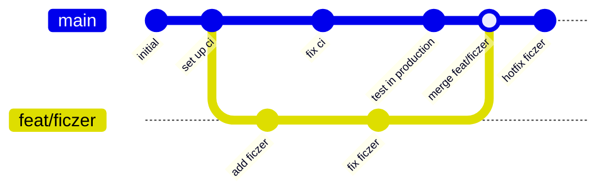
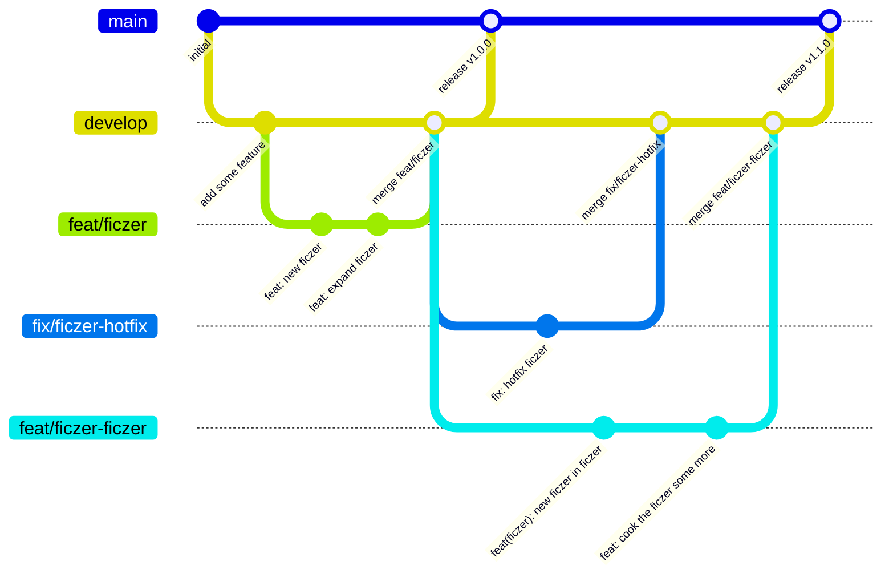

import AsciinemaPlayer from "#components/AsciinemaPlayer";
import {
  Steps,
  Tabs,
  TabItem,
  Card,
  CardGrid,
} from "@astrojs/starlight/components";
import "#components/Mermaid";

W poprzednim rozdziale dowiedzieliśmy się, jak utworzyć własne, prywatne, lokalne repozytorium, jak zarejestrować pierwsze zmiany i jak te zmiany opublikować w zdalnym (może publicznym) repo.
Założyliśmy, że tworzymy nowe repozytorium, i że będziemy jedynymi, którzy je modyfikują.

Jednak w rzeczywistości często spotkamy się z innymi osobami, które zdecydują się zasugerować swoje zmiany, lub sami taką osobą będziemy.
Dlatego w tym rozdziale skupimy się właśnie na tym, jak sugerować zmiany oraz jak takie sugestie przeglądać i integrować.

## Klonowanie repozytorium

Załóżmy więc, że jesteśmy jakąś inną osobą, która natrafiła na repo z poprzednich przykładów i chce zasugerować w nim jakieś zmiany.

Zacznijmy od sklonowania repozytorium z poprzedniego przykładu.
W rzeczywistości, będzie to najczęściej repo na jakimś hostcie repo (np. GitHub).
By sklonować repozytorium, wystarczy znaleźć jego adres, a następnie wykonać komendę `git clone <adres> [katalog docelowy]`.
Można podać katalog, do którego ma się to repo sklonować - domyślnie będzie to nowy katalog w aktualnym katalogu, o nazwie repozytorium wyciągniętej z adresu.
W przypadku niektórych repozytoriów i protokołów dostępu, może być trzeba skonfigurować dostępy, tak jak w przypadku [publikacji zmian](/git/1-singleplayer/#publikacja-zmian).

import contributing01 from "#assets/git/chapter-2/contributing-01.cast";

<AsciinemaPlayer src={contributing01} idleTimeLimit={1} cols={100} rows={25} theme="monokai" >

1. Klonujemy repozytorium
2. Przechodzimy do lokalnego klona repozytorium
3. Sprawdzamy historię - są zapisy z poprzedniego rozdziału

</AsciinemaPlayer>

## Trochę o strukturze historii w gitcie

Mamy już sklonowane pełnoprawne repozytorium gita, jednak zanim zaczniemy zmieniać kod, warto utworzyć i przełączyć się na nową gałąź.

Ale czym takim jest "gałąź"? Jak wogóle działa historia w Gitcie?

**Historia w Gitcie jest jak blockchain.** Nie chodzi tu o kryptowalutę, ale o strukturę danych.

Każdy zapis (commit) jest jak blok w łańcuchu.
Cała zawartość bloku jest hashowana, a sam blok zawiera hashe bloków bezpośrednio przed nim.
Jakakolwiek zmiana w zawartości bloku zmienia jego hash w nieprzewidywalny sposób, co jednocześnie unieważnia następujące po nim bloki.
W efekcie **zapisane raz bloki stają się niemodyfikowalne**.


Historia w repozytorium jednak nie do końca musi być liniowa.
Historia może się po pewnych zapisach rozgałęziać, a te gałęzie mogą się później ponownie łączyć.

O gałęziach można myśleć jak o różnych, alternatywnych ciągach zdarzeń.
Zazwyczaj będą one miały jakiś wspólny początek, a następnie swoje unikatowe zapisy.
Czasami jedna gałąź zintegruje wydarzenia z drugiej, jednak obie pozostaną osobnymi gałęziami.
Częściej jednak po integracji zmian ta druga pozostanie na zawsze bezczynna, lub nawet zostanie usunięta.



Repozytorium zazwyczaj ma jedną główną gałąź, na której dzieje się cały development, zazwyczaj nazwana `main`, `master` lub `develop`.
Czasami zdarza się też gałąź "stabilna", która jest okresowo integrowana z gałęzią główną.



Jako osoba "z zewnątrz" zazwyczaj nie masz uprawnień, by dodawać zapisy bezpośrednio na gałąź główną.
Dlatego zamiast tego musisz stworzyć nową gałąź, na której możesz zacząć dokonywać zmiany.
Stworzyć nową gałąź może być warto nawet jeżeli masz uprawnienia do zapisywania zmian,
szczególnie jeżeli więcej niż jedna osoba ma takie uprawnienia lub jeżeli tempo developmentu w projekcie jest wysokie.
Zapisując bezpośrednio na gałąź główno łatwo jest doznać konfliktów, gdzie podczas dokonywania zmian inna osoba opublikowała swoje nowe zapisy na tą samą gałąź.
Tworząc nową, własną gałąź masz gwarancję spokoju. (... zazwyczaj)

## Rozdzielanie zapisów

Skoro mamy już pobrane repozytorium, utwórzmy nowego brancha i dokonajmy jakiś zmian.
Nową gałąź tworzy się komendą `git branch <nazwa>`, po czym należy użyć komendy `git checkout <nazwa>`, by się na nią przełączyć.
Istnieje również skrót łączący te dwie komendy - `git checkout -b <nazwa>` automatycznie tworzy nową gałąź przed przełączeniem się na nią.

import contributing02 from "#assets/git/chapter-2/contributing-02.cast";

<AsciinemaPlayer src={contributing02} idleTimeLimit={1} cols={100} rows={25} theme="monokai" >

1. Tworzymy i przełączamy się na nowego brancha - `feat/epickie-ficzery`
2. Dokonujemy zmian - dodajemy komunikat początkowy
3. Dokonujemy zmian - dodajemy opóźnienie przed uruchomieniem ponownym
4. Dokonujemy zmian - rozwijamy plik `readme.md`

</AsciinemaPlayer>

Po dokonaniu zmian często mogą pojawić się pytania typu "czy może powinienem te zmiany rozdzielić na kilka zapisów?" i
"jak sensownie rozdzielić te zmiany na mniejsze?".

Odpowiedź na te pytania, tak jak z resztą na kilka poprzednich dotyczących specyfiki używania gita, będą zależały od projektu i osób je prowadzących.
Niektórzy lubią rozdrabniać swoje zmiany na wiele małych, a innym nie przeszkadza zaimplementowanie czegoś dużego jako jeden, duży zapis.
Czasami osoby prowadzące projekt intergrują zmiany za pomocą metody "squash" (więcej o niej nieco później) i w sumie to, czy ktoś rozdziela zapisy czy nie
nie ma żadnego wpływu na to, jaki jest wynik końcowy, bo i tak każdy branch zostanie zawsze na końcu połączony w jeden duży zapis.

Mimo to, jest kilka dobrych zasad, których warto się trzymać w każdym projekcie.

<Card title="Projekt po każdej zmianie powinien działać" icon="setting">
  Nie twórz zapisu, jezeli wiesz, że twój kod ma poważne błędy, które uniemożliwiają kompilację/uruchomienie projektu.
  Jeżeli dodajesz nową funkcjonalność, nie twórz zapisu w momencie, gdy nie da się jeszcze z niej w jakikolwiek sposób korzystać.
  (chociażby ręcznie importując dodane klasy/funkcje/struktury)
</Card>
<Card title="Osobna zmiana - osobny zapis" icon="pen">
  Zmiany w obrębie pojedynczego zapisu powinny być spójne tematycznie.
  Jeżeli dokonujesz dwóch różnych zmian, które mają ze sobą niewiele wspólnego, utwórz dwa osobne zapisy.
</Card>
<Card title="Rozbijaj duże zmiany na mniejsze" icon="puzzle">
  Gdy dodajesz jakąś dużą funkcjonalność (wymagającą dodania wielu nowych systemów i/lub ze zmianami w wielu plikach), 
  nie łącz całości jako jeden duży zapis. Spróbuj rozbić ją na kilka mniejszych zmian, na przykład na osobne dodane/zmodyfikowane systemy.
  Pamietaj jednak o pierwszej zasadzie.

Przykładowo, jeżeli deklarujesz nową funkcję w jakiejś bazowej klasie i jednocześnie implementujesz ją w wielu pochodnych klasach,
możesz utworzyć osobne zapisy dla deklaracji bazowej funkcjonalności, oraz dla szczegółowej implementacji.

</Card>

Aby w gitcie rozdzielić niezapisane zmiany na osobne zapisy, kolejno przygotowuj odpowiednie zmiany do zapisu i twórz zapisy.

- Jeżeli chcesz wszystkie zmiany przydzielić do danego zapisu, użyj prostej komendy `git add <plik>`.
- Jeżeli chcesz wybrać tylko niektóre zmiany z danego pliku, użyj komendy `git add --patch [plik]`,
  a następnie kolejno wybieraj, odrzucaj lub dziel bloki zmian.
- Aby podejrzeć, jakie zmainy już wybrałeś, użyj komendy `git diff --staged`.
- Aby zobaczyć, jakie zmiany pozostały jeszcze do wybrania, użyj komend `git status` i `git diff`.

import contributing03 from "#assets/git/chapter-2/contributing-03.cast";

<AsciinemaPlayer src={contributing03} idleTimeLimit={1} cols={100} rows={25} theme="monokai" >

1. Sprawdzamy, jakie zmiany mamy do zapisania
2. Przystępujemy do częściowego wybrania zmian z pliku `jakis_skrypt.sh`
3. Sprawdzamy dostępne polecenia w trybie interaktywnego wybierania
4. Rozdzielamy dostępny skrawek na mniejsze, po czym wybieramy pierwszy i odrzucamy drugi
5. Sprawdzamy ponownie status repozytorium, i jakie zmiany zostały wybrane do zapisu
6. Dokonujemy pierwszego zapisu
7. Sprawdzamy znów status repozytorium i pozostałe do zapisu zmiany w pliku `jakis_skrypt.sh`
8. Wybieramy wszystkie pozostałe zmiany z pliku `jakis_skrypt.sh` i sprawdzamy status
9. Dokonujemy drugiego zapisu
10. Sprawdzamy ponownie status, oraz wyświetlamy zmiany w pliku `readme.md`
11. Wybieramy wszystkie zmiany z pliku `readme.md` i dokonujemy ostatniego zapisu
12. Sprawdzamy pełną historię zapisów

</AsciinemaPlayer>

Gdy skończysz tworzenie zapisów, wyślij zmiany do zdalnego repozytorium (niekoniecznie tego samego) i poinformuj o nich prowadzącego projekt.
W kole lub w pracy zazwyczaj będziesz miał uprawnienia do wysyłania zmian do głównego repozytorium, więc tam też będziesz je wysyłać,
a prowadzącego poinformujesz tworząc "pull request".
Jednak w przypadku innych projektów open source takiej możliwości zazwyczaj nie masz, więc w tych wypadkach należy skorzystać z funkcji "fork" danego hosta repozytoriów
i wysłać zmiany na własnego forka. (ciekawostka: w rzeczywistości "forki" to często po prostu wydzielone sekcje tego samego repozytorium z odrębnymi uprawnieniami)

Wysyłanie zmian na repozytorium na tym samym hostcie repozytorów nie jest jednak techniczne wymagane.
Ułatwia to jedynie przegląd i integrację zmian poprzez możliwość korzystania z funkcji takich jak "pull/merge request".
W rzeczywistości zmiany możesz wysłać do repozytorium na praktycznie dowolnym hostcie repozytoriów,
(w tym na jakieś ["bare" repo na własnej vmce, które jest hostowane przez http](https://git-scm.com/book/en/v2/Git-on-the-Server-The-Protocols))
a potem wysłać prowadzącemu projekt maila z prośbą o pobranie zmian z wskazanej lokalizacji.
Oczywiście nie jest to praktyczne rozwiązanie, jest ono rzadko widywane i zapewne wywołałoby zdziwienie nie jednego programisty.
... no chyba że prowadzący projekt nazywa się Linus Torvalds, tam to wysyłanie patchy mailem jest standardową praktyką.

import contributing04 from "#assets/git/chapter-2/contributing-04.cast";

<AsciinemaPlayer src={contributing04} idleTimeLimit={1} cols={100} rows={25} theme="monokai" >

1. Wysyłamy zmiany do publicznego repozytorium
2. Informujemy prowadzącego projekt o zmianach kanałem zewnętrznym
3. dostajemy odpowiedź :flushed:

</AsciinemaPlayer>

## Pobieranie i przegląd

Przejmijmy teraz rolę prowadzącego projekt, który właśnie otrzymał sugestię zmian.
Załóżmy, że dostaliśmy link do repozytorium i nazwę brancha jakimś zewnętrznym kanałem - pobierzmy teraz sugerowane zmiany i je sprawdźmy.

By pobrać zmiany, warto byłoby dodać zdalne repozytorium, na którym te zmiany sie znajdują, jeżeli go jeszcze nie mamy.
Technicznie nie jest to wymagane - można wykonywać komendy gita za każdym razem podając pełen URL repozytorium, ale nie jest to zbyt wygodne.

Repozytorium dodajemy komendą `git remote add <nazwa> <URL>`. Nazwa oczywiście musi być unikatowa.

Na pobranie gałęzi jest kilka różnych sposobów.

- Jeżeli nazwa gałęzi ze zmianami jest unikatowa (tj. nie występuje w żadnym innym repozytorium dodanym do twojego, w tym w twoim),
  to wystarczy pobrać zdalne branche komendą `git fetch <nazwa repo>`, a następnie przełączyć się na brancha komendą `git checkout <nazwa brancha>`.
  Git powinien sam utworzyć lokalnego brancha śledzącego brancha zdalnego.
- Jeżeli nazwa nie jest unikatowa, powyższy sposób nie zadziałał, lub po prostu nie podoba ci się nazwa brancha zdalnego i chcesz użyć innej lokalnie,
  to pobierz wybranego brancha bezpośrednio komendą `git fetch <nazwa repo> <nazwa zdalego brancha>:<nazwa docelowego lokalnego brancha>`.

import review01 from "#assets/git/chapter-2/review-01.cast";

<AsciinemaPlayer src={review01} idleTimeLimit={1} cols={100} rows={25} theme="monokai" >

1. Otrzymujemy prośbę o sprawdzenie sugestii zmian
2. trzeba odpowiedź wysłać
3. Aktualizujemy informacje o zdalnym repozytorium
4. Przełączamy się na nowego brancha `feat/epickie-ficzery`
5. Sprawdzamy historię

</AsciinemaPlayer>

No dobra, mamy brancha... ale jakie zmiany zostały dokonane?

Na początek warto sprawdzić listę dodanych zapisów.
Komenda `git log` przyjmuje zakres zapisów, które ma wyświetlić.
Na przykład, by sprawdzić listę zapisów dodanych od brancha `main`, można użyć komendy `git log main..`.

Następnie przydałoby się sprawdzić w jakich plikach dokonano zmiany, ale bez szczegółów.
Można to zrobić komendą `git diff --compact-summary <od>..[do]`.
Na przykład, by zobaczyć jakie zmiany dokonano od brancha `main` do aktualnego zapisu należy wykonać komendę `git diff --compact-summary main..`.

Gdy mamy już ogólny opis zmian, możemy sprawdzić jakie dokładnie zmiany nastąpiły w wybranych plikach.
To też zrobimy komendą `git diff`, ale z lekko innymi parametrami - tym razem `git diff <od>..[do] [plik 1] [plik 2] ... [plik n]`.
Na przykład, by przejrzeć zmiany w pliku `README.md` od brancha `main`, wykonamy komendę `git diff main.. README.md`.
Jeżeli zmian jest mało i chcemy je wszystkie zobaczyć na raz, wystarczy pominąć listę plików.

Można również przeglądać całe zapisy pojedynczo - komenda `git show <hash zapisu>` pokaże wszystkie dane o zapisie - w tym jego wiadomość i zmiany.

import review02 from "#assets/git/chapter-2/review-02.cast";

<AsciinemaPlayer src={review02} idleTimeLimit={1} cols={100} rows={25} theme="monokai" >

1. Sprawdzamy liste nowych zapisów
2. Generujemy krótkie podsumowanie zmian
3. Sprawdzamy jakie zmiany nastąpiły w pliku `jakis_skrypt.sh`
4. Sprawdzamy jakie zmiany nastąpiły w pliku `readme.md`
5. Sprawdzamy szczegóły pierwszego zapisu
6. Sprawdzamy szczegóły drugiego zapisu
7. Sprawdzamy szczegóły ostatniego zapisu

</AsciinemaPlayer>

## Integracja

Gdy już przejrzeliśmy zmiany i nie mamy żadnych zastrzeżeń, czas na ich zintegrowanie.
Git posiada kilka sposobów na integrowanie zmian, które opiszę poniżej.

### Standardowy merge

Merge jest podstawową metodą integracji zmian.
Polega ona na dodaniu na główną gałąź nowego zapisu, którego poprzednikami są ostatnie zapisy z obu gałęzi.

Przykład:

- przed
  ```mermaid
  gitGraph
    commit id: "[99ad] initial"
    commit id: "[2aac] something"
    branch feat/ficzer
    checkout feat/ficzer
    commit id: "[ecfd] feat: add ficzer"
    checkout main
    commit id: "[7e98] fix something"
    checkout feat/ficzer
    commit id: "[0bc2] feat: improve ficzer"
  ```
- po
  ```mermaid
  gitGraph
    commit id: "[99ad] initial"
    commit id: "[2aac] something"
    branch feat/ficzer
    checkout feat/ficzer
    commit id: "[ecfd] feat: add ficzer"
    checkout main
    commit id: "[7e98] fix something"
    checkout feat/ficzer
    commit id: "[0bc2] feat: improve ficzer"
    checkout main
    merge feat/ficzer id: "[0708] Merge feat/ficzer into main"
  ```

Ten nowy, integrujący zapis często pozostaje pusty (aka. sam w sobie nie wprowadza żadnych zmian),
jednak gdy podczas integracji powstaną konflikty, to w nim zostaną zapisane ich rozwiązania.

import merge01 from "#assets/git/chapter-2/merge-01.cast";

<AsciinemaPlayer src={merge01} idleTimeLimit={1} cols={100} rows={25} theme="monokai" >

1. Przełączamy się na główną gałąź
2. Sprawdzamy pełną historię repozytorium
3. Dokonujemy standardowego merge'a
4. Konflikt - sprawdzamy plik, w którym wystąpił konflikt
5. Rozwiązujemy konflikt ręcznie scalając dwa skrawki
6. Zapisujemy scalony plik
7. Sprawdzamy wynik scalenia

</AsciinemaPlayer>

<CardGrid>
  <Card icon="approve-check" title="Zalety">

      - Standardowa metoda
      - Prosta
      - Nie powoduje problemów
      - Konflikty roziwiązuje się tylko raz
      - Zachowuje pełną historię
      - Pozwala dodać dodatkowe informacje w zapisie łączącym
      - Nie zmienia istniejących zapisów

  </Card>
  <Card icon="close" title="Wady">

    - Pozostawia nieliniową historię
    - Wykres historii potrafi wyglądać jak spaghetti

  </Card>
</CardGrid>

### Fast-forward "merge" (aka. przewinięcie)

Fast-forward, czyli "przewinięcie", to metoda integracji, której można użyć tylko w jednym szczególnym przypadku - gdy
od czasu utworzenia brancha na główną gałąź nie dodano żadnych zapisów.
Ta metoda polega na prostym przesunięciu gałęzi głownej na koniec integrowanej gałęzi.
Domyślnie komenda `git merge` próbuje korzystać z tej metody, gdy tylko możliwe.

Przykład:

- przed
  ```mermaid
  gitGraph
    commit id: "[99ad] initial"
    commit id: "[2aac] something"
    branch feat/ficzer
    checkout feat/ficzer
    commit id: "[ecfd] feat: add ficzer"
    commit id: "[0bc2] feat: improve ficzer"
  ```
- po
  ```mermaid
  gitGraph
    commit id: "[99ad] initial"
    commit id: "[2aac] something"
    commit id: "[ecfd] feat: add ficzer"
    commit id: "[0bc2] feat: improve ficzer"
  ```

import merge02 from "#assets/git/chapter-2/merge-02.cast";

<AsciinemaPlayer src={merge02} idleTimeLimit={1} cols={100} rows={25} theme="monokai" >

1. Sprawdzamy pełną historię repozytorium - brak zapisów na głownej gałęzi od momentu utworzenia nowej
2. Przełączamy się na główną gałąź i dokonujemy przewinięcia
3. Sprawdzamy wynik - gałąź główna przesunęła się na koniec scalanej

</AsciinemaPlayer>

<CardGrid>
  <Card icon="approve-check" title="Zalety">

    - Prosta
    - Szybka
    - Nie powoduje problemów
    - Konflikty nie występują
    - Nie zmienia istniejących zapisów
    - Pozostawia liniową historię
    - Zachowuje pełną historię

  </Card>
  <Card icon="close" title="Wady">

    - Wymaga szczególnego przypadku, by użyć
    - Nie pozostawia śladu po oryginalnej gałęzi

  </Card>
</CardGrid>

### Rebase (aka. przestawienie)

Rebase, czyli "przestawienie", polega na utworzeniu kopii zapisów z gałęzi integrowanej na końcu gałęzi głównej.
Sam rebase nie powoduje integracji gałęzi - w tym celu po przestawieniu gałęzi wykorzystuje się metodę fast-forward.

Przykład:

- przed
  ```mermaid
  gitGraph
    commit id: "[99ad] initial"
    commit id: "[2aac] something"
    branch feat/ficzer
    checkout feat/ficzer
    commit id: "[ecfd] feat: add ficzer"
    checkout main
    commit id: "[7e98] fix something"
    checkout feat/ficzer
    commit id: "[0bc2] feat: improve ficzer"
  ```
- po przestawieniu
  ```mermaid
  gitGraph
    commit id: "[99ad] initial"
    commit id: "[2aac] something"
    commit id: "[7e98] fix something"
    branch feat/ficzer
    checkout feat/ficzer
    commit id: "[7093] feat: add ficzer"
    commit id: "[c324] feat: improve ficzer"
  ```
- po integracji
  ```mermaid
  gitGraph
    commit id: "[99ad] initial"
    commit id: "[2aac] something"
    commit id: "[7e98] fix something"
    commit id: "[7093] feat: add ficzer"
    commit id: "[c324] feat: improve ficzer"
  ```

Zauważ, że przestawienie spowodowało zmianę hashy zapisów, gdyż zmieniły się ich poprzedzające zapisy!

import merge03 from "#assets/git/chapter-2/merge-03.cast";

<AsciinemaPlayer src={merge03} idleTimeLimit={1} cols={100} rows={25} theme="monokai" >

1. Sprawdzamy pełną historię repozytorium
2. Rozpoczynamy przestawianie gałęzi integrowanej na gałąź główną
3. Konflikt - sprawdzamy plik, w którym wystąpił konflikt
4. Rozwiązujemy konflikt ręcznie scalając dwa skrawki
5. Zapisujemy scalony plik i kontynuujemy przestawianie
6. Pojawia się opcja edycji opisu zmiany - zapisujemy i wychodzimy
7. Sprawdzamy historię po przestawieniu - zauważ że zapisy gałęzi integrowanej zostały zduplikowane, ale gałąź główna jest w tyle
8. Przełączamy się na gałąź główną i dokonujemy przewinięcia
9. Sprawdzamy ponownie historię - gałąź główna wskazuje teraz na przestawione zapisy

</AsciinemaPlayer>

<CardGrid>
  <Card icon="approve-check" title="Zalety">
   
    - Pozostawia liniową historię
    - Zachowuje pełną historię
    - Potężne narzędzie

  </Card>
  <Card icon="close" title="Wady">
   
    - Lekko skomplikowana
    - Nie pozostawia śladu po oryginalnej gałęzi
    - Może się zdarzyć, że konflikty trzeba będzie rozwiązywać dla każdego przestawianego zapisu
    - Zmienia istniejące zapisy
    - Usuwa podpisy zapisów (jeżeli są używane)

  </Card>
</CardGrid>

### Squash (aka. spłaszczanie)

Squash, czyli "spłaszczanie", polega na złączeniu wszystkich zapisów z gałęzi integrowanej w jeden, a następnie dopisanie tego nowego zapisu na koniec gałęzi docelowej.

Przykład:

- przed
  ```mermaid
  gitGraph
    commit id: "[99ad] initial"
    commit id: "[2aac] something"
    branch feat/ficzer
    checkout feat/ficzer
    commit id: "[ecfd] feat: add ficzer"
    checkout main
    commit id: "[7e98] fix something"
    checkout feat/ficzer
    commit id: "[0bc2] feat: improve ficzer"
  ```
- po
  ```mermaid
  gitGraph
    commit id: "[99ad] initial"
    commit id: "[2aac] something"
    commit id: "[7e98] fix something"
    commit id: "[d75c] feat: nowy epicki ficzer"
  ```

Zauważ, że zmienił się hash, wiadomość i zawartość zapisu!

import merge04 from "#assets/git/chapter-2/merge-04.cast";

<AsciinemaPlayer src={merge04} idleTimeLimit={1} cols={100} rows={25} theme="monokai" >

1. Sprawdzamy pełną historię repozytorium
2. Przełączamy się na gałąź główną i rozpoczynamy integrację metodą spłaszczania
3. Konflikt - sprawdzamy plik, w którym wystąpił konflikt
4. Rozwiązujemy konflikt ręcznie scalając dwa skrawki
5. Zapisujemy scalony plik i dokonujemy zapisu, zmieniając cały opis zapisu
6. Sprawdzamy wynik scalania

</AsciinemaPlayer>

<CardGrid>
  <Card icon="approve-check" title="Zalety">
   
    - Pozostawia liniową historię
    - Pozwala na całkowitą zmianę opisu zapisu
    - Konflikty roziwiązuje się tylko raz

  </Card>
  <Card icon="close" title="Wady">
   
    - Zmienia istniejące zapisy
    - Usuwa całą historię zmian
    - Usuwa podpisy zapisów (jeżeli są używane)

  </Card>
</CardGrid>

## Sprzątanie

Gdy zintegorwaliśmy już otrzymane zmiany, możemy bezpiecznie usunąć dodatkową gałąź.

Gałęzie można usuwać komendą `git branch`.
W przypadku gdy gałąź zintegrowano standardowymi metodami (standardowy merge lub przewinięcie),
to wystarczy użyć komendy `git branch -d <gałąź>`.
W przypadku użycia pozostałych metod, git może nie rozpoznać gałęzi jako poprawnie zintegorwanej i odmówić usunięcia.
W takim przypadku należy użyć `git branch -D <gałąź>` lub `git branch -d --force <gałąź>`.
By usunąć gałęzie śledzące zdalne repozytoria, należy dołożyć flagę `-r`.

import cleanup01 from "#assets/git/chapter-2/cleanup-01.cast";

<AsciinemaPlayer src={cleanup01} idleTimeLimit={1} cols={100} rows={25} theme="monokai" >

1. Sprawdzamy historię repozytorium
2. Usuwamy lokalną gałąź
3. Sprawdzamy ponownie - gałąź lokalna znikła, ale śledząca pozostała
4. Usuwamy gałąź śledzącą
5. Sprawdzamy jeszcze raz - gałęzie znikły

</AsciinemaPlayer>

## Klasyczna historia gita, zwizualizowana w lekko inny sposób

<iframe
  src="https://www.youtube-nocookie.com/embed/S9Do2p4PwtE"
  frameborder="0"
  allowfullscreen
  style="width: 100%; aspect-ratio: 16 / 9;"
></iframe>
