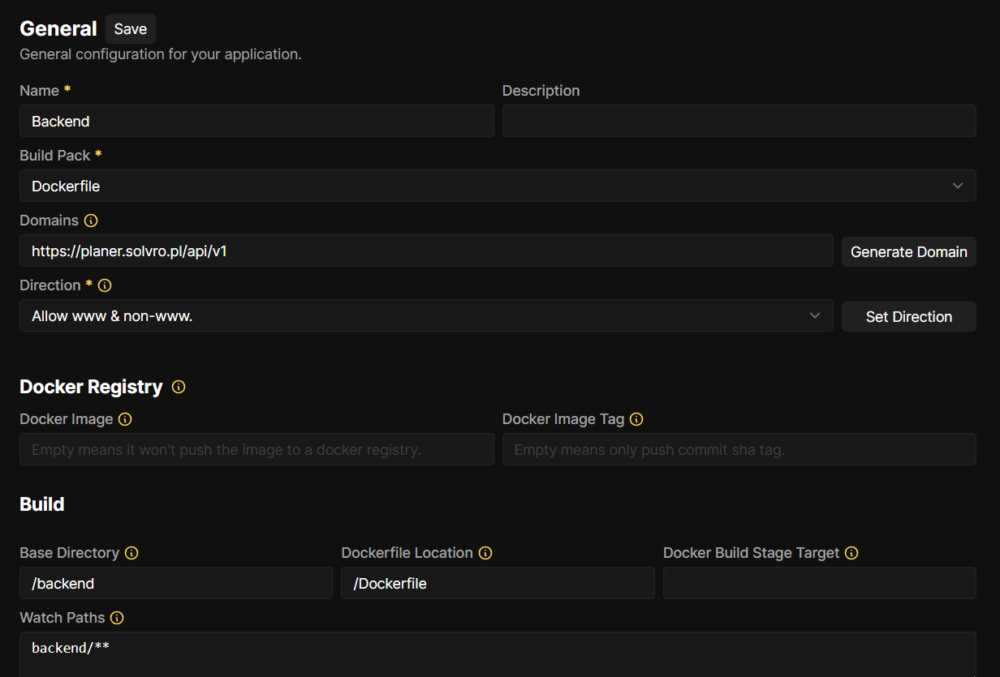
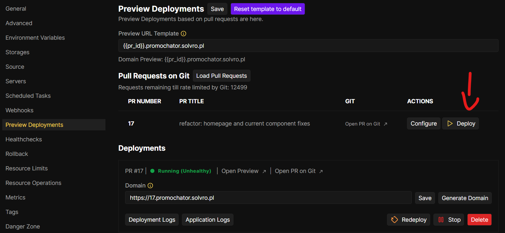
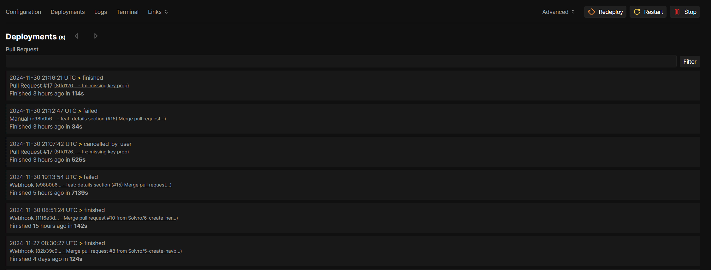

import { Steps } from "@astrojs/starlight/components";

_Krótki poradnik jak postawić apkę Adonisową (i nie tylko) na Coolify korzystając z GitHub App (autodeploy)_

## Repozytorium

Jeśli macie gotowy projekt i repo na Solvrowskim GitHubie to możecie śmiało zdeploywać waszą apkę.  
:::tip
Nawet jeśli nie jest gotowy na produkcje, to możecie już go zdeployować i np. ograniczyć dostęp [https://coolify.io/docs/knowledge-base/traefik/basic-auth/](https://coolify.io/docs/knowledge-base/traefik/basic-auth/)
:::

## Dockerfile (obligatoryjnie)

Coolify używa [Nixpacka](https://nixpacks.com/docs), który na podstawie drzewa projektu jest w stanie wygenerować obraz kontenera, który będzie chodził potem na serwerze.

Niestety, Adonisa za pomocą nixpacka tak łatwo nie postawicie, więc musicie stworzyć dockerfile’a - co nie jest zbyt skomplikowane.

Dockerfile najlepiej umieścić w rootcie projektu o nazwie `Dockerfile` (tak domyślnie Coolify szuka dockerfile’a). Pamiętajcie, żeby pushnąć dockerfile’a do repo na GitHubie.

Link do dockerfile’a z adonisowej dokumentacji, który możecie dostosować do swoich potrzeb:  
[https://docs.adonisjs.com/guides/getting-started/deployment\#creating-a-docker-image](https://docs.adonisjs.com/guides/getting-started/deployment#creating-a-docker-image)

## Coolify

Crème de la crème, dostępny pod adresem https://devops.solvro.pl - o dostępy do zarządu

_Widok projektów - wszystkie projekty postawione na Coolify_


_Każdy projekt ma swoje zasoby (Resources), które składają się na cały system projektu_


## Baza danych

W naszym przypadku używamy Postgresql, tu nie ma większej filozofii, wystarczy się przeklikać i Coolify wszystko za nas ogarnie.

<Steps>

1. Klikamy `New` i tworzymy nowy resource

2. Wybieramy PostgresSQL

3. Wybieramy serwer

   - localhost - typowo produkcyjny serwer, dostępny pod adresami `*.solvro.pl`
   - Seohost - ma więcej ramu i wrzucamy tam mniej ważne projekty albo projekty członków, dostępny pod adresami `*.s.solvro.pl`

4. Wybieramy domyślnego Postgresa

5. Ewentualnie zmieniamy nazwę na ładniejszą

6. Można odpalać 🚀

</Steps>


Ważne dane, które będą potrzebne do envów na backendzie:

- Username
- Password
- PostgresSQL URL (internal)
  - **postgres://\{username\}:\{password\}@\{host\}:\{port\}/\{database\}**

## Aplikacja

### Tworzenie resource'a

<Steps>

1. Klikamy `New` i tworzymy nowy resource

2. Wybieramy Private Repository (with GitHub App) - nie sugerujcie się nazwą, z publicznym repo będzie działać

3. Wybieramy serwer

   - localhost - typowo produkcyjny serwer, dostępny pod adresami `*.solvro.pl`
   - Seohost - ma więcej ramu i wrzucamy tam mniej ważne projekty albo projekty członków, dostępny pod adresami `*.s.solvro.pl`

4. Wybieramy Github App

5. Wybieramy repozytorium

6. Wybieramy brancha, którego Coolify ma deployować  
    Wybieramy jak Coolify ma tworzyć obraz kontenera (zawsze **Dockerfile** przy Adonisie)
   
7. Powinno działać 🚀

</Steps>

### General

Po udanym procesie tworzenia resource’a powinniście ujrzeć następujący widok


:::tip
Po zmianach w zakładce zapisujcie zmiany, żeby potem nie wychodziły jakieś kwiatki.


:::

Na początku warto zmienić nazwę na bardziej czytelną, zmienić domenę \{poddomena\}.solvro.pl, ewentualnie dodać opis.  
Przykład:


Jeśli macie monorepo to warto też zmienić Base Directory, jeśli macie np. w jednym repo frontend i backend.  
Przykład z [Planera](https://github.com/Solvro/web-planer) 🔥:


#### Network

Ports Exposes jest istotny, domyślnie Adonis słucha na porcie 3333 - jeśli ustawiliście inny w env-ach to zmieńcie na ten z env-ów.  
Porst mappings - jeśli nie macie konkretnych powodów, to nie zmieniajcie mapowania portów do hosta.


Zakładka Pre/Post Deployment Commands jest użyteczna, jeśli chcecie, żeby po każdym deployu jakaś akcja się wykonała - w naszym przypadku wykonujemy migracje:

```sh
node ace migration:run --force
```

### Advanced

W advance’ach warto zaznaczyć Preview Deployments co pozwoli na sprawdzenie działania aplikacji po otworzeniu pull requestu na repo.
Ostatnio (11.2024) Bartosz pisał, że automatyczne preview deployments są wyłączone i jeśli chcemy zrobić preview deployment, to musimy sobie wyklikać.


### Preview deployments



### Zmienne środowiskowe

Kolejna ważna zakładka, Enviroment Variables - tu ustawiacie niezbędne zmienne środowiskowe.


Polecam wejść w widok developerski, przekleić envy z folderu projektu adonisa i poustawiać odpowiednie wartości:


Dane do zmiennych zaczynających się od DB\_\{zmienna\} wyciągacie z bazy którą uprzednio utworzyliście, wszystkie dane możecie wyciągnąć z URL’a bazy:


_**postgres://\{username\}:\{password\}@\{host\}:\{port\}/\{database\}**_

Jeśli nie chcecie ręcznie przeklejać danych z url'a możecie poprosić Gepetto albo Kloda (jest to względnie bezpieczne)

### Source

W Sourcie mozecie wybrać brancha, którego chcecie deployować.


### Health checks

Jeśli nie chcecie mieć irytującego warningu koło statusu resource’a to możecie ustawić healthchecki [https://coolify.io/docs/knowledge-base/health-checks/](https://coolify.io/docs/knowledge-base/health-checks/)


### Deployments

Zdarzyć się może, że w trakcie deploy-u co się wykrzaczy - na ratunek przychodzi zakładka _Deployments_, w której możecie sprawdzić logi wszystkich deploy-ów i naprawić usterkę.



### Terminal

Jeśli macie uprawnienia admina to, macie możliwość połączenia się do kontenera przez terminal. Można to zrobić na 2 sposoby:

1. Będąc w resourcie przejść do zakładki _Terminal_ - jeśli mamy więcej niż 1 deploy, to trzeba wybrać, do którego kontenera chcemy się połączyć.
2. Kliknąć na sidebarze w _Terminal_, a następnie wybrać kontener (z wszystkich dostępnych na serwerze), do którego chcemy się połączyć.

Po więcej szczegółów: [https://coolify.io/docs/](https://coolify.io/docs/)
