import { Steps } from "@astrojs/starlight/components";

_Krótki poradnik jak postawić apkę Adonisową (i nie tylko) na Coolify korzystając z GitHub App (autodeploy)_

## Repozytorium

Jeśli macie gotowy projekt i repo na Solvrowskim GitHubie to możecie śmiało zdeploywać waszą apkę.  
:::tip
Nawet jeśli nie jest gotowy na produkcje, to możecie już go zdeployować i np. ograniczyć dostęp [https://coolify.io/docs/knowledge-base/traefik/basic-auth/](https://coolify.io/docs/knowledge-base/traefik/basic-auth/)
:::

## Dockerfile (obligatoryjnie)

Coolify używa [Nixpacka](https://nixpacks.com/docs), który na podstawie drzewa projektu jest w stanie wygenerować obraz kontenera, który będzie chodził potem na serwerze.

Niestety, Adonisa za pomocą nixpacka tak łatwo nie postawicie, więc musicie stworzyć dockerfile’a - co nie jest zbyt skomplikowane.

Dockerfile najlepiej umieścić w rootcie projektu o nazwie `Dockerfile` (tak domyślnie Coolify szuka dockerfile’a). Pamiętajcie, żeby pushnąć dockerfile’a do repo na GitHubie.

Link do dockerfile’a z adonisowej dokumentacji, który możecie dostosować do swoich potrzeb:  
[https://docs.adonisjs.com/guides/getting-started/deployment\#creating-a-docker-image](https://docs.adonisjs.com/guides/getting-started/deployment#creating-a-docker-image)

## Coolify

Crème de la crème, dostępny pod adresem https://devops.solvro.pl - o dostępy do zarządu


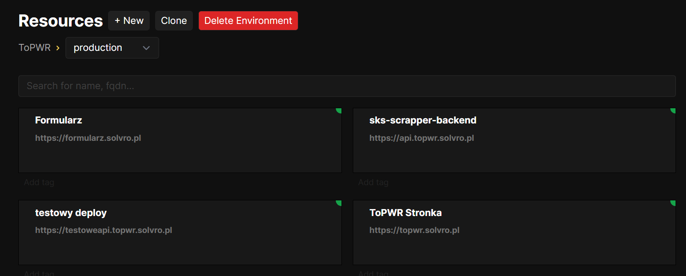

### Baza danych

W naszym przypadku używamy Postgresql, tu nie ma większej filozofii, wystarczy się przeklikać i Coolify wszystko za nas ogarnie.

<Steps>

1. Klikamy `New` i tworzymy nowy resource

2. Wybieramy PostgresSQL

3. Wybieramy serwer

   - localhost - typowo produkcyjny serwer, dostępny pod adresami `*.solvro.pl`
   - Seohost - ma więcej ramu i wrzucamy tam mniej ważne projekty albo projekty członków, dostępny pod adresami `*.s.solvro.pl`

4. Wybieramy domyślnego Postgresa

5. Ewentualnie zmieniamy nazwę na ładniejszą

6. Można odpalać 🚀

</Steps>

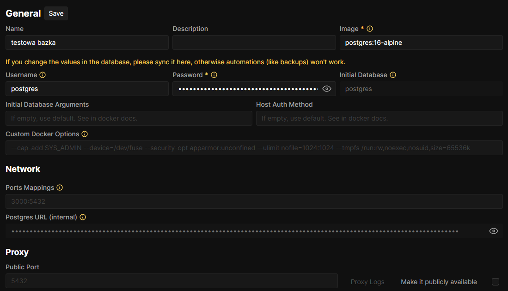

Ważne dane, które będą potrzebne do envów na backendzie:

- Username
- Password
- PostgresSQL URL (internal)

### Aplikacja

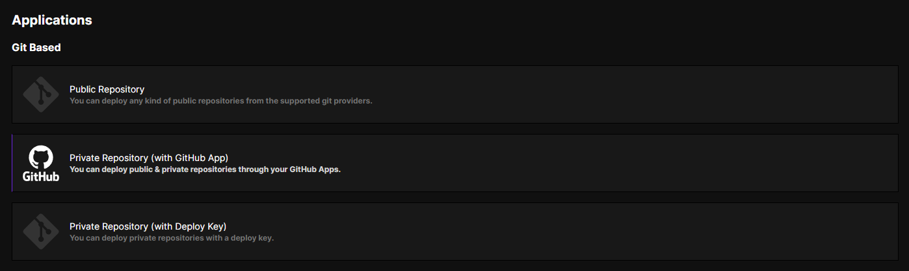

Jeśli nie chcecie bawić się potem z autodeployem to wybierzcie Private Repository (with GitHub App) (nie sugerujcie się nazwą, z public repo będzie działać xd)

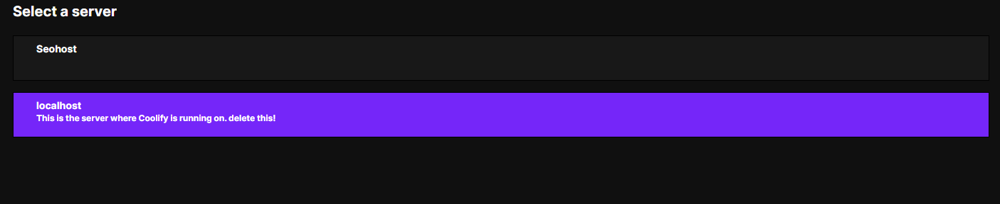

Wybieracie localhosta

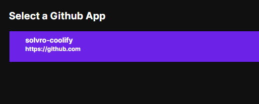

Nie ma zbyt dużego wyboru xd Wybieracie solvro-coolify

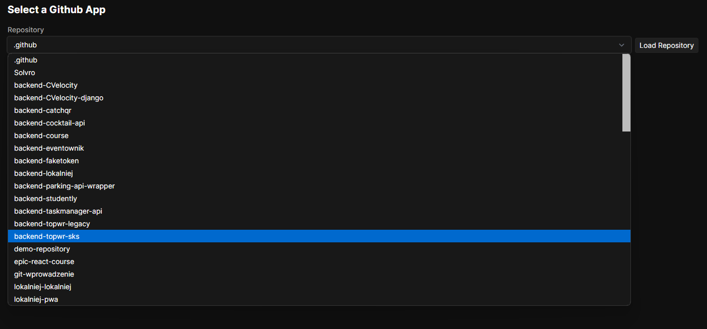

Wybieracie swoje repo

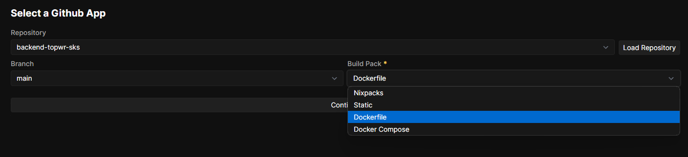

W tym widoku domyślnie jest wybrany Nixpacks, jeśli wam to odpowiada, to zostawcie, a jak nie to wybierzcie Dockerfile (zawsze przy adonisie).


Uważka: po zmianach w zakładce zapisujcie zmiany, żeby potem nie wychodziły jakieś kwiatki.

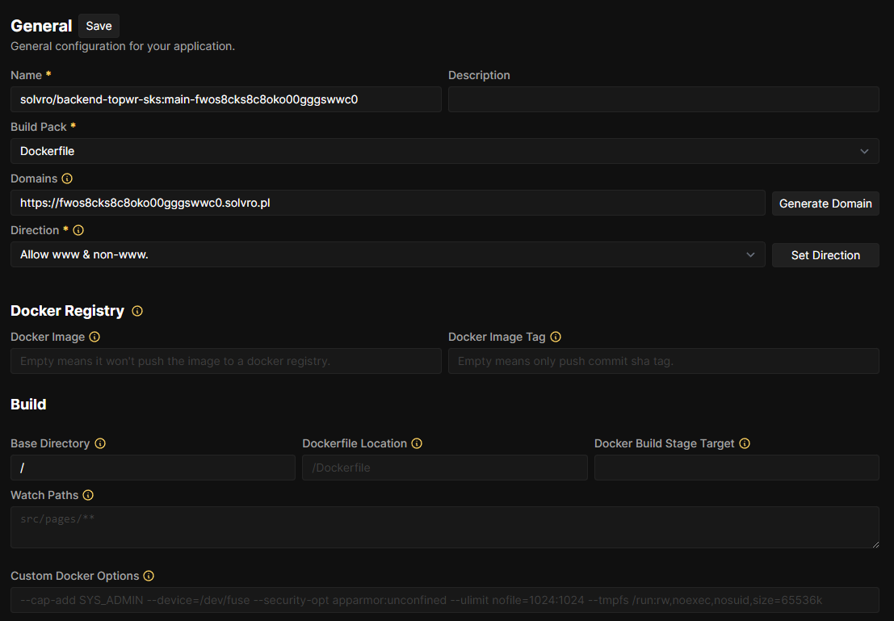

Widok po udanym utworzeniu resourca.  
Na początku warto zmienić nazwę na bardziej czytelną, zmienić domenę \{poddomena\}.solvro.pl, ewentualnie dodać opis.  
Jeśli macie monorepo to warto też zmienić Base Directory, jeśli macie np. w jednym repo frontend i backend.  
Przykład:

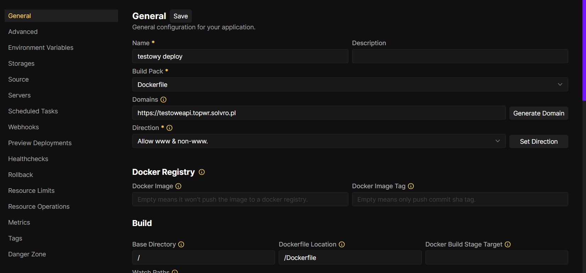
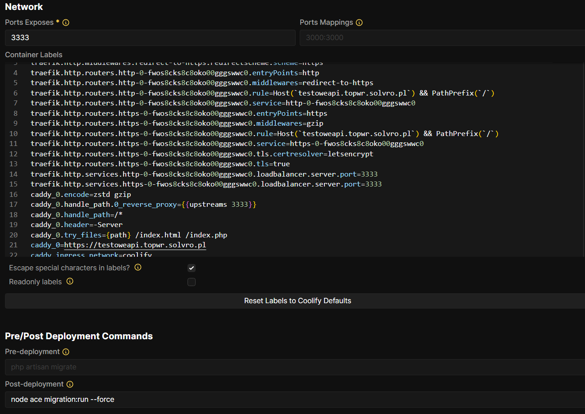

Dalej w zakładce General, Ports Exposes jest istotny, domyślnie Adonis słucha na porcie 3333. Zakładka Pre/Post Deployment Commands jest użyteczna, jeśli chcecie, żeby po każdym deployu jakaś akcja się wykonała - w naszym przypadku wykonujemy migracje:

```sh
node ace migration:run --force
```

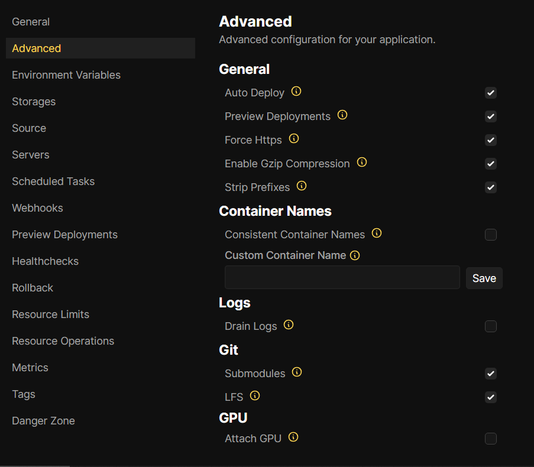

W advance’ach warto zaznaczyć Preview Deployments co pozwoli na sprawdzenie działania aplikacji po otworzeniu pull requestu na repo.

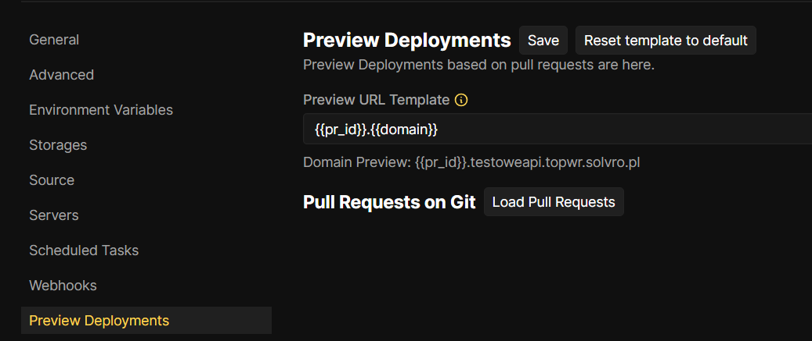
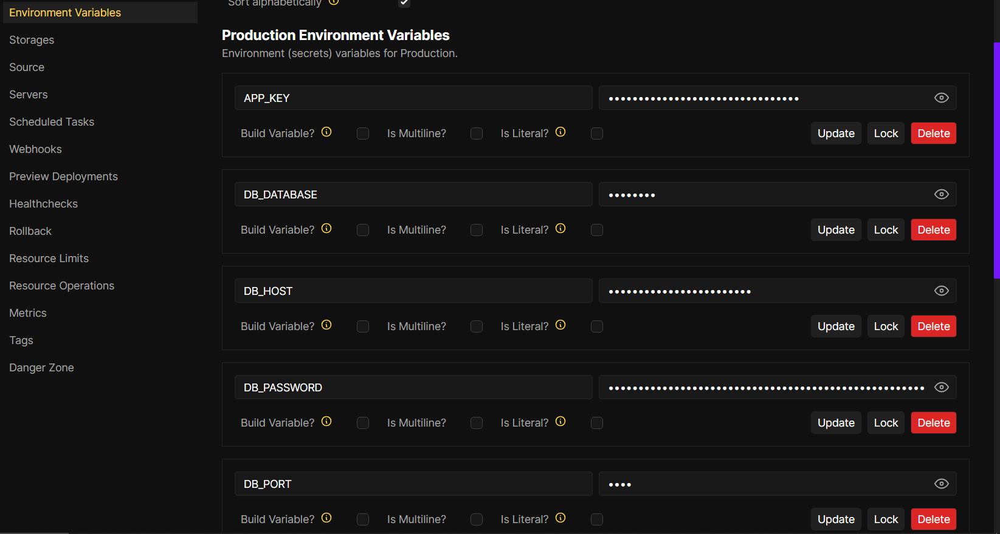

Kolejna ważna zakładka, Enviroment Variables - tu ustawiacie niezbędne zmienne środowiskowe. Polecam wejść w widok developerski, przekleić envy z folderu projektu adonisa i poustawiać odpowiednie wartości:

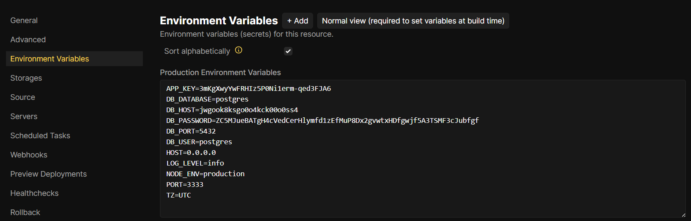

Dane do zmiennych zaczynających się od DB\_\{zmienna\} wyciągacie z bazy którą uprzednio utworzyliście, wszystkie dane możecie wyciągnąć z URL’a bazy:

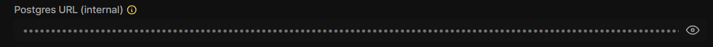

np. wklejając do Gepetto albo Kloda

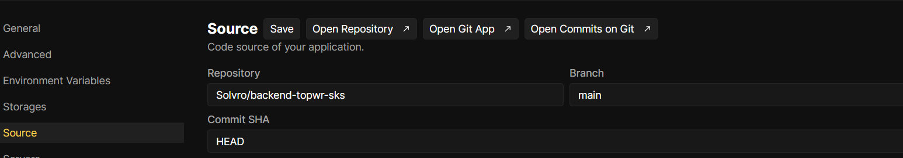

W Sourcie mozecie wybrać brancha, którego chcecie deployować.

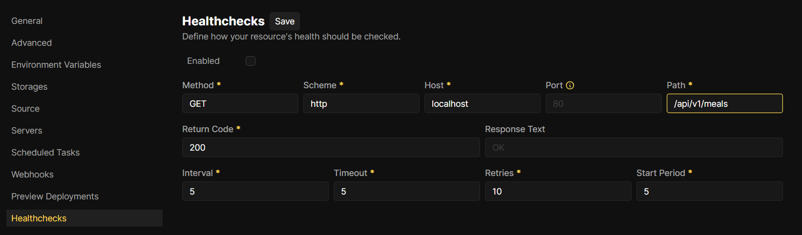

Jeśli nie chcecie mieć irytującego warningu koło statusu resource’a to możecie ustawić healthchecki ([https://coolify.io/docs/knowledge-base/health-checks/](https://coolify.io/docs/knowledge-base/health-checks/))

Po więcej szczegółów: [https://coolify.io/docs/](https://coolify.io/docs/)
