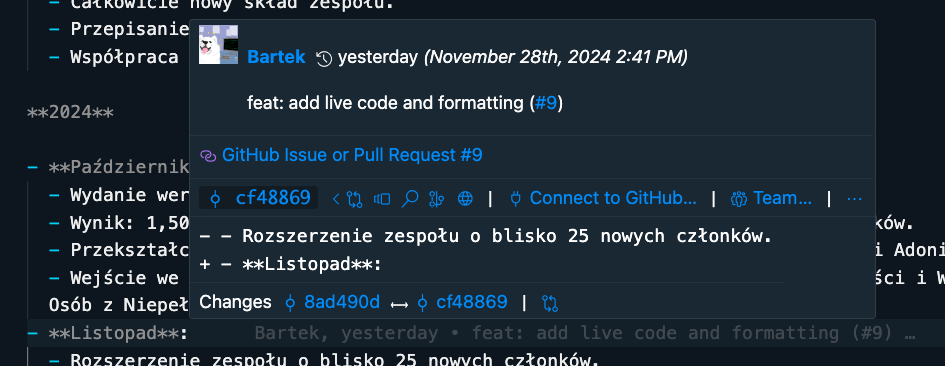
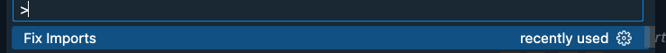

Hejo żelo, witamy w handbooku Flutterowca w Solvro. Tutaj staramy się zamieścić wszystko i jeszcze trochę co wiemy o programowaniu we Flutterze, z głównym naciskiem na platformy mobilne (ale nie tylko).

Poradnik jest dość zopiniowany i zachęcamy do dyskusji o dowolnym rozdziale - _issues i pr'ki są mile widziane_.

https://github.com/Solvro/web-solvro-docs

## Wymagania wstępne (założenia o czytelniku)

Ten handbook zakłada, że czytelnik słyszał już o frameworku [Flutter](https://docs.flutter.dev/), ale nie koniecznie musi dużo o nim wiedzieć. Docelowo poradnik ma uczyć zarówno podstaw i zaawansowanych aspektów, ale nie tłumaczy czym jest i po co został stworzony Flutter.

Zakładamy również, że czytelnik ma chociaż przeciętne pojęcie o programowaniu funkcyjnym i obiektowym. Oczywiście najlepiej w języku [Dart](https://dart.dev/), ale prawdopodobnie większość mainstreamowych języków jest też w pełni wystarczająca do zrozumienia większości rozdziałów.

Szczególnie dobrą podstawa są języki z [silnym typowaniem](https://pl.wikipedia.org/wiki/Typowanie_silne) i null safety jak np. typescript lub kotlin. Składnia Darta specjalnie łączy elementy z innych popularnych języków np. (java/type)script, C++, python, java. Jest to celowy zabieg, aby każdy mógł się w miarę łatwo odnaleźć.

## Słowo wstępne

Flutter jest relatywnie młody i z racji swojej wieloplatformowości, jest podatny na wpływy z innych technologii. Dzieje się to poprzez migracje programistów do Fluttera, którzy przynoszą również swoje nawyki, architektury i naleciałości z poprzednich specjalności.

Szczególnie widoczne są wpływy z obydwóch mobilnych natywnych platform Android i iOS oraz webówki (głównie Reacta). Sprawia to, że we Flutterze często nie ma jedynego słusznego sposobu na pewną rzecz, szczególnie w kwestii architektury aplikacji i zarządzania stanem.

Dlatego ten handbook stara zaznaczać się, w których momentach coś jest raczej obiektywne i powszechnie uznawane, a gdzie przedstawiony materiał jest zopiniowany, dostosowany pod to co wybrało Solvro i ToPWR, z jednoczesnym wspomnieniem chociaż najbardziej popularnych alternatyw uznawanych przez środowisko Fluttera.

:::note
Disclaimer: handbook jest w początkowej fazie rozwoju, więc te wymagania i słowo wstępne mogą być trochę oderwane od rzeczywistości.
:::

## Środowisko

### System operacyjny

Jeżeli chcecie wypuszczać apki na iOS/MacOS to bez inwestycji w komputerek z jabłkiem się nie obejdzie (można próbować stawiać maszynę wirtualną, jest to możliwe, ale nie łatwe).

Na szczęście dzięki wieloplatformowości możecie pisać we Flutterze i testować na Androidzie i większość funkcjonalności będzie działać na obu platformach (nie 100%, ale dostosowanie tego pod koniec nie jest zazwyczaj trudne).

Z "tańszych" OS-ów polecam oczywiście raczej Linuxa niż Windowsa, ale to już wasza sprawa.

O Linuxie i WSLu poczytacie najlepiej w napisanym przez specjalistę [Web Development Handbook](/guides/web-development#wsl). Jest to wygodniejsze niż korzystanie z Windowsa, ale nie wymagane.

:::tip[Link dla kolegi]
Losowa instrukcja instalacji wirtualki MacOS: https://antyweb.pl/wirtualny-macos-na-windows-10-dziala-imessage-icloud-i-inne

**Disclaimer**: jest to niezgodne z licenją MacOS i robisz to na własną odpowiedzialność.
:::

### Edytor / IDE

Polecam osobiście [Visual Studio Code](https://code.visualstudio.com/), bo jak zaczynałem to miał najlepiej działające wtyczki pod Fluttera. Trochę mniej, ale prawie równie popularny jest [Android Studio](https://developer.android.com/studio?hl=pl) (który i tak musi być zainstalowany do budowania na Androida), ale przynajmniej parę lat temu jego wtyczki były bardziej toporne - mogło sie to jednak zmienić.

Inne edytory to śmierć, ale to już wasza sprawa.

Poniżej, po instalacji Fluttera, załączam listę wtyczek i ustawień do VSCode, które ułatwią/umożliwią Wam pracę.

## Instalacja Fluttera

Dla odmiany od np. technologii zbudowanych na JSie, Flutter ma dość jednolite środowisko. Oczywiście czasami problemem może być jego wieloplatformowość i to że pod spodem musi zależeć trochę od natywnego Androida i iOSa (no i przegladarkowych i desktopowych) warstw. Jednak sama flutterowa warstwa jest dość jednolita i nie ma np. 15 różnych środowisk uruchomieniowych, kilku standardów, sposobów rozwiązywania ścieżek itp. Tutaj środowisko jest jedne, którego kierunek rozwoju jest dość silnie wytyczane przez Flutter and Dart team w Google (_z małą gwiazdką o Flocku_). A sposoby na instalacje są właściwie tylko dwa:

### Instalacja bezpośrednia 1:1 z dokumentacją

Wszystko jest dokładnie opisane w docsach: [Instrukcja instalacji Fluttera](https://flutter.dev/docs/get-started/install). Ale w skrócie potrzebujemy:

- Fluttera i Darta
- Android Toolchain / Android Studio
- iOS Platform / XCode (tylko na Macu)
- (opcjonalnie) Symulatory iOS i/lub Androida

### Instalacja przez [FVM (Flutter Version Manager)](https://fvm.app/) - polecane

Wadą pierwszej metody jest to, że Flutter jest zainstalowany globalnie i jeżeli pracujemy nad kilkoma projektami, to musimy używać jednej wersji Fluttera. FVM pozwala na zainstalowanie wielu wersji Fluttera i łatwe przełączanie między nimi.

Dlatego moim zaleciem jest zainstalowanie FVM i korzystanie z niego od samego początku: https://fvm.app/documentation/getting-started/installation
Jeśli zdecydujecie się na FVM, to Fluttera i Darta nie musicie instalować globalnie, bo FVM zrobi to za was.
Nadal musicie zainstalować Android Studio i XCode, zgodnie z instrukcją z dokumentacji Fluttera.

:::caution
Nie polecam instalacji zarówno z FVM i globalnej instalacji Fluttera, bo to może tam to się gryźć. Jak chcecie się przenieść z globalnej instalacji na FVM, to polecam odinstalować globalnego Fluttera.
:::

:::note
Jeśli korzystacie z FVM, trzeba proxować wszystkie komendy przez dodanie przedrostka `fvm`:

```shell
fvm flutter doctor

fvm flutter {command}

fvm dart {command}
```

Można też ustawić aliasy/symlinki w terminalu, żeby nie pisać `fvm` za każdym razem. Instrukcja jest w docsach: https://fvm.app/documentation/guides/running-flutter
:::

## Jak ustawić VSCode'a do pracy z Flutterem

Creditsy: Część tego rozdziału jest zainspirowana solidną [sugestią od Andrea](https://codewithandrea.com/articles/vscode-shortcuts-extensions-settings-flutter-development/)
Jest to jednak moja wariacja na ten temat.

### Wtyczki

IMO wszystkie z tej listy to większy lub mniejszy must have.

- [Oficjalna do Fluttera](https://marketplace.visualstudio.com/items?itemName=Dart-Code.flutter): 
  - [Oficjalne docsy](https://docs.flutter.dev/tools/vs-code): (polecam przeczytać)
    :::tip
    Dwie rzeczy o której ludzie często zapominają to: 
    1. Wbudowane snippety. Na przykład wystaczy napisać `stl` i nacisnąć tab, żeby dostać szablon `StatelessWidget`u. 
    2. Refactoring assistant: `Cmd + Shift + R` i możemy na przykład okalać widget na którym jesteśmy w `Column`.
    :::
- [Oficjalna do Darta](https://marketplace.visualstudio.com/items?itemName=Dart-Code.dart-code)
- [Better Comments](https://marketplace.visualstudio.com/items?itemName=aaron-bond.better-comments): kolorowe komentarze
- [Error Lens](https://marketplace.visualstudio.com/items?itemName=usernamehw.errorlens): podświetla błędy w kodzie w fajny sposób
- [GitLens](https://marketplace.visualstudio.com/items?itemName=eamodio.gitlens): fajny Git Blame (widać kto popsuł każdą linijkę)
    
- GitHub Copilot: każdy wie co to jest, polecam free studencką licencję se ogarnąć.
- [DartPad Theme](https://marketplace.visualstudio.com/items?itemName=Alejandro-FA.vscode-theme-dartpad): Fajny theme, inspirowany dartpadem (oficjalnym playgroundem do Darta)
- [Version Lens](https://marketplace.visualstudio.com/items?itemName=pflannery.vscode-versionlens): podpowiada która paczka w pubspecie ma dostępną nowszą wersję
- [Riverpod Snippets](https://marketplace.visualstudio.com/items?itemName=robert-brunhage.flutter-riverpod-snippets): 
  - skróty do Riverpoda
  - wystarczy napisać kilka znaków i wstawia nam template
    
- [dart-import](https://marketplace.visualstudio.com/items?itemName=luanpotter.dart-import): Komenda do sprzątania i formatowania importów. `Cmd + Shift + P -> Fix Imports`
    
- [Image preview](https://marketplace.visualstudio.com/items?itemName=kisstkondoros.vscode-gutter-preview): pokazuje wizualizacje assetów
- [Flutter Color](https://marketplace.visualstudio.com/items?itemName=circlecodesolution.ccs-flutter-color): koloruje koloreki flutterowe (są też bardziej uniwersalne wtyczki, ale Flutter ma format`0xAARRGGBB` więc się czestą zajebują w akcji)
- [Flutter Icons](https://marketplace.visualstudio.com/items?itemName=AntoineGtr.flutter-icons): ikonki do edytora
### Ustawienia

Ważne ustawienia, które warto dodać do `settings.json` - w kontekście Flutter Developmentu:

1. Fix all errors on Save

```json
"[dart]": {
        "editor.codeActionsOnSave": {
            "source.fixAll": true
        }
    }
```

2. Format on Save

```json
"[dart]": {
   "editor.formatOnSave": true
}
```

3. Bracked Pair Colorization

```json
"[dart]": {
    "editor.bracketPairColorization.enabled": true
}
```

4. Preview Flutter UI Guides

```json
"dart.previewFlutterUiGuides": true

```

5. Enable Sticky Scroll

```json
"editor.stickyScroll.enabled": true,
```

6. Enable file nesting for auto-generated Dart files

```json
"explorer.fileNesting.patterns": {
    "*.dart": "${capture}.g.dart, ${capture}.freezed.dart, ${capture}.gr.dart, ${capture}.tailor.dart, ${capture}.gform.dart",
    "*.graphql": "${capture}.graphql.dart"
},
"explorer.fileNesting.enabled": true,
"explorer.fileNesting.expand": false,
```

Wrzuciłbym Wam moje całe ustawienia, ale jest tam za dużo śmieci. Możecie sobie zerknąć na nie tutaj: https://gist.github.com/simon-the-shark/1c99f3e6f45f9af7903bad11d4dc105a

:::note
Jeśli korzystacie z FVM, to musicie zmienić jeszcze ustawić, żeby automatycznie wykrywał instancję z FVM w tym projekcie. Instukcja: https://fvm.app/documentation/guides/vscode
:::

## Jak ustawić Android Studio do pracy z Flutterem

**_Nie planuję tego opisywać. Jak ktoś jest fanem JetBrainsów to poproście Mikołaja_**  

Mogę tylko podrzucić linkacza, ale nawet nie czytałem: https://codewithandrea.com/articles/intellij-keyboard-shortcuts-flutter-development/

## Flutter Aliasy

Nie ma jakiś jednych przyjętych jak np. do [Gita](https://kapeli.com/cheat_sheets/Oh-My-Zsh_Git.docset/Contents/Resources/Documents/index), ale Andrea proponuje kilka podstawowych: https://codewithandrea.com/tips/useful-aliases-flutter-dev/

```shell
alias fclean="flutter clean"
alias fpg="flutter pub get"
alias fpu="flutter pub upgrade"
alias frun="flutter run"

alias brb="dart run build_runner build -d"
alias brw="dart run build_runner watch -d"

alias fpgbrb="fpg && brb"
alias fpgbrw="fpg && brw"

alias pinst="pod install"
alias pru="pod repo update"
```

:::caution
Jak używacie FVM i nie włączyliście proxy (patrz wyżej), to musicie dodać `fvm` przed każdym aliasem.

```shell
alias fclean="fvm flutter clean"
alias fpg="fvm flutter pub get"
alias fpu="fvm flutter pub upgrade"
alias frun="fvm flutter run"


alias brb="fvm dart run build_runner build -d"
alias brw="fvm dart run build_runner watch -d"

alias fpgbrb="fpg && brb"
alias fpgbrw="fpg && brw"

alias pinst="pod install"
alias pru="pod repo update"
```

:::
