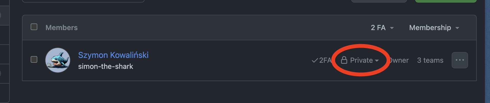
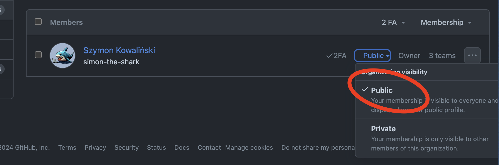
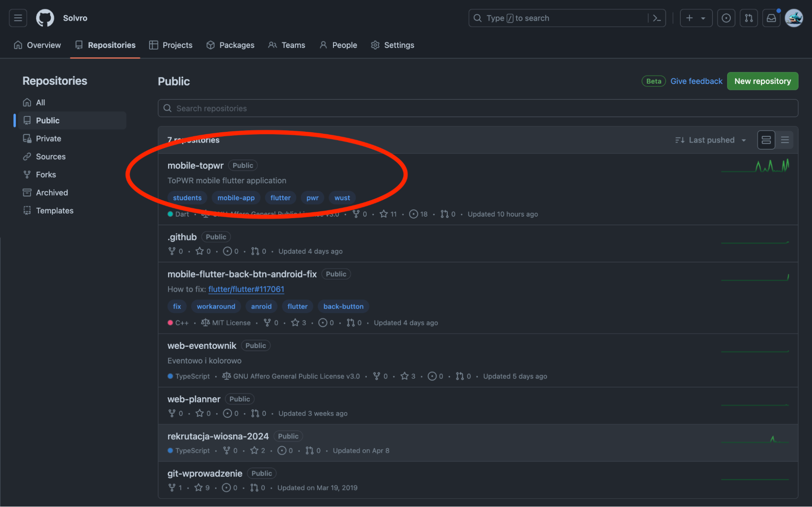
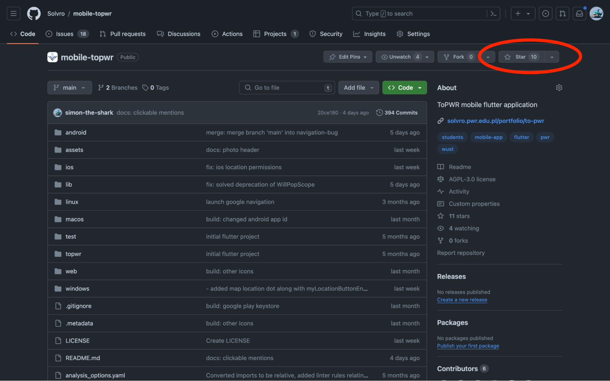
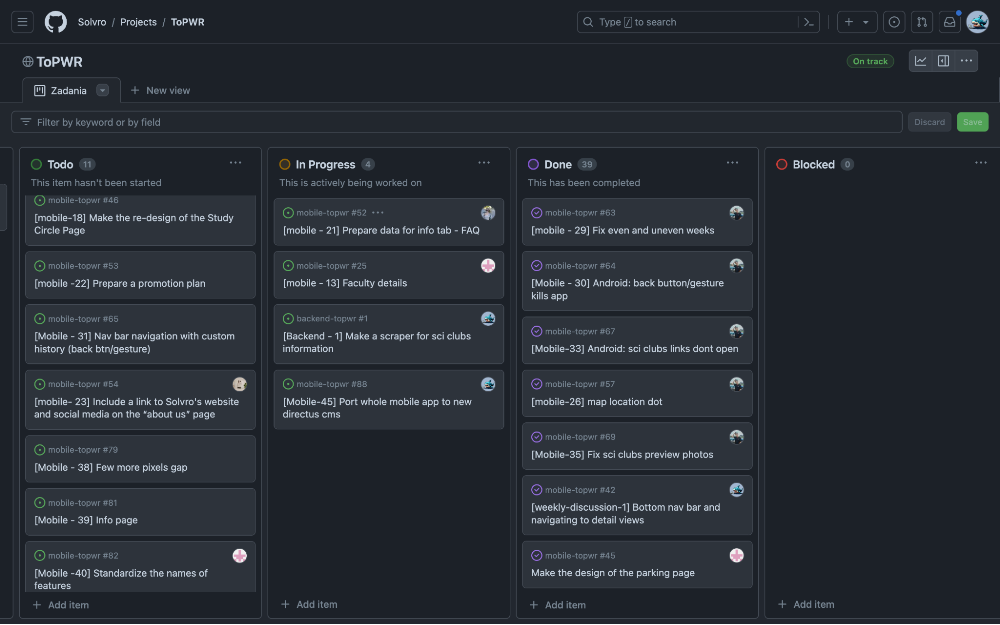
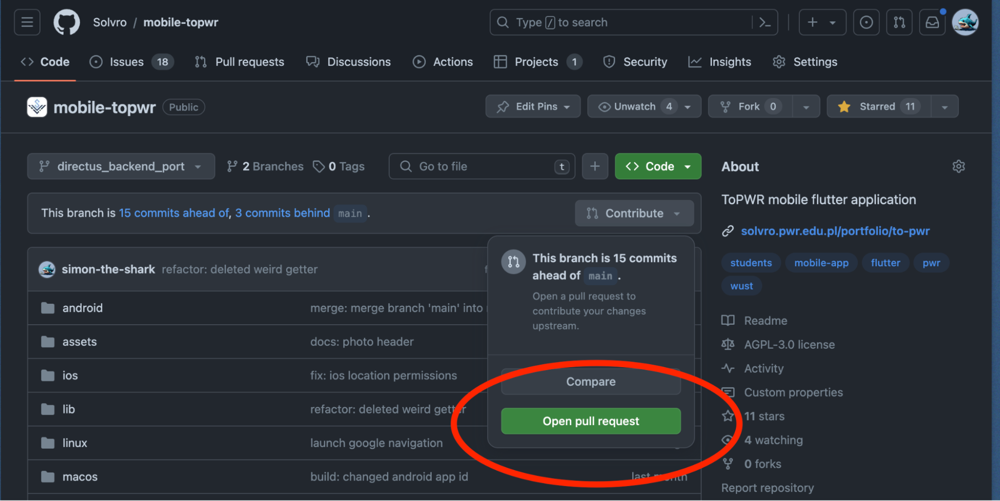
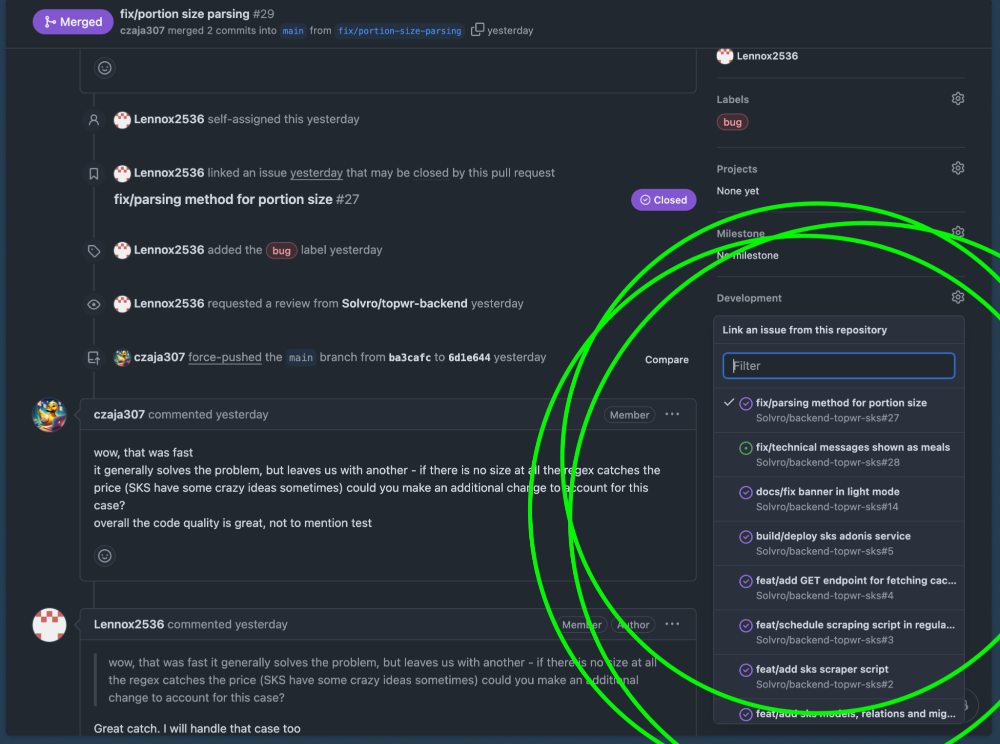

_Działalność KN Solvro skoncentrowana jest wokół kodu, więc naturalnie nasz Github jest sercem naszej organizacji. Poniższy handbook ma przybliżyć strukturę i konwencję przyjęte na naszym GitHubie oraz przedstawić sposób i zasady pracy podczas działalności projektowej._

## Organizacja “KN Solvro”

Mamy utworzoną organizację, do której powinni należeć wszyscy członkowie i gdzie przechowywane są wszystkie repozytoria projektowe, nad którymi pracujemy lub pracowaliśmy w kole. Jest to również odpowiednie miejsce do zarządzania zadaniami w projektach za pomocą narzędzi projektowych, wbudowanych w GitHuba.

### Link

[https://github.com/Solvro](https://github.com/Solvro)

### Jak dołączyć

Aby dołączyć do organizacji, należy wysłać swój nick lub link konta na GitHubie do wybranego członka zarządu. Jeśli nie posiadasz konta: [załóż je](https://github.com/signup) czym prędzej\!

## Pierwsze kroki

Jeśli już jesteś członkiem naszej organizacji, oto lista rzeczy, od których powinieneś zacząć\!

### Publiczne członkostwo

Domyślnie po dołączeniu do organizacji, jesteś członkiem prywatnym, a świat zewnętrzny nie wie, że jesteś członkiem naszego koła. Jest to niedopuszczalne\! Prawda?

Jeśli się nas wstydzisz i nie chcesz chwalić się członkostwem \- twoja sprawa, ale serdecznie zachęcamy wszystkich członków do ustawiania publicznego członkostwa\! Pokażmy, że jest nas dużo\!

Dzięki publicznemu członkostwu widać Solvro na twoim profilu, a przede wszystkim, nasza organizacja prezentuje się prężnie i licznie dla wszystkich przeglądających.

### Jak ustawić publiczne członkostwo \- szybki poradnik

1. Wejdź na [https://github.com/orgs/Solvro/people](https://github.com/orgs/Solvro/people)
2. Namierz siebie na liście członków i kliknij na swoją aktualną widoczność 

3. Wybierz członkostwo publiczne, i tada\! Jesteś już pełnoprawnym członkiem naszego koła.

### Podaruj nam gwiazdki ⭐⭐⭐

Zachęcamy do gwiazdkowania naszych publicznych repozytoriów Pokażmy innym, że mamy fajne projekty.

1. Wchodzimy na listę repozytoriów. Ich publiczna liczba będzie tylko rosła (miejmy nadzieję).
2. Wchodzimy po kolei w co fajniejsze projekty. 
3. Zostawiamy gwiazdkacza ⭐\! 

## Nazewnictwo repozytoriów

W celu ujednolicenia nazewnictwa repozytoriów, obowiązuje następująca konwencja.

Projekty nazywamy w pełnym [lower-kebab-case](https://www.theserverside.com/definition/Kebab-case), w formacie:

**_typ-projektu-nazwa-projektu-suffixy_**

## Lista przedrostków typów projektów.

Nazwę repo zaczynamy od przedrostka oznaczającego jego typ. Przewidziane na ten moment są następujące przedrostki:

| backend- | Projekt backendu aplikacji, obejmuje to wszystkie customowe backendy, CMSy, API, BaaSy itd. |
| :------- | :------------------------------------------------------------------------------------------ |
| web-     | Projekt aplikacji webowej, frontendowej, w tym wszystkie nowoczesne frameworki jsowe/tsowe. |
| lib-web- | Biblioteka do aplikacji webowej, lub coś co nie wpada w ramy aplikacji                      |
| ml-      | Projekt Machine Learning, modele, notebooki itp.                                            |
| mobile-  | Projekt aplikacji mobilnej, zarówno w technologiach natywnych, jak i hybrydowych            |
| script-  | Projekt zawierający skrypty pomocnicze, scrapery, crawlery itd.                             |

_Lista może podlegać zmianom, jeśli jest taka potrzeba._

### Co, jeśli w repozytorium jest zarówno backend i frontend?

1. Wszędzie gdzie to możliwe zachęcamy do rozdziału repozytoriów na dwa osobne.
2. Jednak jeśli taka sytuacja zaistniała, bo np. projekt jest stary i już tak po prostu ma lub jest to aplikacja webowa monolityczna, wybierz przedrostek **_web-_**

## Nazwa projektu

Drugą częścią nazwy jest nazwa projektu w [lower-kebab-case](https://www.theserverside.com/definition/Kebab-case)  
np. _seg-a-2023, aplikacja-zapisowa, czasoprzestrzen-scanning_

W przypadku krótkich nazw (jeśli nie wpłynie to na ich czytelność) zachęcamy do użycia prostego lower case’a np. _topwr, catchqr, planner, eventownik._

## Przyrostki (suffixy)

Po nazwie projektu można dodawać **wiele dowolnych własnych** przyrostków według uznania (w lower kebab case). Jednak te zdefiniowane poniżej powinny być zawsze w pierwszej kolejności od końca.

### Lista przyrostków funkcjonalnych

| \-legacy                                                            | Projekty zastąpione nowszymi wersjami. NIE dotyczy wszystkich projektów ukończonych, TYLKO TYCH NIEAKTUALNYCH np. z racji powstania całkowicie nowej wersji w innej technologii                |
| :------------------------------------------------------------------ | :--------------------------------------------------------------------------------------------------------------------------------------------------------------------------------------------- |
| \-legacy-legacy                                                     | Projekty dwukrotnie zastąpione (tak, mamy takie)                                                                                                                                               |
| \-android, \-ios, \-react,-flutter, \-angular, \-vue, \-svelte, itd | Opcjonalny suffix technologiczny; Szczególnie przydatne jak mamy ten sam projekt o tym samym typie w dwóch różnych technologiach np. _mobile-topwr-ios-legacy_ i _mobile-topwr-android-legacy_ |
| \-team1, \-team2                                                    | Opcjonalny suffix zespołu; Przydatne jeśli dwa zespoły robią podobny projekt np. jakieś zadanie z ML-a.                                                                                        |

_Brak innych pomysłów na ten moment, można zgłaszać propozycje._

# Nazewnictwo commitów

Jest to propozycja standaryzacji commitów. Poszczególne projekty mogą nadpisać te zasady swoimi, ale niech każdy projekt ma jakąś przyjętą spójną konwencję.

## Format

Ogólny proponowany format jest następujący:

**_type: short description_**

## Przedrostek typu zmiany

| feat:     | Zmiana wprowadzająca nowe funkcjonalności.                                                                               |
| :-------- | :----------------------------------------------------------------------------------------------------------------------- |
| fix:      | Zmiana naprawiająca istniejące funkcjonalności.                                                                          |
| refactor: | Refaktoryzacja/refaktoring, zmiana nie wprowadza zmian w funkcjonalnościach, jedynie zmienia strukturę/sposób wykonania. |
| chore:    | “Nudna” powtarzalna czynność np. podbicie numeru builda.                                                                 |
| init:     | Commit dodający jakiś boilerplate frameworka/projektu, cokolwiek “początkowego”.                                         |
| merge:    | Merge branchów.                                                                                                          |
| docs:     | Zmiana dokumentacji (np. README, LICENSE).                                                                               |

Czasami mogą wystąpić też inne przedrostki. Ciekawym rozwiązaniem są też zakresy np. _feat(blog): code snippets_ lub _fix(login view): password strength calculator_

Dla zainteresowanych zalecam zapoznanie się ze spycifikacją Conventional Commits [https://www.conventionalcommits.org/en/v1.0.0/](https://www.conventionalcommits.org/en/v1.0.0/)

## Krótki prosty opis zmiany

Powinien być krótki, po angielsku, opisujący czego dotyczy zmiana.  
Przykłady: _login view, shopping list, product detail view, auth service, product model, new db system, ios location permissions, photo header, offline message widget, change welcome message, improve fetching time, active tile content, cold start initialization_ i można by wymieniać w nieskończoność

Czasami można się rozpisać na kilka dobrych słów, ale commity nie powinny wykraczać poza widoczne na githubie miejsce. (Wasze edytory IDE powinny o tym ostrzegać)

**UWAGA** od [272647@student.pwr.edu.pl](mailto:272647@student.pwr.edu.pl) (Bartosz Gotowski): Czasowniki w opisach powinny być w czasie teraźniejszym, a nie przeszłym. Np. _`add new logo`_ zamiast _`added new logo`_

# Zarządzanie zadaniami i projektami

Każdy zespół projektowy powinien mieć utworzony team na Githubie. Każdy team ma maintainera (PM/TechLeada), który może dodawać członków. Team ma też swoje logo i można grupowo oznaczać ich członków w dyskusjach/issues/pr-ach.

Do teamu powinny być przyporządkowane repozytoria w potrzebnej liczbie i typie (z permisjami WRITE) oraz projekt (z permisjami WRITE).

Jeśli kierujesz nowym projektem i nie masz jeszcze wszystkiego z listy \- napisz do kogoś z zarządu\!

## Projekt / KANBAN board

Projekty mają wiele zaawansowanych diagramów, z których możecie korzystać w projekcie, jeśli umiecie i wiecie czemu służą 😛

Podstawowym typem jest jednak tablica KANBAN, gdzie można dodawać zadania w formie draft, lub przypinać issues lub pull-requesty.  

### Flow pracy na boardzie

- **PM/TechLead** tworzy zadania w formie draftów lub issues ze statusem **TODO**.
- Ktoś chętny do jego wykonania, przypisuje się do niego jako **assignee** lub robi to **lead** od razu na **weekly**.
- Gdy zaczynasz pracę to zmień status taska na **In Progress**.
- Gdy zadanie oczekuje na review to zmień status na **In Review** (jeśli istnieje).
- Gdy zadanie jest wykonane, zmień jego status na **Done**.
- Jeśli zadanie jest zablokowane z przyczyn niezależnych od wykonującego (np. czekamy na coś), zmieniamy status na **Blocked** (jeśli istnieje).

Jeśli potrzebujesz bardziej szczegółowej instrukcji użycia tej tablicy, napisz na ogólnych kanałach lub do zarządu. W przypadku takich próśb, rozbudujemy tą sekcje o dokładniejszy manual.

# Zadania ogólno-kołowe \- projekt KN Solvro

Został utworzony team i projekt [KN Solvro](https://github.com/orgs/Solvro/projects/3), gdzie zarząd i wszyscy członkowie mogą dodawać taski do zrobienia, które nie są przyporządkowane do żadnego z projektów. Dotyczą one ogólnie koła np. przygotować README organizacji lub jakiegoś starego projektu. Znajdują się tam też zadania dla działu grafików.

## Dostęp / Jak wejść

Każdy aktywny członek Solvro powinien mieć dostęp pod tym linkiem: [https://github.com/orgs/Solvro/projects/3](https://github.com/orgs/Solvro/projects/3)  
Jeśli nie masz dostępu, napisz do zarządu\!

## Przypisujmy się i róbmy\!

Zachęcamy każdego członka, który ma chwilę czasu, do przypisywania się do wolnych zadań i ich realizacji, aby przyczynić się do rozwoju naszej organizacji.

# Praca programistyczna w projekcie

Sekcja opisująca flow pracy programisty w projekcie na naszym GitHubie.

Zakładamy, że znasz podstawowe komendy git. Jeśli jednak nie jesteś pewien, to przeczytaj nasz blog: [https://solvro.pwr.edu.pl/blog/solvro-talks-1-podstawy-gita](https://solvro.pwr.edu.pl/blog/solvro-talks-1-podstawy-gita)

Oprócz konsolowego użycia, wszystkie edytory IDE mają wbudowane też odpowiednie integracje do gita.

Jeśli nie rozumiesz technikaliów związanych z którymś z poniższych punktów, odezwij się, a ktoś na pewno ci pomoże\!

## Zgłoszenie chęci wykonania zadania

Wchodzimy na naszą tablice zadań i przypisujemy się do zadania sygnalizując, że zgłaszamy się do jego zrobienia:  

## Rozpoczęcie pracy nad zadaniem

1. Zmieniamy status taska na **In Progress**
2. Tworzymy nowego **brancha** z nazwą lub opisem taska. Proponujemy dodać prefix związane z głównym typem zadania:

| feat/     | zadanie, którego głównym celem jest dodanie jakieś funkcjonalności  |
| :-------- | :------------------------------------------------------------------ |
| fix/      | zadanie, którego głównym celem jest naprawienie jakiegoś błędu      |
| refactor/ | zadanie, które nie zmienia funkcjonalności, tylko jakiś refactoring |

np. feat/ add login screen

3. Pracujemy na tym branchu, jest on nasz, commitujemy i pushujemy tam nasze zmiany, kiedy uznamy to za słuszne. Nie trzeba się wstydzić pushowania niedokończonych zadań, są one na osobnym branchu i nikomu nie przeszkadzają.

## Code review, finalizacja zadania i sprzątanie

1. Gdy jesteśmy gotowi, zmieniamy status taska na **In Review** (jeśli taki status jest w projekcie).
2. Tworzymy pull requesta z naszego brancha na branch **main** lub **dev** (jeśli aplikacja na main jest już opublikowaną wersją produkcyjną).
   

3. Dodajemy znaczący tytuł (najlepiej powiązany z nazwą lub numerem taska/tasków) i krótko wypisujemy co zmieniliśmy lub dodaliśmy. Jeśli napotkaliśmy jakiś problem/dylemat, możemy wyjaśnić jak go rozwiązaliśmy, jakiej dokonaliśmy decyzji i dlaczego. Jeśli z jakiegoś powodu nie wykonaliśmy 100% zakresu zadania, to jest to dobre miejsce żeby o tym wspomnieć. Jeśli chcesz ładnie sformatować swój opis, obczaj [tą szybką ściągę do gh markdowna](https://github.com/adam-p/markdown-here/wiki/Markdown-Cheatsheet).
4. Można oznaczyć swojego techleada jako reviewer (opcjonalne).
5. Po prawej na dole, w sekcji _Development_ możesz przypiąć **issue** (np. swoje zadanie), który zostanie automatycznie zamknięty po zmergowaniu tego pull requesta. 
6. Oczekujemy na code review od naszego techleada.
7. Przeglądamy komentarze, wprowadzamy sugestie i dyskutujemy nad rzeczami, z którymi się nie zgadzamy. Zadajemy pytania i wprowadzamy zmiany, commitujemy i pushujemy.
8. Pingujemy code reviewer’a po wprowadzeniu każdej fazy poprawek (chyba, że ma on ustawione wszystkie powiadomienia do projektu).
9. Gdy code reviewer “przyklepie” pull requesta, dokonujemy merga i usuwamy starego brancha z GitHuba (po mergu od razu pojawia się w tym samym miejscu przycisk `delete branch`).
10. Rozwiązujemy potencjalne merge konflikty.
11. Jeśli chcesz, to możesz też usunąć tego brancha lokalnie (`git branch -d my_branch`) i wyczyścić cache zdalnych branchy (`git fetch -–prune`).
12. Zmieniamy status taska na **Done**.
13. Onto the next adventure\!💥💥💥

# Dokumentacja repozytoriów

Jako Koło aktualnie dążymy do maksymalizacji liczby repozytoriów open source, aby prężnie prezentować się na GitHubie, ale każdy projekt przed publicznym wypuszczeniem musi mieć co najmniej krótkie README i LICENSE.

## LICENSE

Możecie wraz z zespołem projektowym wybrać dowolną licencję, lecz nasze propozycje to:

| GNU AGPL 3.0 | Dla większych projektów, aplikacji mobilnych, webowych, desktopowych itp. |
| :----------- | :------------------------------------------------------------------------ |
| MIT          | Dla paczek/modułów open-source, krótkich skryptów.                        |

Oficjalna instrukcja od Githuba, jak dodać gotowy szablon wielu popularnych licencji. [https://docs.github.com/en/communities/setting-up-your-project-for-healthy-contributions/adding-a-license-to-a-repository](https://docs.github.com/en/communities/setting-up-your-project-for-healthy-contributions/adding-a-license-to-a-repository)

## README

### Początkowy must-have:

Każde repozytorium przed wypuszczeniem powinno mieć README z co najmniej następującą zawartością:

1. Tytuł/nazwa projektu.
2. Banner (zdjęcie) \- customowy projektu, lub w przypadku braku takiego, domyślny banner KN Solvro.
3. Krótki opis projektu, jego pomysły/zamysły i np. parę przykładowych/flagowych featerów.
4. Sekcja \#Development \- rozwijana na bieżąco wraz z pisanym kodem, gdzie programiści dopisują informacje techniczne np. jak odpalić projekt, zainstalować dependencies, ustawić środowisko itd. Można też podlinkować instrukcje szczegółowe do napisanych przez siebie (lub nie) modułów, których można używać pisząc kod w projekcie. Początkowo ta sekcja może być pusta lub zawierać tylko komendę odpalającą debug builda/serwer lokalny w wybranym frameworku.

### Dalszy rozwój

Na tym etapie projektu, można już upublicznić repozytorium. Następnie repo można rozszerzać o wiele sekcji. Poniżej lista propozycji:

5. Lista użytych technologii.
6. Krótka historia projektu.
7. Dlaczego powstał ten projekt.
8. Pomysłodawcy projektu.
9. Lista członków zespołu i ich role/zakres obowiązków.
10. Prosty Changelog z najważniejszymi/przełomowymi zmianami.
11. W przypadku paczek/pluginów, sekcja Breaking Changes \- zawierająca ostrzeżenia o zmianach powodujących niezgodność starego kodu z nową wersją.
12. W przypadku paczek/pluginów, bardziej rozbudowana dokumentacja, lub link do niej.
13. Contribution guidelines \- instrukcje dla kontrybutorów zewnętrznych, którzy chcieliby się zaangażować w nasz projekt open-source.
14. Przykładowe screeny z aplikacji.
15. Linki do innych repozytoriów z projektu.
16. Star history: [https://star-history.com/](https://star-history.com/)
17. Repobeats: [https://repobeats.axiom.co/](https://repobeats.axiom.co/)

_LISTA OTWARTA, CZEKAM NA SUGESTIE_

Uwaga: Oprócz README repozytoriów, każdy projekt (kanban board) ma też swoje README \- które przydałoby się wypełnić, ale może być takie same jak głównego repozytorium

# Koniec

To już koniec tego handbooka. Mam nadzieję, że był przydatny i aż tak bardzo nie bolał, mimo zauważalnej liczby stron. Proszę zgłaszać swoje propozycje zmiany tego dokumentu i miłego kodowania 🙂🙃🙂

**Wiceprezes VII Zarządu KN Solvro**
