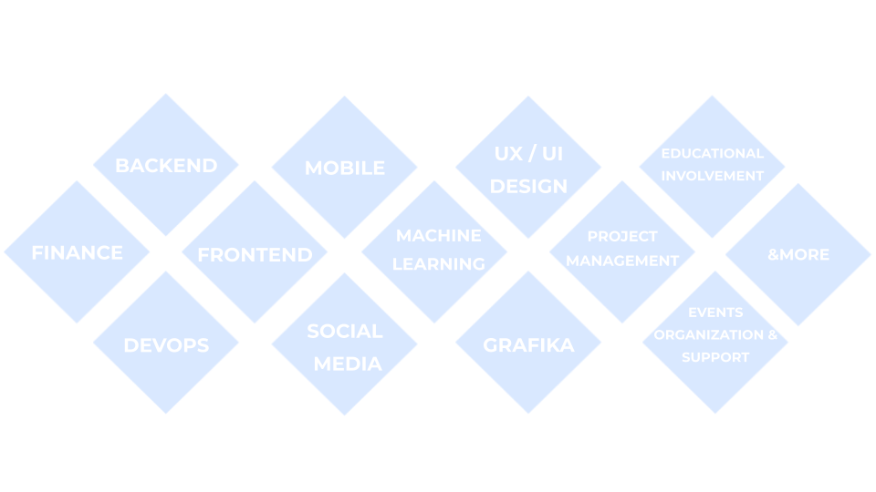

import {
  Steps,
  Card,
  CardGrid,
  LinkCard,
  Aside,
} from "@astrojs/starlight/components";

## Cześć 👋

Miło nam Cię powitać w otwartej dokumentacji organizacyjnej KN Solvro. Jest to miejsce, gdzie przechowujemy lata rozwoju naszej organizacji, zarówno od strony zarządczej jak i technicznej. Możesz znaleźć tu sprawozdania, procesy, poradniki i instrukcje dotyczące działalności Koła Naukowego Solvro.

### Dla gości

<LinkCard title="Nasza oficjalna strona" href="https://solvro.pwr.edu.pl" />
<LinkCard title="Strategia KN Solvro" href="/solvro/strategy" />
<LinkCard title="Obecny zarząd" href="/solvro/vii_board" />
<LinkCard title="Historia" href="/solvro/history" />

### Dla nowych członków

<LinkCard title="Jak pracujemy" href="/solvro/structure" />
<LinkCard title="Komunikacja" href="/communication" />
<LinkCard title="GitHub" href="/git-github/intro/1-intro/" />

### Dla starych wyjadaczy

<LinkCard
  title="Prowadzenie projektów"
  href="/sections/management/guides/managing-projects/"
/>

## Nasza działalność

Nasze codzienne działanie skupia się na nabywaniu umiejętności twardych w poszczególnych sekcjach technicznych, które potem przekładamy na praktyczne projekty napędzające innowację na Politechnice Wrocławskiej.

<CardGrid>
### Sekcje

### Projekty

  <LinkCard title="Frontend" href="/sections/frontend/"  />
  <LinkCard title="ToPWR" href="/projects/topwr/handbook/" />
  <LinkCard title="Backend" href="/sections/backend/get-started" />
  <LinkCard title="Eventownik" href="/projects/eventownik/handbook/" />
</CardGrid>

Jest to tylko część naszej działalności, gdzie w rzeczywistości działamy w wielu obszarach jednocześnie.

## Jak dołożyć cegiełkę do dokumentacji?

Nasza dokumentacja jest otwarta na wszelkie sugestie. Widzisz błąd? Chcesz coś zmienić lub dodać? A może masz pomysł na nowy materiał? Nie czekaj! Wszystkie potrzebne informacje znajdziesz w [poradniku pisania dokumentacji](/projects/dokumentacja-solvro).

**Zapraszamy również do kontaktu przez naszą [stronę](https://solvro.pwr.edu.pl/contact) lub [maila](mailto:kn.solvro@pwr.edu.pl) 🚀**
