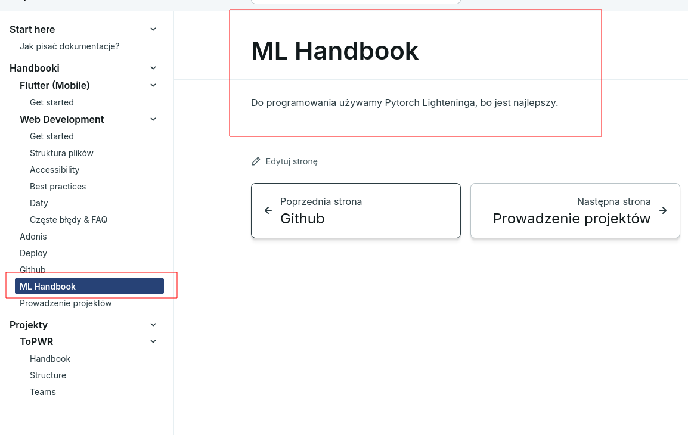
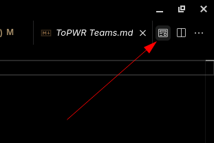
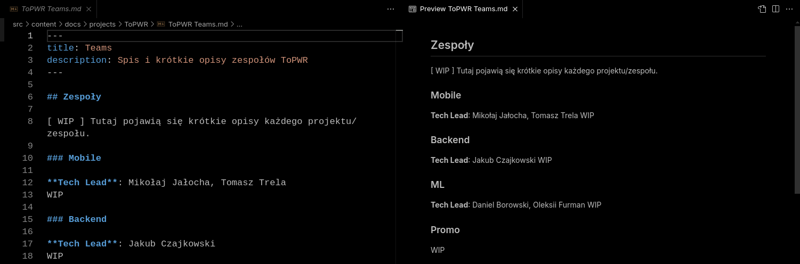

import { Steps } from "@astrojs/starlight/components";

Cała dokumentacja jest trzymana w zwykłych plikach Markdown z rozszerzeniem `.md`, nie ma tu dużej filozofii.

Wszystko jest dostępne tutaj na githubie: https://github.com/Solvro/web-solvro-docs

## Jak pisać docsy?

- Jak napiszecie plik w formacie Markdown to wystarczy, że podeślecie go na kanale `#main` i wam go wrzucę do repozytorium.

  Dla początkujących polecam [StackEdit](https://stackedit.io/app#), jest to onlineowy edytor markdowna, który pozwala na podgląd na żywo.

- Jak komuś się chce to może sobie samemu zrobić PRa z nowo dodanym/zedytowanym plikiem, ale nie jest to wymagane.

## Jak odpalić docsy?

Wymagania:

- Node.js >20 - https://nodejs.org/en/download
- git - https://git-scm.com/downloads

<Steps>

1. Klonujemy repozytorium

   ```bash
   git clone https://github.com/Solvro/web-solvro-docs.git
   ```

2. Wchodzimy do katalogu z repozytorium

   ```bash
   cd web-solvro-docs
   ```

3. Instalujemy zależności

   ```bash
   npm install
   ```

4. Odpalamy lokalny serwer

   ```bash
   npm run dev
   ```

5. Otwieramy przeglądarkę na http://localhost:4321

   

</Steps>

## Jak samemu dodawać strony?

import { FileTree } from "@astrojs/starlight/components";

1. Dodaj nowy plik .md folderze `src/content/docs/guides/` np. `ml-handbook.md`

   <FileTree>

   - src
     - content
       - docs
         - guides
           - **ml-handbook.md**
           - ...

   </FileTree>

2. W pliku `ml-handbook.md` musisz napisać tytuł i opis przykładowo:

   ```md
   ---
   title: ML Handbook
   description: Cała nasza wiedza o Machine Learningu.
   ---

   Do programowania używamy Pytorch Lighteninga, bo jest najlepszy.
   ```

3. Strona powinna automatycznie się pokazać w pasku nawigacyjnym po lewej

   

### Jak pisać markdown?

Markdown to bardzo prosty język do formatowania tekstu. Można się z nim zapoznać na stronie: https://www.markdownguide.org/basic-syntax/

Do edytowania markdowna polecamy wbudowany edytor w **Visual Studio Code**:

<Steps>

1.  Po wejściu w plik .md w VS Code, kliknijcie w prawym górnym rogu na podgląd:

    

2.  Po kliknięciu powinien wam się otworzyć podgląd po prawej stronie:

    

3.  Teraz możecie na bieżąco zobaczyć jak wasz tekst będzie wyglądał po zapisaniu.

</Steps>

Ewentualnie można użyć jakiegoś onlineowego edytora markdowna, np. https://stackedit.io/app# i potem skopiować zawartość do pliku.

### Jak pisać ładnie?

Tutaj są wszystkie tricki, które można tutaj robić: https://starlight.astro.build/guides/authoring-content/

:::tip
Można coś takiego!
:::

> Albo coś takiego

```bash title="Tutaj tytuł!"
npm install
```

```diff lang="js"
  function thisIsJavaScript() {
    // This entire block gets highlighted as JavaScript,
    // and we can still add diff markers to it!
-   console.log('Old code to be removed')
+   console.log('New and shiny code!')
  }
```

Astro wspiera również format `.mdx`, który pozwala na importowanie komponentów Reacta do plików Markdown.

Dzięki temu możemy tworzyć bardziej interaktywne i dynamiczne dokumentacje. Na stronie https://starlight.astro.build/components/using-components znajdziesz listę dostępnych komponentów i przykładowe użycie.

My najczęściej używamy komponentu `<Steps>`, który pozwala na stworzenie krok po kroku instrukcji:

```mdx
import { Steps } from "@astrojs/starlight/components";

## Jak napisać dobry post techniczny?

<Steps>
1. **Zastanów się nad grupą docelową.**

Czy kierujesz swój post do osób znających podstawy, czy do bardziej zaawansowanych użytkowników? Dostosuj treść i ciekawostki do odbiorców. Unikaj omawiania zbyt trudnych zagadnień, ponieważ może to zniechęcić czytelników.

2. **Zacznij od chwytliwego jednozdaniowego wezwania.** Przyciągnij uwagę użytkownika catchy zdaniem z emotikonami, np.:

   "‼️ Sprawdź, czy też popełniasz ten błąd w React — jak większość początkujących! ‼️"

</Steps>
```
