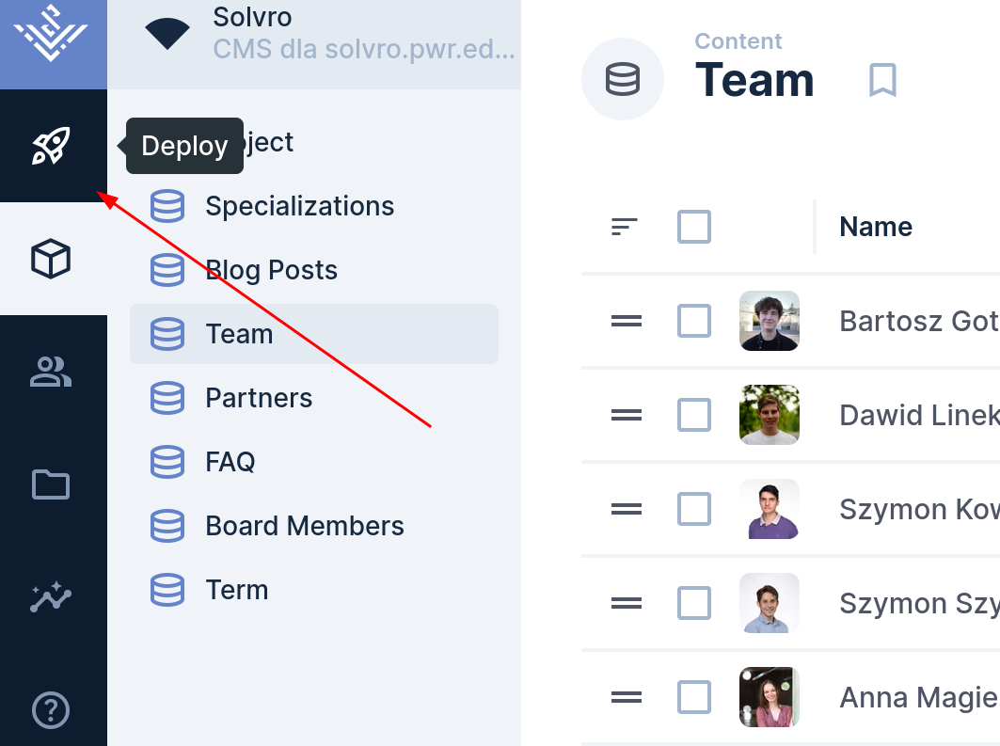
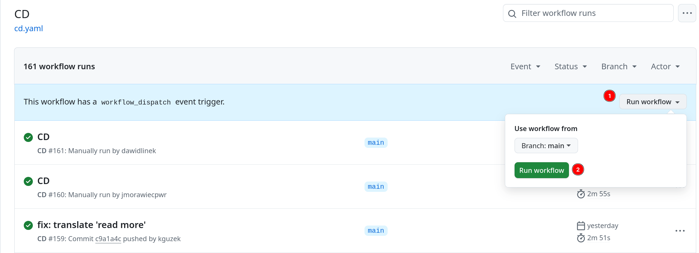

## Jak zmieniać treści na stronie Solvro

1. VPN Politechniki Wrocławskiej (opcjonalne)

   Aby dostać się do naszego systemu zarządzania treścią, należy najpierw pobrać VPN studencki ze strony [https://di.pwr.edu.pl/uslugi/siec/vpn/globalprotect-vpn-dla-studentow](https://di.pwr.edu.pl/uslugi/siec/vpn/globalprotect-vpn-dla-studentow)

1. Wejście do CMS'a

   - Jak pobrałeś VPN'a wystarczy wejść na stronę <https://cms.solvro.pl>

   - Jeśli nie, wejdź na stronę <https://vpn.student.pwr.edu.pl/https/cms.solvro.pl/admin>, zaloguj się swoimi danymi z USOSa. Po zalogowaniu się wejdź jeszcze raz w ten sam link.

1. Logowanie

   

   Jeśli nie masz dostępu napisz na kanale [#frontend](https://discord.com/channels/687360174377533442/899370698869461072), a ktoś Cię doda w najbliższym czasie.

1. Edycja treści

   Strona stoi na [Directusie](https://directus.io/) i edycja treści jest raczej intuicyjna, pamiętaj, żeby zawsze zapisywać zmiany.

1. Wdrożenie zmian na stronie

   Klikasz przycisk w lewym górnym rogu z rakietą, który przekierowuje na stronę Githuba. Jeśli nie masz zainstalowanego VPN'a, wejdź ręcznie w link <https://github.com/Solvro/web-solvro.pwr.edu.pl/actions/workflows/cd.yaml>, bo przekierowanie nie zadziała poprawnie.

   

1. Deploooy!

   Kliknij Run Workflow, a potem zielony przycisk Run Workflow. Po chwili zmiany powinny być widoczne na stronie.

   Jeśli nie masz dostępów do Github Actions, napisz na kanale [#frontend](https://discord.com/channels/687360174377533442/899370698869461072), a ktoś Cię doda w najbliższym czasie.

   

1. Poczekaj chwilę (około 3 minuty) i strona powinna mieć twoje zmiany!
