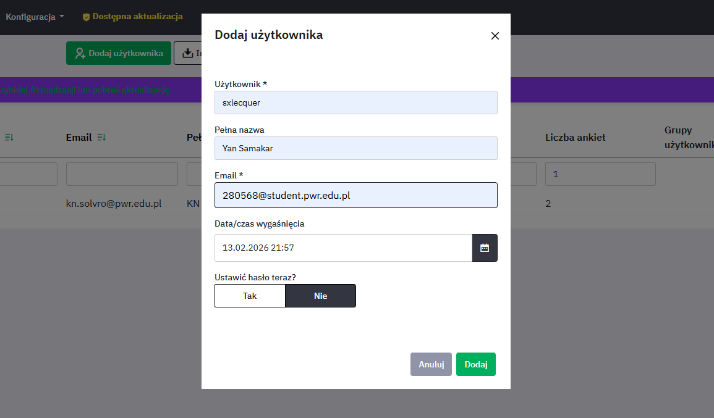
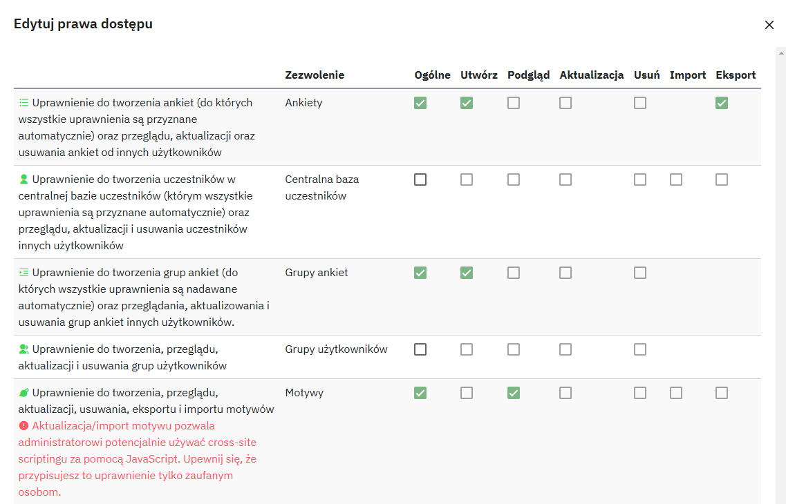
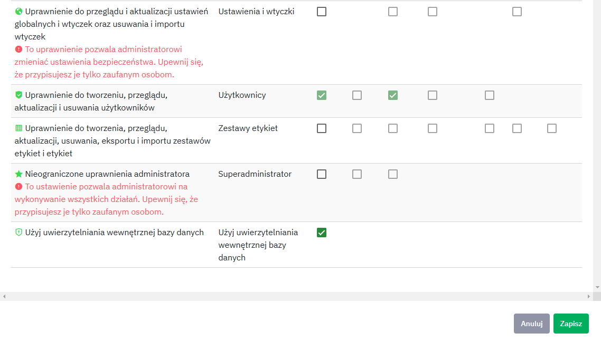

## Instrukcja zarządzania LimeSurvey

### Dostęp do platformy

**URL instancji:** https://limesurvey.s.solvro.pl  
**Adres URL logowania:** https://limesurvey.s.solvro.pl/admin  
**E-mail do pomocy technicznej:** kn.solvro@pwr.edu.pl

📩 Studenci muszą poprosić o konta za pośrednictwem maila, podając następujące informacje:

- Preferowana nazwę użytkownika
- Imię i nazwisko
- Krótki opis celu badań

> ℹ️ Użytkownik musi pisać ze studenckiego adresu, tj. adres musi kończyć się na **_@student.pwr.edu.pl_**

### Tworzenie nowego użytkownika w LimeSurvey

Aby utworzyć nowego użytkownika, otwórz okno zarządzania użytkownikami, klikając `Konfiguracja` (znajdująca się na
głównym pasku narzędzi LimeSurvey) → `Zarządzanie użytkownikami`.  
Następnie kliknij `Dodaj użytkownika`, znajdujące się w górnej części tabeli kontrolnej użytkowników. Pojawi się
okno, w którym należy:

- Wprowadzić pożądaną nazwę użytkownika w polu **Użytkownik**.
- Wprowadzić imię i nazwisko użytkownika w polu **Pełna nazwa**. Pełna nazwa użytkownika będzie używana jako domyślna nazwa
- Wprowadzić adres e-mail w polu **Email**. Należy pamiętać, że:
  - LimeSurvey wysyła e-mail potwierdzający na wprowadzony adres e-mail. Adres ten będzie używany jako domyślny adres
    kontaktowy dla ankiet tworzonych przez tego użytkownika.
  - Jeśli nie chcesz, aby użytkownik otrzymał wiadomość e-mail z linkiem do LimeSurvey, nazwą użytkownika i hasłem,
    możesz użyć własnego adresu e-mail do odbioru tej wiadomości. Po jej otrzymaniu możesz zmienić adres na właściwy.
    kontaktowa dla ankiet utworzonych przez tego użytkownika.
- Opcjonalnie ustawić **Datę/czas wygaśnięcia**, jeśli chcesz ograniczyć czas dostępu użytkownika do systemu. Po upływie tego
  terminu użytkownik nie będzie mógł się zalogować.
- Opcjonalnie ustawić hasło początkowe użytkownika, ale warto go poinformować, że powinien je zmienić po pierwszym
  logowaniu.
- Kliknij `Dodaj`, aby utworzyć nowego użytkownika.

Następnie system zapyta, jakie uprawnienia będzie miał użytkownik.

### Zarządzanie uprawnieniami

Możesz teraz dodać lub usunąć następujące uprawnienia:

- **Zbiory etykiet**: Uprawnienia do tworzenia, przeglądania, aktualizowania, usuwania, eksportowania i importowania
  zbiorów etykiet. Zbiory etykiet nie posiadają specyficznych uprawnień (w przeciwieństwie do motywów).
- **Ustawienia i wtyczki**: Umożliwia użytkownikowi sprawdzanie integralności danych, zapisywanie bazy SQL do pliku
  .sql, zarządzanie ustawieniami globalnymi, przeglądanie informacji o PHP oraz zarządzanie wszystkimi wtyczkami.
- **Grupy ankiet**: Daje dostęp do wszystkich grup ankiet. Aby umożliwić użytkownikowi zarządzanie własnymi grupami
  ankiet, należy nadać mu uprawnienie tworzenia. Twórca grupy ankiet jest jej właścicielem domyślnie.
  > ℹ️ Uprawnienie do grupy ankiet nie daje automatycznie dostępu do wszystkich ankiet, ale użytkownik może nadać
  > uprawnienia do wszystkich ankiet w ramach grupy.
- **Ankiety**: Umożliwia dostęp do wszystkich ankiet. Aby pozwolić użytkownikowi na tworzenie i zarządzanie tylko
  własnymi ankietami, nadaj mu uprawnienie tworzenia. Twórca ankiety jest jej właścicielem i zawsze będzie miał do niej
  dostęp. Pamiętaj, że każda ankieta może mieć różne uprawnienia.
  > ℹ️ Uprawnienia globalne są stosowane przed uprawnieniami specyficznymi dla ankiety!
- **Motywy**: Umożliwia użytkownikowi korzystanie z wszystkich dostępnych motywów oraz edycję niestandardowych motywów.
  Osoba posiadająca to uprawnienie powinna znać się na HTML, JavaScript i CSS. Jeśli użytkownik ma korzystać tylko z
  określonych motywów, lepiej nadać mu tylko uprawnienie odczytu.
- **Grupy użytkowników**: Pozwala użytkownikowi tworzyć, przeglądać, aktualizować i usuwać grupy użytkowników.
- **Użytkownicy**: Pozwala użytkownikowi tworzyć, modyfikować i usuwać własnych użytkowników administracyjnych. Nowo
  utworzeni użytkownicy nie mogą mieć wyższych uprawnień niż ich twórca. Nie można edytować użytkowników należących do
  innych administratorów, chyba że nadano uprawnienie Superadministratora.
- **Superadministrator**: Może być nadany tylko przez innego Superadministratora i daje pełny dostęp do całej aplikacji
  LimeSurvey, w tym do instalacji wtyczek oraz używania dowolnych treści (w tym JavaScript) w ankietach.
- **Używanie wewnętrznej autoryzacji bazy danych**: Pozwala użytkownikowi logować się do LimeSurvey poprzez stronę
  uwierzytelniania (np. http://domain/admin/authentication/sa/login). Jeśli ta opcja jest odznaczona, użytkownik otrzyma
  komunikat o błędzie: „Wewnętrzna metoda uwierzytelniania bazy danych nie jest dozwolona dla tego użytkownika”.
  > ℹ️ Wszystkie powyższe uprawnienia nadane Superadministratorowi nie mogą zostać usunięte przez interfejs
  > użytkownika (GUI).

#### Minimalny zestaw uprawnień dla użytkownika zarządzającego własnymi ankietami:

- **Surveys → Create** – pozwala użytkownikowi tworzyć, aktualizować oraz usuwać **_tylko swoje ankiety_**
- **Surveys → Export / Import** – pozwala eksportować i importować ankiety w formacie LimeSurvey.
- **Survey groups → Create** – jeśli użytkownik ma organizować ankiety w grupach.
- **Themes → View/read** – umożliwia korzystanie z dostępnych motywów ankiet.
- **Users → View/read** - umożliwia dodanie innego użytkownika do ankiety w celu współpracy.
- **Use internal database authentication** – użytkownik musi mieć możliwość logowania się do panelu LimeSurvey.

#### Czego użytkownik NIE powinien mieć:

- **Surveys → Read / Update / Delete** – pozwala na zarządzanie wszystkimi ankietami, nie tylko swoimi.
- **Surveys groups → Read / Update / Delete** – pozwala na zarządzanie wszystkimi grupami ankiet, nie tylko swoimi.
- **Superadministrator** – daje pełne uprawnienia do systemu, co jest zbędne dla zwykłego użytkownika.
- **Users → Create / Update / Delete** – użytkownik nie powinien zarządzać innymi użytkownikami.
- **Settings & Plugins** – zarządzanie ustawieniami globalnymi i pluginami.

### 📺 Tutorial: Tworzenie ankiet w LimeSurvey

Jeśli dopiero zaczynasz pracę z LimeSurvey lub potrzebujesz krótkiego przewodnika, obejrzyj ten filmik:

🔗 **Obejrzyj tutaj:** [Jak tworzyć ankiety w LimeSurvey](https://www.youtube.com/watch?v=H8hQ4kk55SM)

W tym filmie znajdziesz instrukcję krok po kroku, w tym:  
✔️ Tworzenie nowej ankiety  
✔️ Dodawanie i edytowanie pytań  
✔️ Zarządzanie strukturą i logiką ankiety  
✔️ Aktywowanie i udostępnianie ankiety

Więcej szczegółowych informacji znajdziesz w [kolejnych filmach](https://www.youtube.com/@limesurvey-tutorials7197/videos) tego autora. 🚀

### Domyślny motyw ankiet

Wszystkie nowo utworzone ankiety mają domyślnie przypisany motyw "**solvro**", który został zaprojektowany specjalnie na
potrzeby naszego koła. Dzięki temu ankiety mają spójny wygląd i są dostosowane do naszych standardów wizualnych. 😊

> 💡 Jeśli chcesz użyć innego motywu, możesz zmienić go w ustawieniach ankiety:  
> **Survey → Settings → General → "Theme" section**

### Przykładowa ankieta

Aby lepiej zrozumieć możliwości LimeSurvey oraz przetestować działanie platformy, przygotowaliśmy przykładową ankietę dotyczącą opinii o systemie LimeSurvey Solvro.

🔗 Ankieta jest dostępna pod [tym linkiem](https://limesurvey.s.solvro.pl/index.php/424459?lang=pl).

Ankieta może służyć jako przykład dla nowych użytkowników LimeSurvey oraz jako inspiracja do tworzenia własnych badań.
