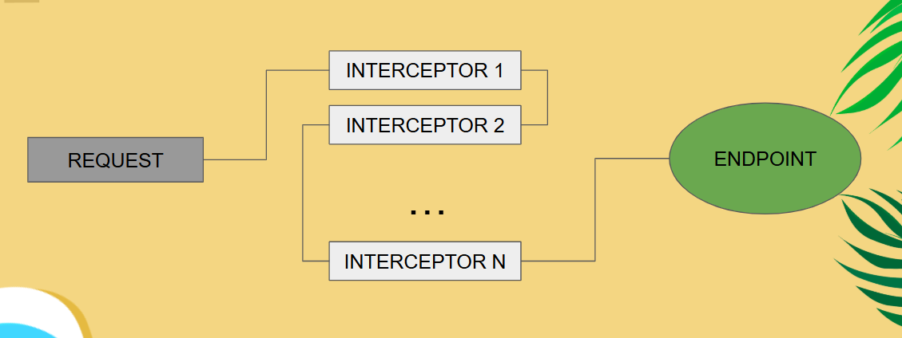
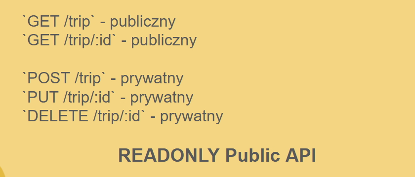
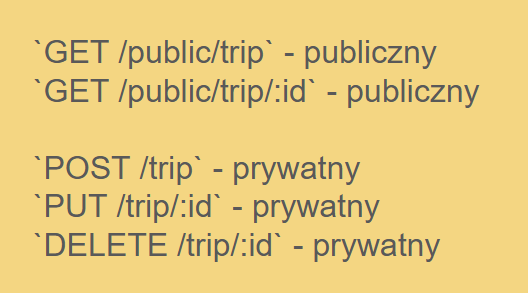
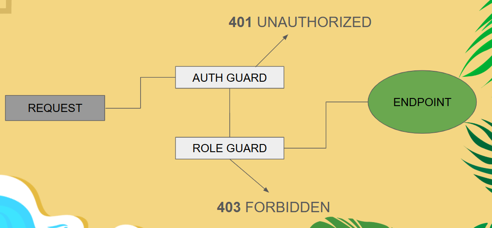
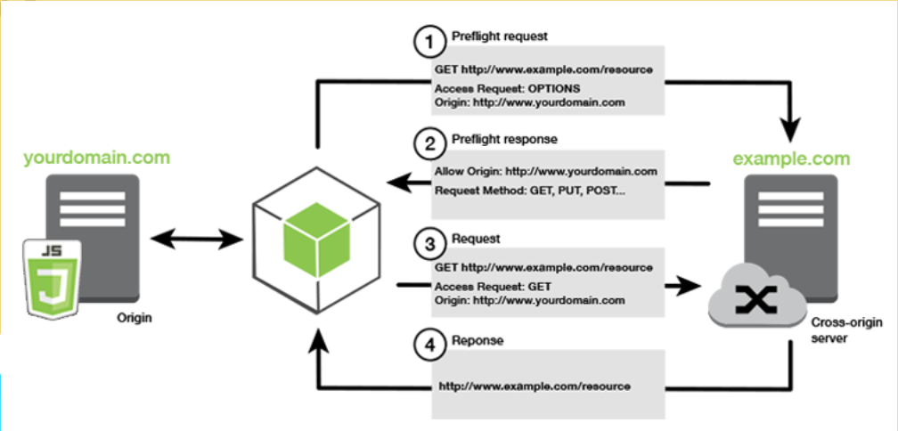

## Wstęp

Autoryzacja jest potrzebna w zasadzie w każdej aplikacji. Nawet jeżeli nasze API jest całkowicie publiczne i dostępne dla każdego,
to przydałoby się aby nowe treści można było dodać poprzez pewnego rodzaju panel administratora. W tym rozdziale zostaną wytłomaczone podstawy
przebiegu i metod autoryzacji, opisane kilka dobrych praktyk związanych z nimi oraz, dodatkowo, znajdzie się sekcja o walidacji danych wejściowych.


Kod zawarty w tym poradniki można zobaczyć w całości w [repozytorium z Wakacyjnego Wyzwania 2025](https://github.com/Solvro/backend-wakacyjne-wyzwanie-2025)

----------------

## Autoryzacja

### 1. „Co zrobić z tym hasłem?”

Nieodłącznym elementem autoryzacji jest potrzeba udowodnienia, że ty, jako osoba wysyłająca zapytanie, jesteś tym za kogo się podajesz.

Najprostszym sposobem jest użycie zwykłego hasła dostępu, powiązanego z kontem danego użytkownika. Jednak sama obecność hasła stwarza zagrożenie dla
developera aplikacji - hasła mogą bowiem wyciec, czy zostać ukradzione. Dlatego należy zastanowić się w jaki sposób takie hasło można bezpiecznie
przechowywać. Tutaj pojawiają się dwa słowa: hashowanie oraz enkrypcja. Poniżej definicje z Oxford Languages Dictionary (przetłumaczone):

**Enkrypcja (Encryption)** - *odwracalny proces zamiany informacji lub danych w kod/szyfr, szczególnie aby uniemożliwić nieautoryzowany dostęp.*

**Hashowanie (Hashing)** - *zamiana kawałka danych na numeryczny lub alfanumeryczny łańcuch znaków za pomocą funkcji, której rezultat ma zawsze tą samą długość.*

Do hasła jednak, najlepsze jest hashowanie - wtedy, nawet w przypadku wycieku danych, złodziej nie jest w stanie odzyskać pierwotnego hasła z hashu. Zatem typowy *flow* rejestracji użytkownika oraz
logowania wygląda następująco:

Flow rejestracji:

1. Hasło jako łańcuch znaków (plaintext)
2. Hashowane za pomocą wyznaczonej funkcji
3. Przechowujemy tylko hash

Flow logowania:

1. Hasło jako łańcuch znaków (plaintext)
2. Hashowane za pomocą wyznaczonej funkcji
3. Wyciągamy hash hasła z bazy danych
4. Porównujemy dwie wartości do siebie

Charakterystyka każdej poprawniej funkcji hashującej gwarantuje nam unikalny hash dla każdego ciągu znaków, i zawsze ten sam hash dla tego samego ciągu znaków.

Pozostaje nam pytanie, jaki hash wybrać? Najpopularniejszą opcją dla haseł jest funkcja haszująca “bcrypt” wynaleziony w 1999 roku.
Złożoność hashu powstałego z tej funkcji można modyfikować wybierając liczbę rund hashowania - implementacja w JS (node.bcrypt.js), jako wartość domyślną, wybiera 10 rund,
a wartością maksymalną jest 20. Biblioteka ma bardzo proste API, przykładowo, do sprawdzenia czy hasło zgadza się z hashem wystarczy użycie funkcji `compare`:

```ts
async signIn(email: string, password: string): Promise<LoginResponseDto> {
        const user = await this.usersService.findOne(email);
        if (user === null || !await compare(password, user.password).catch(() => false)) {
            throw new UnauthorizedException();
        }
        return {token: this.generateToken(user.email)};
}
```

### 2. „Endpoint to koniec drogi zapytania - Interceptors”

Jednak użytkownik może wysyłać wiele zapytań, a przesyłanie i weryfikowanie hasła za każdym razem stwarza zagrożenie bezpieczeństwa -
powinniśmy dążyć do tego, by hasło było przesyłane jak najrzadszej. Tutaj z pomocą przychodzą ciastka i headery, w których możemy zawrzeć
dodatkowe informacje, automatycznie, nie robiąc trudu użytkownikowi. O tym czym są ciastka i headery było opowiedziane, w poprzednich etapach
kursu, dlatego już bez zbędnego przedłużania, zastanówmy się jak można ich użyć do autoryzacji. Najprostszym i najlepszym pomysłem jest następujący
flow zapytania:

Flow każdego zapytania wymagającego autoryzacji:

1. Klient automatycznie dodaje unikalną informację do każdego zapytania
2. Weryfikujemy tą informację na serwerze
3. Zapytanie przechodzi dalej lub zostaje odrzucone

Z pomocą tutaj przychodzą *interceptory*, zwane czasami *filtrami*, czy *guardami*. Idea jest jedna - zareaguj na, przekształć, lub odrzuć zapytanie.



My zajmiemy się tzw. Guards, które działają jak służba celna - mają na celu zbadać, czy zapytanie może wejść do naszego endpoint’u. Powstaje jednak pytanie, co badać i jak badać?

Temat jest bardzo obszerny, ale my skupimy się na jednym z najpopularniejszych i
 nie wymagającym utrzymania żadnego stanu na naszym serwerze rozwiązaniu - dzięki temu nie będzie problemów z utrzymaniem sesji.

Podstawowe kryteria:
- unikalna wartość dla każdego użytkownika
- z wartości można uzyskać identyfikator użytkownika
- wartość jest przekazana klientowi podczas logowania

Dodatkowo (dzisiaj się tym nie zajmujemy):

- wartość powinna być unikalna dla każdego logowania
- wartość powinna mieć swój czas ważności
- wartość powinna być zaenkryptowana by uniemożliwić zmianę danych w niej zawartych

Wady rozwiązania:

- ukradziona wartość pozwala się bez żadnych problemów podszyć pod właściciela wartości
- brak wiedzy o zalogowanych urządzeniach (wartość nie jest zależna od urządzenia)

Oczywiście, nawet te problemy mają swoje rozwiązania, ale w tym poradniku nie będziemy się nimi przejmować. Poniżej znajduje się najprostsze rozwiązanie
spełniające trzy podstawowe kryteria (**oczywiście nie jest ono w żadnym wypadku bezpiecznie - jedynie poglądowe**)

```ts
// Walidacja tokenów
async validateToken(token: string): Promise<UserMetadata> {
    return token.startsWith(this.tokenPrefix) ?
        await this.usersService.findMetadataOrFail(token.slice(this.tokenPrefix.length))
        : Promise.reject(new Error("Invalid token"));
}
// Generowanie tokenów
generateToken(email: string): string {
    return `${this.tokenPrefix}${email}`;
}
```

W NestJS, każdy *Guard* implementuje metodę `canActivate` zwracającą wartości boolean. Jeżeli metoda zwróci fałsz lub rzuci wyjątek,
zapytanie jest odrzucane. W przypadku wartości `true`, zapytanie przechodzi do następnego interceptora, lub, jeżeli już nie ma żadnego w kolejce, do naszego
endpointu.

```ts
// Autoryzacja zapytania w interceptorze
async canActivate(context: ExecutionContext): Promise<boolean> {
        const request: RequestWithUser = context.switchToHttp().getRequest();
        const token = this.extractTokenFromHeader(request);
        if (token === undefined) {
            throw new UnauthorizedException("Missing token");
        }
        try {
            request.user = await this.authService.validateToken(token);
        } catch (error) {
            throw new UnauthorizedException((error as Error).message);
        }
        return true;
}
```

### 3. „Nie zawsze wszystko jest dla wszystkich, czyli po co dzielić nasze endpointy?”

Przy podstawowej konfiguracji w NestJS, każdy endpoint z adnotacją `@UseGuards(AuthGuard)` staje się prywatny. Analogicznie, wszystkie bez tej adnotacji są publiczne.

Często wymaganie jest tzw. "Read-Only Public API", czyli API, które jest dostępne publicznie dla każdego do odczytu, ale jakiekolwiek modyfikacje
wymagają dodatkowych uprawinień.



### 4. “Wspólne i nasze – Public & Private API pattern”

Aby ułatwić i rozgraniczyć API, z pomocą przychodzi wzorzec "Public & Private API". Podczas kursu nie będziemy używać tego wzorca, ponieważ łamie on niektóre zasady REST. Wspominam o nim, ponieważ jest czasami używany i osobiście jestem jego fanem 👍

Idea jest prosta:

- wszystkie endpointu zaczynające się z prefixem `/public` lub `/na` (non-authenticated), itp. są dostępne publiczne
- wszystkie inne są prywatne



Zalety wzorca to m.in. łatwe instalowanie interceptorów oraz wiedza co wymaga zalogowania, a co nie, bez zagłębiania się w dokumentację.
Jako wady można wymienić, obecność tych samych zasobów pod innymi ścieżkami, czy np. dwa razy więcej kontrolerów.

### 5. „Ta część jest tylko dla mnie, czyli RBAC”

Czasami jednak samo zalogowanie się na konto nie wystarczy, albowiem nie każdy użytkownik jest równy. Pojawia się nowe pojęcie, często mylone z tym przez Was już znanym,
czyli Authentication i Authorization.

Authentication, to sprawdzenia kim jest dany użytkownik. Można rozumieć to jako przedstawienie się. Udowodnienie, że nie jest się obcym. Innymi słowy, zalogowanie się.
Authorization, to sprawdzenie jakie uprawnienia ma dany użytkownik. Tutaj metaforom może być sprawdzenie jakie ma wykształcenie, gdzie pracuje, ile ma lat.

W aplikacjach problem uprawnień często się pojawia. Najprostszym przykładem będzie użytkownik zwykły oraz użytkownik Administrator. Najprostsze rozwiązanie (ale nie najlepsze), to **RBAC**, skrót od **Role Based Access Control**.
Każdy użytkownik ma jedną, lub kilka, przypisanych roli, a do niektórych działań wymagane są poszczególne role.



Warto też zaznaczyć różnicę pomiędzy kodem błędu 401 i 403. 401 oznacza, że serwer nie wie kim jesteś. 403 natomiast, oznacza, że serwer wie kim jesteś, ale nie ma uprawnień by zrobić to co chciałeś.

Implementacja podstawowego RBAC w NestJS jest prosta. Załóżmy, że każdy użytkownik ma przypisaną jedną rolę.

```ts
// RoleGuard, interceptor, który sprawdza uprawnienia
@Injectable()
export class RoleGuard implements CanActivate {
    constructor(private reflector: Reflector) {
    }

    canActivate(context: ExecutionContext): boolean {
        const requiredRoles = this.reflector.getAllAndOverride<Role[]>(ROLES_KEY, [
            context.getHandler(),
            context.getClass(),
        ]);
        if (requiredRoles.length === 0) {
            return true;
        }
        const request: RequestWithUser = context.switchToHttp().getRequest();
        return request.user !== undefined && requiredRoles.includes(request.user.role);
    }
}
// dekorator (adnotacja) do endpointów
export const ROLES_KEY = 'roles';
export const Roles = (...roles: Role[]) => SetMetadata(ROLES_KEY, roles);
```

Użycie takiego interceptora jest dość intuicyjne i proste. Wystarczy dodać adnotację `@UserGuards` nad endpointem, tak jak w przypadku naszego "AuthGuard",
oraz adnotację `@Roles` z naszego dekoratora z wymienionymi rolami. Przykładowo, endpoint poniżej jest dostępny jedynie dla administratora.

```ts
@UseGuards(AuthGuard, RoleGuard)
@Roles(Role.ADMIN)
async disableUser(@Param('email') email: string) {
    return this.userService.disableAccount(email);
}
```

Pozostaje jeszcze odpowiedź na pytanie, czemu takie rozwiązanie nie jest najlepsze. Powodem jest ilość ról, a dokładniej nakładanie się uprawnień.
Przykład poniżej pochodzi z jednego z projektów, które pisałem (kod jest z Javy):

```java
enum Permission {
    ADMIN(128),
    TEAM_OWNER(64),
    DRIVER(32)
    RACE(16),
    TASK(8),
    EVENT_SEND(4),
    EVENT_RECEIVE(2),
    USER(1),
    BLOCKED(0);
}
```

Co jeżeli użytkownik może wysyłać eventy, nie może ich odbierać, jest kierowcą, użytkownikiem, może zarządzać zadaniami, ale nie może zarządzać wyścigiem?

Rozwiązania są dwa:

1.  Pozwalamy aby jeden użytkownik miał kilka roli (dodatkowe tabele w bazie danych i overhead na bardzo częstej operacji)
2.  Tworzymy hybrydowe role: EventSendDriverTaskUser... (i wszystkie możliwe kombinacje?)

Żadne z nich nie jest dobre - są to limitacje prostego RBAC. Najlepszym rozwiązaniem jest zmiany systemu kontroli na inny (np. ACL).
Czasami jednak trzeba customowy system samemu napisać, bo większość frameworków oferuje jedynie wbudowane implementacje dla RBAC.

### 6. „Nie lubimy obcych - CORS”

Kilka słów o **CORS** (skrót od **Cross-Origin Resource Sharing**).

Jest to mechanizm dla przeglądarek internetowych, który kontroluje czy dana domena może uzyskać zasoby od innej. Przed wysłaniem prawdziwego
zapytania, klient wysyła zapytanie typu OPTIONS, tzw. "preflight request" z danymi klienta, które trafia do pierwszego interceptora na serwerze. Tylko, i tylko wtedy gdy, odpowiedź
na to zapytanie jest pozytywna, to klient wysyła drugie, już właściwe, zapytanie.



Konfiguracja CORS w NestJS jest bardzo prosta i wymaga w zasadzie jednej linijki kodu:

```ts
/// main.ts
app.enableCors({
        methods: ['GET', 'POST', 'PUT', 'DELETE', 'OPTIONS', 'PATCH'],
        origin: 'http://localhost:5500',
        preflightContinue: false,
});
```
Określamy jakie typy zapytań są dopuszczalne, i jakie źródła akceptujemy.

### 7. „Nasze 500, to dalej 500 – Walidatory”

Nieodłączną częścią każdego API jest walidacja danych wejściowych. Pozwala to nie tylko uniknąć nieprawidłowych danych, ale również
uchronić nas przed nieoczekiwanymi błędami. NestJS bez problemów wspiera różne techniki walidacji danych, a zaczęcie wymaga jedynie instalacji
pakietów: `npm i --save class-validator class-transformer`.

#### Pipes

Pipe (dosłowne, ale raczej nie używane tłumaczenie - "rura"), to element biblioteki `class-transformer`. Celem jest transformacja i jednoczenie
walidacja danych. Spójrz na przykład poniżej używający wbudowanej `ParseIntPipe`:

```ts
@Get(":id")
async findOne(@Param("id", ParseIntPipe) id: number) {
    return this.tripService.findOne(id);
}

@Patch(":id")
async update(@Param("id") id: string, @Body() updateTripDto: UpdateTripDto) {
    return this.tripService.update(+id, updateTripDto);
}
```
Załóżmy, że klient wyśle zapytanie, gdzie parametr `id` nie będzie liczbą.

Pierwsze rozwiązanie (z `ParseIntPipe`), zwróci do klienta odpowiedź z kodem 400 i informacją o ty, że `id` musi być liczbą całkowitą.
Drugie zaś, wyrzuci kod błędu 500, bo serwer nie może zamienić nie-liczby na liczbę za pomocą sztuczki z `+`.

### Walidacja DTO

Walidacja DTO jest również prosta. Nad każdym z pól wymagających walidacji umieszczamy odpowiednie dekoratory. W przypadku, gdy walidacja zakończy się
błędem, użytkownik dostanie odpowiedź z kodem 400 i, opcjonalnie, mniej lub bardzie szczegółową wiadomością o błędzie - zależy to od nas.
Za pomocą wbudowanych walidatorów można sprawdzić większość potrzebnych kryteriów - nazwa walidatora przekazuje co dany walidator sprawdza.

```ts
export class CreateTripDto {
    @IsString()
    @Length(3, 255)
    name: string;

    @IsOptional()
    @IsNumber()
    @Min(0)
    plannedBudget?: number;
}
```

Jeżeli wbudowane walidatory nie wystarczą, możemy zawsze stworzyć swój własny. Załóżmy, że celem jest moderacja danych użytkownika - jego status
nie może zawierać pewnych słów.

```ts
// nice-text.validator.ts
@ValidatorConstraint({name: 'niceText', async: false})
export class NiceText implements ValidatorConstraintInterface {
    validate(text: string, _: ValidationArguments) {
        return !text.includes("loser");
    }

    defaultMessage(_: ValidationArguments) {
        return "That's not a nice text, is it?";
    }
}
```

Nasz walidator zawiera metodę `validate`, która zwraca fałsz jeżeli niedozwolone słowo zostanie wykryte, oraz metodę `defaultMessage` z informacją dla klienta o tym co poszło nie tak.
Sposób użycia customowego walidatora jest taki sam jak tych wbudowanych, poprzez dekorator `@Validate(NazwaKlasyWalidatora):

```ts
export class UserUpdateDto {
  @IsOptional()
  @IsString()
  @MaxLength(30)
  @Validate(NiceText)
  newAboutMe?: string | null;
  @IsOptional()
  @MaxLength(15)
  @IsOptional()
  @IsString()
  name?: string | null;
}
```

## Zadanie do wykonania

Zadanie domowe do wykonania znajduje się na [głównych repozytorium](https://github.com/Solvro/backend-wakacyjne-wyzwanie-2025/blob/main/4.%20Autoryzacja%20i%20walidatory/4.md)

## Materiały

- Link do [nagrania prezentacji](https://drive.google.com/file/d/136PmaiBlXc1wRuipbGF2iG7x-D8HI-r4/view?usp=sharing) z wykładu
- Slajdy z prezentacji
- Repozytorium z kodem przedstawionym podczas prezentacji: [link do repozytorium](https://github.com/Solvro/backend-wakacyjne-wyzwanie-2025/blob/main/4.%20Autoryzacja%20i%20walidatory/4.md)
- https://docs.nestjs.com/security
- https://github.com/kelektiv/node.bcrypt.js#readme
- https://github.com/expressjs/cors#configuration-options
- https://github.com/typestack/class-validator (walidatory używane przez Nest'a)
