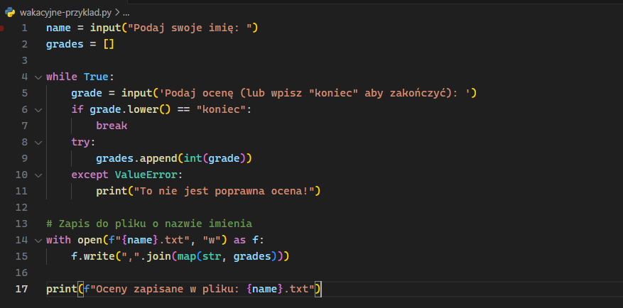
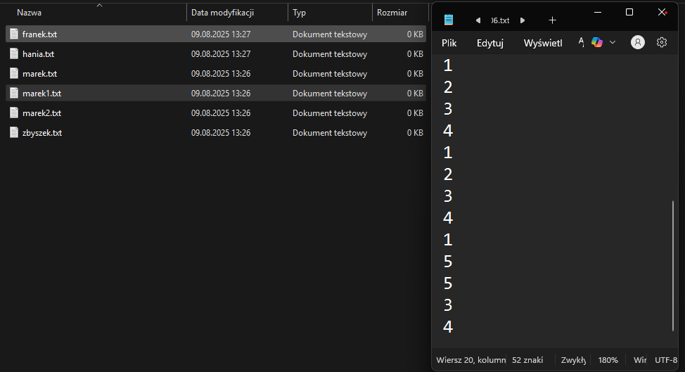

## Baza danych

Zacznijmy od prostego przykładu, mamy przykładowa aplikacje, która odpytuje użytkownika o jego imię a nastepnie o liczbe ocen potrzebnych do obliczenia sredniej. Aplikacja działa, jednak ma jeden problem stan aplikacji przepada po jej zamknieciu, uzytkownik musi sie witać od nowa i wprowadzać oceny jeszcze raz.

Przy małej liczbie ocen nie jest to problemem ale co jesli ocen jest 50/60/70+?. Oczywiscie moglibysmy rozszerzyć aplikacje o tworzenie plikow z imieniem uzytkownika i zapisem jego dotychczasowych danych ale co jeśli bedzie dwoch uzytkowników o tym samym imieniu?

Podejscie z plikami jest bardzo trywialne, nieustruktyryzowane, do tego do tak prostej aplikacji juz potrzebujemy dokumentacji dla przyszłych developerów opisujacej jak dziala nasz system przechowywania danych. Baza danych jest narzedziem stworzonym wlasnie do przechowywania danych w **ustruktyryzowanym** formacie z **określonymi regułami**.

### Relacyjne bazy danych

Rodzajów baz danych jest wiele o czym wspomnimy za chwile, jednak najczejsciej spotykamy sie z relacyjnymi bazami danych. Relacyjne bazy danych to rodzaj bazy , w której dane są zorganizowane w **tabele** zawierające **wiersze i kolumny**, a między tymi tabelami można tworzyć powiązania (**relacje**).
