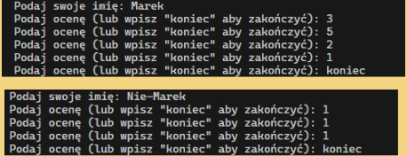
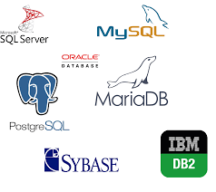

## Baza danych


Zacznijmy od prostego przykładu: mamy przykładową aplikację, która pyta użytkownika o jego imię, a następnie o liczbę ocen potrzebnych do obliczenia średniej. Aplikacja działa, jednak ma jeden problem — stan aplikacji przepada po jej zamknięciu. Użytkownik musi witać się od nowa i wprowadzać oceny jeszcze raz.

Przy małej liczbie ocen nie jest to problemem, ale co, jeśli ocen jest 50, 60, 70 lub więcej? Oczywiście moglibyśmy rozszerzyć aplikację o tworzenie plików z imieniem użytkownika i zapisem jego dotychczasowych danych, ale co, jeśli będzie dwóch użytkowników o tym samym imieniu?

Podejście z plikami jest bardzo trywialne, nieustrukturyzowane, a do tego — nawet w tak prostej aplikacji — już potrzebujemy dokumentacji dla przyszłych developerów, opisującej, jak działa nasz system przechowywania danych. Baza danych jest narzędziem stworzonym właśnie do przechowywania danych w **ustrukturyzowanym formacie** z **określonymi regułami**.

## Praca z bazą danych dla backend developera


Aplikacje backendowe mają warstwy (tak jak cebule). Jest to wzorzec, dzięki któremu oddzielamy odpowiedzialność poszczególnych komponentów aplikacji. Mówiąc o bazach danych, zawsze będziemy myśleć o najniższych poziomach aplikacji — plikach/klasach nazywanych repozytoriami lub, nieco wyżej, serwisami (w zależności od konwencji w danym frameworku).


Mieliście już styczność z pierwszymi kontrolerami i serwisami. Początkowo może wydawać się bez sensu rozbijać funkcję, która ma dwie linijki, na aż dwa pliki, jednak ma to duże znaczenie architektoniczne.

Kontroler jest odpowiedzialny za odbieranie requestów z zewnątrz. Serwis z kolei odpowiada za logikę biznesową (np. odpytywanie bazy danych). Serwis nie potrzebuje wiedzieć, kto wysłał request, a jedynie, o co poprosił go kontroler. Z kolei kontroler nie musi wiedzieć, w jaki sposób serwis pobiera dane z bazy danych.

W ten sposób refaktoryzacja i debugowanie kodu stają się dużo prostsze, a programowanie — mniej łysinogenne.

### Relacyjne bazy danych

Rodzajów baz danych jest wiele (o czym wspomnimy za chwilę), jednak najczęściej spotykamy się z relacyjnymi bazami danych.
Relacyjne bazy danych to rodzaj bazy, w której dane są zorganizowane w **tabele** zawierające **wiersze i kolumny**. Każdy rekord w bazie danych ma swój unikalny identyfikator nazywany **kluczem głównym**, który możemy umieszczać jako **klucz obcy** w innych tabelach, tworząc w ten sposób między tymi tabelami **powiązania (relacje)**.


### Tabele, wiersze, kolumny, klucz główny

Trochę tego dużo, przejdźmy po kolei.

Na podanym przykładzie widzimy dwie **tabele**: Uczeń oraz Kurs.

Każda z tabel ma 3 **kolumny**, z czego jedna jest **kluczem głównym (id unikalny dla każdego obiektu)**.


### SQL

SQL (Structured Query Language) to język stworzony specjalnie do rozmawiania z bazami danych. Składnia języka SQL wygląda jak zdania w języku angielskim, składa się z **KEYWORDÓW** (konwencjonalnie pisanych dużymi literami) oraz **identyfikatorów** (nazwy rekordów).


### Typy danych

Każda kolumna w tabeli bazy danych musi mieć określony typ danych, który definiuje, jakie wartości mogą być w niej przechowywane. Typy danych w większości pokrywają się ze znanymi nam z klasycznych języków programowania, jednak z pewnymi różnicami.


### Modelowanie bazy danych

Modelowanie bazy danych na diagramie encji (ERD – Entity-Relationship Diagram) to proces wizualnego przedstawienia tego, jak dane w systemie są zorganizowane i w jaki sposób są ze sobą powiązane.

Dokumentowanie naszych relacji bazy danych w ten sposób znacznie pomaga zrozumieć strukturę i wykrywać błędy już na etapie modelowania.

Aby lepiej zrozumieć jak działają te całe bazy, relacje i diagramy encji, przejdźmy sobie po przykładzie i _zamodelujmy kawałek rzeczywistości_.

Załóżmy sobie, że mamy zlecenie na przygotowanie projektu bazy danych dla wydziału, który ma tylko jeden kierunek. W naszej bazie chcemy przechowywać dane o studentach, kursach i zostawić miejsce na rozszerzenia.

Zacznijmy od utworzenia trzech tabel dla każdej z wymienionych "wstaw tu coś".

Połączmy nasze trzy tabele relacjami. Zakładamy w systemie, że **kierunek może mieć wiele kursów** z nim powiązanych. Umieszczamy klucz obcy odpowiadający kierunkowi, do którego należy kurs w tabeli kursów. W taki sposób kurs wie, do jakiego kierunku należy, z kolei kierunek może mieć wiele (n) kursów, więc szukając swoich kursów musi przejrzeć całą tabelę kursów.

Analogicznie sprawa wygląda z uczniem, w naszym systemie zakładamy, że uczeń może należeć tylko do jednego kierunku.

Sprawa się komplikuje przy modelowaniu relacji **wiele do wielu**. W naszym systemie uczeń może należeć do wielu kursów, a do każdego kursu może należeć wielu uczniów. Relacje N do N modeluje się poprzez tabele pośredniczące, które będą przechowywać nasze kombinacje uczniów i kursów. Taka tabela może posiadać swój własny klucz główny (ale nie musi), w naszym systemie zakładamy, że uczeń może mieć wiele **ocen** z tego samego kursu, w takiej sytuacji **musimy** zapewnić, że rekordy w tabeli pośredniczącej będzie można od siebie odróżnić, w innym przypadku nie mielibyśmy jak zapisać np. dwóch tych samych ocen z danego kursu dla danego ucznia.

Projekt wyszedł tak super, że dostaliśmy zlecenie poszerzyć nasz system o możliwość dodawania wydziałów i pracowników do tych wydziałów. Po dodaniu odpowiednich kolumn i dwóch nowych tabel mogłoby się wydawać, że fajrant. Nic bardziej mylnego, bystre oko dojrzy pewną niespójność. Tabela pracownika i ucznia ma te same pola, odnosząc się do podobnego kawałka rzeczywistości. Założenie, że pracownik nie może być jednocześnie uczniem, jeszcze bylibyśmy w stanie to przepuścić, jednak jest to droga na skróty, która może mieć swoje konsekwencje w przyszłości.

Znacznie lepszym rozwiązaniem będzie przenieść część wspólną obu tych tabel do osobnej i połączyć relacją z istniejącymi.

### Normalizacja i relacje


Normalizacja to ważny temat (może nawet najważniejszy z tutaj podejmowanych), dlatego nawet nie będę próbował streszczać i wynajdywać koła na nowo. Odsyłam zainteresowanych do YouTube'a.
[Click me !!!](https://www.youtube.com/watch?v=GFQaEYEc8_8&t)


### DBMS-y

DBMS to warstwa bezpośrednio przy samej bazie danych i jest interfejsem, z którym się komunikujemy, by pracować z bazą danych. Czym się różnią? Jeden ma jako logo słonia, drugi fokę, a trzeci delfina, niektóre są opensource'owe, inne nie.

A tak na poważnie, **Oracle, MSSQL** są bardziej skierowane pod wielkie komercyjne systemy, **SQLite** spotkamy (chyba) na każdym telefonie. Do tego różnią się też typami danych, **PostgreSQL** jest bardzo rozbudowany pod tym względem - dostarcza takie typy jak ARRAY czy JSON, a nawet pozwala definiować swoje własne typy danych.


### Rodzaje baz danych

Zanim przejdziemy do praktyki, warto wspomnieć, że poza relacyjnymi bazami danych jest jeszcze wiele innych typów baz danych.

Relacyjne (RDBMS) – dane w tabelach (wiersze + kolumny) z relacjami między nimi; używają SQL. PostgreSQL, MySQL, Oracle, SQLite.

Dokumentowe (NoSQL) – przechowują dane w dokumentach (np. JSON), elastyczne struktury, brak sztywnego schematu. MongoDB, CouchDB.

Klucz–wartość – dane w parach klucz → wartość, bardzo szybki dostęp. Redis, Amazon DynamoDB.

Grafowe – dane jako węzły i krawędzie, idealne do sieci społecznych, powiązań, rekomendacji. Neo4j, JanusGraph.

Kolumnowe – dane przechowywane kolumnami, zoptymalizowane pod analitykę i hurtownie danych. Apache Cassandra, ClickHouse, HBase.


### Instalacja PostgreSQL

Dacie radę, nie zmieniajcie portu z **5432** i nie wpisujcie byle czego w **hasło**, bo to wszystko przyda się do łączenia się z bazą danych z kodu. Daliście radę z solvro configiem, dacie radę przeklikać instalację PostgreSQL.

## Prisma

```bash
npm install prisma --save-dev
npx prisma init
```

### Łączenie się z bazą

W tym momencie warto wspomnieć o **.env** oraz **.gitignore**.

- .gitignore to plik, który definiuje, które pliki/foldery/ścieżki mają być ignorowane przez gita (kontrolę wersji). Oznacza to tyle, że te pliki nie znajdą się na zdalnym repozytorium (GitHub).
- Nie wszystko z naszego kodu chcemy umieszczać publicznie, plik .env jest dokładnie miejscem, w którym ukrywamy wszystkie nasze klucze i dane dostępowe developerskie przed publiką.

**Przykład**: żeby połączyć się z bazą danych, potrzebujemy podać URI zawierające naszego użytkownika z bazy danych, hasło do tego użytkownika oraz adres i port, na którym pracuje serwis bazy danych. Są to informacje, których nie chcemy oddawać w ręce każdego, kto jest w stanie przejrzeć nasze repozytorium (a nawet jego historię).


### Modele

Następnym krokiem przygotowania do pracy z naszym ORM-em jest utworzenie modeli. Model to uniwersalny koncept, który jest niezależny od frameworka czy języka programowania. Model to nasza reprezentacja tabeli w kodzie, za pomocą której będziemy wykonywać zapytania do bazy danych.

ORM wyklucza nam pisanie kodu w SQL-u (jednak warto zwrócić uwagę, czy wasz ORM zezwala na korzystanie z rawSQL query do zapytań).


### Migracje

Migracje to mechanizm synchronizowania/utrwalania struktury bazy danych na podstawie zdefiniowanych modeli. Zapewniają kontrolę i wersjonowanie podczas wprowadzania zmian w strukturze bazy danych.

```bash
npx prisma migrate dev --name init
```


### Prisma Client

```bash
npm install @prisma/client
npx prisma generate
```


### Seedery

Seedery to skrypty, które wypełniają bazę danych przykładowymi lub początkowymi danymi (np. kontem admina, testowymi danymi).
Służą do szybkiego przygotowania środowiska developerskiego lub testowego bez ręcznego wprowadzania wpisów.


W Prismie jest to osobny plik **prisma/seed.ts** z pojedynczą funkcją, w której wykonujemy wszystkie potrzebne zapytania odpowiadające naszym potrzebom.

### Database service

```bash
npx nest generate module database
npx nest generate service database
```

Konfigurujemy moduł dla naszego połączenia z bazą danych.


W Nescie tworzymy osobny serwis, do którego oddelegowujemy inicjalizację Prisma Clienta i przez niego wykonujemy wszystkie zapytania.


Do dowolnych serwisów wstrzykujemy przez DI wcześniej skonfigurowany serwis.


### Narzędzia do pracy z bazą danych

Do pracy z bazą danych mamy bardzo wiele przeróżnych narzędzi:

Terminalowe CLI **psql, mysql**.
Wtyczki do VS Code (jak **DataClient**) czy do Jetbrains'owych IDE.

W pełni dedykowane rozwiązanie **PgAdmin4** - PostgreSQL,

**MySQL Workbench** - MySQL (_kto by się spodziewał_)

**DataGrip** - w pełni standalone IDE do pracy z bazą.


## Zadanie domowe
