## CRUD

**CRUD** czyli skrót od **Create**, **Read**, **Update**, **Delete**, to operacje za pomocą których można **zapisywać**, **pozyskiwać**, **modyfikować** i **usuwać** dane.

Jest to nam potrzebne, aby zarządzać i przechowywać stan aplikacji - dostępy użytkowników, content bloga czy wiadomości w komunikatorze.

## Przykłady CRUDów z codziennego życia

Wyniki z przeglądarki (kolejne linki do stron):

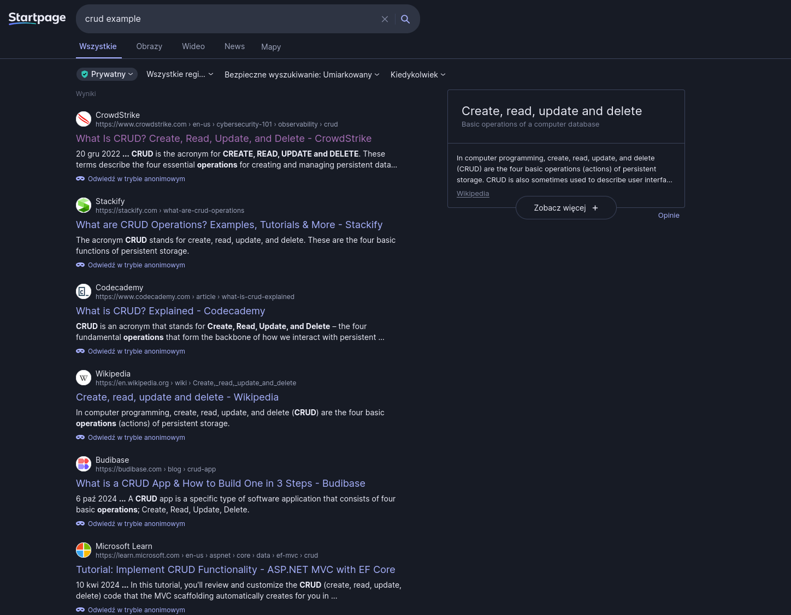

Treści artykułów na stronach blogowych:

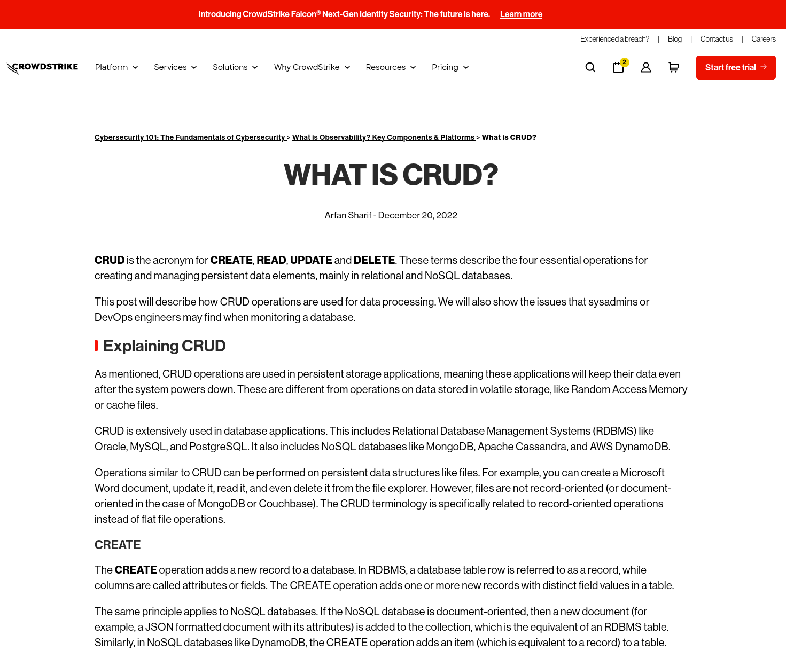

Czy choćby wiadomości z komunikatorów (w tym przypadku discord):

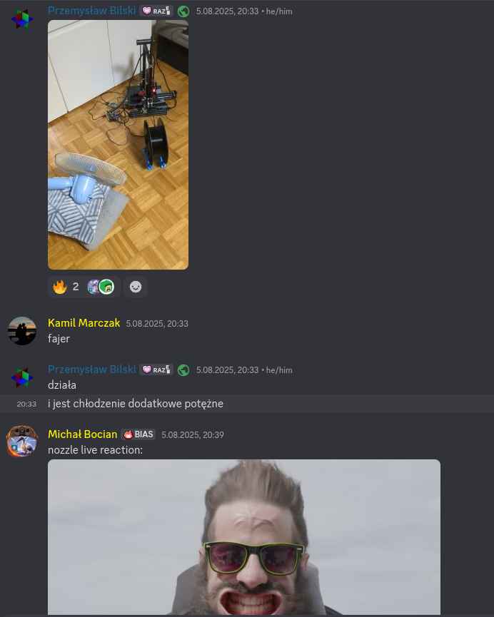

## REST

### Czym jest REST API?

REST API to styl architektury, który bardzo współgra z protokołem HTTP. Używa się go, bo jest prosty, skalowalny i niezależny od technologii. Wszystko w nim traktuje się jak zasób, przez co łatwo przypisać metody HTTP do poszczególnych operacji CRUD.

### CRUD na bazie RESTu

Istnieje łatwa do zapamiętania korelacja między CRUDem a metodami HTTP, które są wykorzystywane w REST API:

- **Read** lub odczytanie danego zasobu używa metody **GET**
- **Create** lub stworzenie danego zasobu używa metody **POST**
- **Update** lub aktualizacja danego zasobu używa metody **PUT**
- **Delete** lub usunięcie danego zasobu używa metody **DELETE**

## Przesyłanie danych do aplikacji

Aby przesyłać dane do aplikacji, musimy mieć możliwość wysyłania danych do niej. Istnieje kilka sposobów przekazywania aplikacji informacji o tym co od niej chcemy, bądź to co chcemy jej przekazać.

### Body

Najprostsza do zrozumienia forma przesyłu danych to wysłanie aplikacji wiadomości w formacie zrozumiałym przez nią. Format wiadomości, z którego najczęściej korzysta się w REST API to JSON. Wkładamy ją to “ciała” wiadomości, a następnie wysyłamy na dany endpoint.

**Uwaga**: najczęściej body zostanie zignorowane dla metod innych niż POST, PUT, PATCH (natomiast nic nie zabrania wysyłania go)

### Path i Query parametry

Czasami potrzebujemy, a nawet jest prościej, przekazać informacje w ścieżce URI (w linku) ze względu na architekturę REST. Zawierane są w nich ID, albo dodatkowe informacje (metadane), określające co zrobić w danym zapytaniu.

## Metody HTTP i CRUD

Na tapet weźmiemy prosty zasób użytkowników, który znajduje się pod endpointem:

```
https://api.example.com/users
```

Wysyłając kolejne metody HTTP (GET, POST, PUT, DELETE), możemy kontrolować zasoby naszej aplikacji.

### GET

Jeśli wyślemy na ten endpoint żądanie HTTP z metodą **GET**, to powinniśmy dostać mniej więcej coś takiego:

```JSON
[
	{
		"id": 1,
		"name": "Jan Kowalski"
	}
]
```

Dzieje się tak, iż prosimy serwer o "odczytanie nam" wszystkich użytkowników. Jeżeli byśmy dodali na końcu żądania dodatkowe ID `/1`, moglibyśmy oczekiwać:

```JSON
{
	"id": 1,
	"name": "Jan Kowalski"
}
```

W tym przypadku prosimy o konkretnego użytkownika, więc nie obiekt nie jest zwracany w tabeli, a tylko jako pojedynczy rekord.

### POST

Jeśli wyślemy na ten endpoint żądanie HTTP z metodą POST oraz dodamy w body:

```JSON
{
	"name": "Ban Bowalski"
}
```

To powinniśmy dostać mniej więcej coś takiego:

```JSON
{
	"id": 2,
	"name": "Ban Bowalski"
}
```

Czemu? Otóż dostajemy to samo co wysłaliśmy, aby dostać potwierdzenie, że to co wysłaliśmy na pewno zostało odpowiednio, w ten sam sposób zapisane przez naszą aplikację. Inną możliwością mogłoby być dostanie przez nas następującą odpowiedź:

```JSON
{
	"status": 201,
	"message": "Created successfully"
}
```

## Jak użyć Postmana do wykonania tych zapytań?

### Jak wysłać body?

Aby wysłać body w formacie JSON (z automatycznym podświetlaniem) nawiguj tutaj:

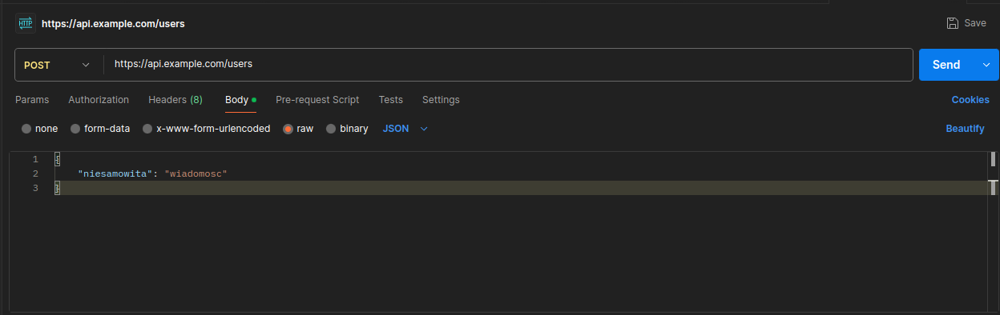

### Jak wysłać parametry query i path?

Wystarczy wprowadzić je do URI (tam gdzie normalnie wpisujemy "link"):


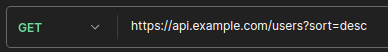

## Jak to działa w NestJS?

### Moduły

Największą jednostką w NestJS, w której siedzą kontrolery i serwisy/providery to moduł. Zawiera on metadane opisujące w jaki sposób “złączyć”/”wpiąć” moduł do całej aplikacji. Za pomocą jego łatwo też np. zobaczyć z jakich serwisów korzysta dany moduł.

Najprostszy moduł wygenerowany za pomocą nest-cli:

```ts
import { Module } from "@nestjs/common";
import { ExampleService } from "./example.service";
import { ExampleController } from "./example.controller";

@Module({
  controllers: [ExampleController],
  providers: [ExampleService],
})
export class ExampleModule {}
```

### Kontrolery

Kontroler to “wejście”-plik, w którym opisujemy wszystkie endpointy danego zasobu. Za pomocą dekoratorów @Get(), @Post() itd., nad metodami oznaczamy je jako endpointy, w których przyjmujemy dane z DTO lub parametrów path/query. Najczęściej potem przekazujemy te dane do serwisów, które przetwarzają te dane.

Najprostszy kontroler wygenerowany za pomocą nest-cli:

```ts
import {
  Controller,
  Get,
  Post,
  Body,
  Patch,
  Param,
  Delete,
} from "@nestjs/common";
import { ExampleService } from "./example.service";
import { CreateExampleDto } from "./dto/create-example.dto";
import { UpdateExampleDto } from "./dto/update-example.dto";

@Controller("example")
export class ExampleController {
  constructor(private readonly exampleService: ExampleService) {}

  @Post()
  create(@Body() createExampleDto: CreateExampleDto) {
    return this.exampleService.create(createExampleDto);
  }

  @Get()
  findAll() {
    return this.exampleService.findAll();
  }

  @Get(":id")
  findOne(@Param("id") id: string) {
    return this.exampleService.findOne(+id);
  }

  @Patch(":id")
  update(@Param("id") id: string, @Body() updateExampleDto: UpdateExampleDto) {
    return this.exampleService.update(+id, updateExampleDto);
  }

  @Delete(":id")
  remove(@Param("id") id: string) {
    return this.exampleService.remove(+id);
  }
}
```

### Serwisy/Providery

Serwisy, znane też jako providery, to pliki, w których zawieramy implementację aplikacji. Mogą być one podpięte pod dedykowany kontroler (kontroler userów - serwis userów), lub zapewniające ogólną funkcjonalność (serwis dostępu do bazy danych).

Najprostszy serwis wygenerowany za pomocą nest-cli:

```ts
import { Injectable } from "@nestjs/common";
import { CreateExampleDto } from "./dto/create-example.dto";
import { UpdateExampleDto } from "./dto/update-example.dto";

@Injectable()
export class ExampleService {
  create(createExampleDto: CreateExampleDto) {
    return "This action adds a new example";
  }

  findAll() {
    return `This action returns all example`;
  }

  findOne(id: number) {
    return `This action returns a #${id} example`;
  }

  update(id: number, updateExampleDto: UpdateExampleDto) {
    return `This action updates a #${id} example`;
  }

  remove(id: number) {
    return `This action removes a #${id} example`;
  }
}
```

## Co to DTO?

DTO - Data Transfer Object. Dla naszych potrzeb - typ.

Kiedy odbieramy informacje w danych endpointach kontrolera, i chcemy otrzymać konkretne dane, to DTO zapewnia nam walidację oraz serializację danych.

Przykładowy Data Transfer Object:

```ts
export class CreateTripDto {
  name: string;
  plannedBudget?: number;
}
```

## Dokumentacja

Aby wygodnie, wydajnie i przyjemnie pracowało się backend i frontend developerom warto dokumentować w jakiś sposób stan endpointów. Rozwiązanie, które zostało przyjęte na ogół to Swagger. Jest to najczęściej plik .yml/.yaml, w ustalonym formacie gdzie zapisywane są informacje o endpointach.

### Swagger UI

Do wygody przyglądania się wygenerowanym informacjom przez Swaggera dostępne są różne frontendy, które przedstawiają w miły, prosty sposób wszystkie informacje o endpointach zawartych w aplikacji.

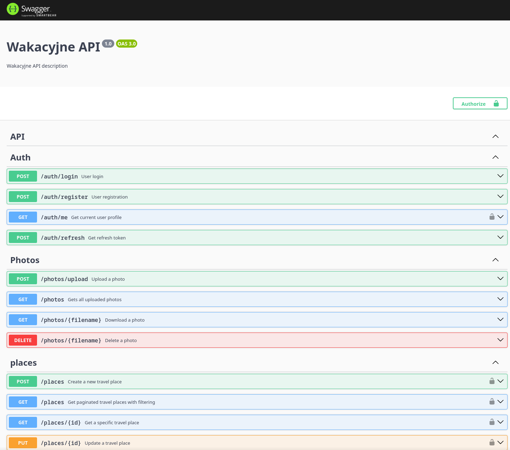

## Praktyka

### Tworzenie za pomocą komend

Wpisując “npx nest” dostajemy menu pomocnicze, które przedstawia nam wszystkie możliwe opcje:

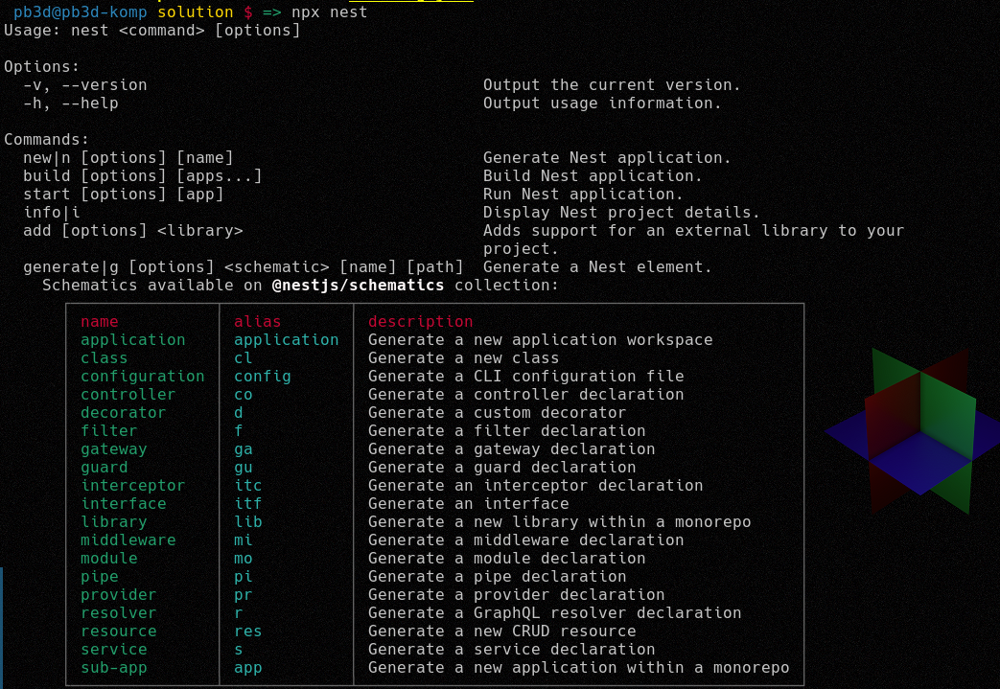

Interesuje nas tutaj wygenerowanie nowego zasobu, więc patrzymy w tabelkę:


Możemy tutaj wyczytać (3 linijka od dołu), że wpisując `npx nest g res trip` wygenerujemy nowy zasób CRUD, dla naszych wyjazdów. W takim razie zróbmy to:

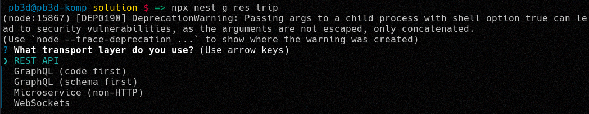
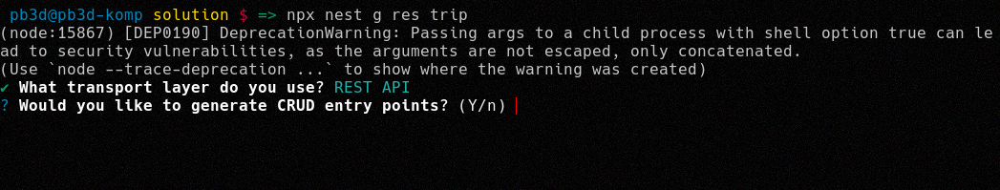
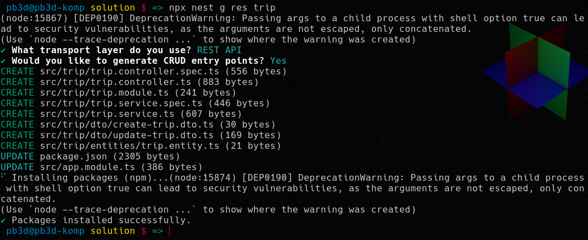

Powinna wygenerować się w projekcie taka struktura plików...

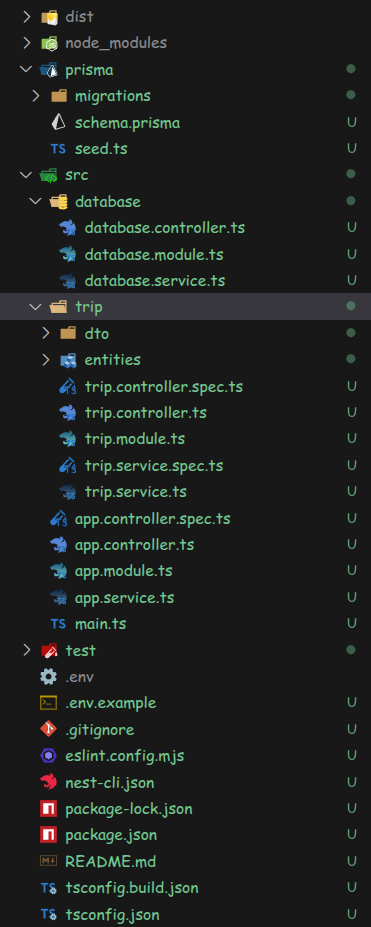

...chociaż najważniejsze z tego, to zasób, który chcieliśmy żeby nam wygenerowało:

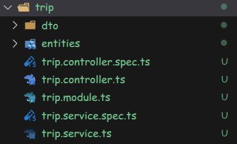

Teraz na serio zaczynamy pisać

Kiedy wygenerowaliśmy już, mamy bardzo podobną strukturę, do tej przedstawionej wyżej (zmieniają się jedynie nazwy klas, katalogu i niektórych typów).

Podłączmy serwis bazy danych do naszego modułu, aby móc zarządzać zasobami:

```ts
import { DatabaseService } from "src/database/database.service.ts";

import { Module } from "@nestjs/common";

import { TripController } from "./trip.controller";
import { TripService } from "./trip.service";

@Module({
  controllers: [TripController],
  providers: [TripService, DatabaseService],
})
export class TripModule {}
```

...to by zadziałało, natomiast patrząc w dokumentację NestJSa widzimy co tłumaczą deweloperzy o dokładnie tym schemacie:

_If we were to directly register the `CatsService` in every module that requires it, it would indeed work, but it would result in each module getting its own separate instance of the `CatsService`. This can lead to ***increased memory usage*** since multiple instances of the same service are created, and it could also ***cause unexpected behavior***, such as state inconsistency if the service maintains any internal state._

[Źródło](https://docs.nestjs.com/modules)

Aby podłączyć bazę w sposób _poprawny_ (korzystanie z jednej instancji bazy danych):

_database.module.ts_

```ts
import { Module } from "@nestjs/common";

import { DatabaseController } from "./database.controller";
import { DatabaseService } from "./database.service";

@Module({
  providers: [DatabaseService],
  controllers: [DatabaseController],
  exports: [DatabaseService],
})
export class DatabaseModule {}
```

_trip.module.ts_

```ts
import { DatabaseModule } from "src/database/database.module";

import { Module } from "@nestjs/common";

import { TripController } from "./trip.controller";
import { TripService } from "./trip.service";

@Module({
  controllers: [TripController],
  providers: [TripService],
  imports: [DatabaseModule],
})
export class TripModule {}
```

Jeżeli podłączymy już w taki sposób serwis bazy danych, możemy podłączyć go do naszego serwisu, w taki sposób do jednej z metod:

```ts
async create(createTripDto: CreateTripDto) {
	return this.database.trip.create({
		data: {
			name: createTripDto.name,
			plannedBudget: createTripDto.plannedBudget,
		},
	});
}
```

Przykładowy skończony serwis wygląda tak:

```ts
import { DatabaseService } from "src/database/database.service";

import { Injectable } from "@nestjs/common";

import { CreateTripDto } from "./dto/create-trip.dto";
import { UpdateTripDto } from "./dto/update-trip.dto";

@Injectable()
export class TripService {
  constructor(private database: DatabaseService) {}

  async create(createTripDto: CreateTripDto) {
    return this.database.trip.create({
      data: {
        name: createTripDto.name,
        plannedBudget: createTripDto.plannedBudget,
      },
    });
  }

  async findAll() {
    return this.database.trip.findMany();
  }

  async findOne(id: number) {
    return this.database.trip.findUnique({ where: { id } });
  }

  async update(id: number, updateTripDto: UpdateTripDto) {
    return this.database.trip.update({
      where: { id },
      data: {
        name: updateTripDto.name,
        plannedBudget: updateTripDto.plannedBudget,
      },
    });
  }

  async remove(id: number) {
    return this.database.trip.delete({ where: { id } });
  }
}
```

Następnie niedużym wysiłkiem, bo dodając tylko słowa kluczowe `async` przed metodami kontrolera kończymy pisanie w nim na ten moment:

```ts
import {
  Body,
  Controller,
  Delete,
  Get,
  Param,
  Patch,
  Post,
} from "@nestjs/common";

import { CreateTripDto } from "./dto/create-trip.dto";
import { UpdateTripDto } from "./dto/update-trip.dto";
import { TripService } from "./trip.service";

@Controller("trip")
export class TripController {
  constructor(private readonly tripService: TripService) {}

  async create(@Body() createTripDto: CreateTripDto) {
    return this.tripService.create(createTripDto);
  }

  async findAll() {
    return this.tripService.findAll();
  }

  async findOne(@Param("id") id: string) {
    return this.tripService.findOne(+id);
  }

  async update(@Param("id") id: string, @Body() updateTripDto: UpdateTripDto) {
    return this.tripService.update(+id, updateTripDto);
  }

  async remove(@Param("id") id: string) {
    return this.tripService.remove(+id);
  }
}
```

Jeżeli SolvroConfig sprawia wam problemy - jeżeli korzystasz z VsCode - wystarczy tylko najechać na błąd, kliknąć ctrl+. , a następnie kliknąć `Fix ...`. Wszystkie typy powinny zostać automatycznie naprawione :)

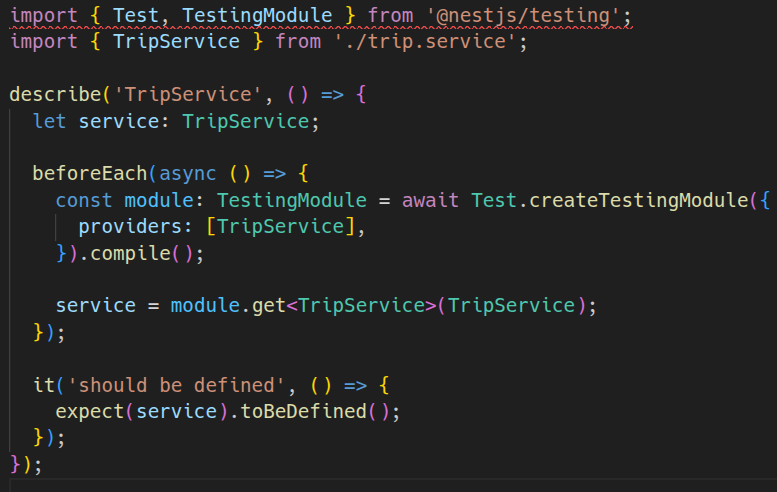
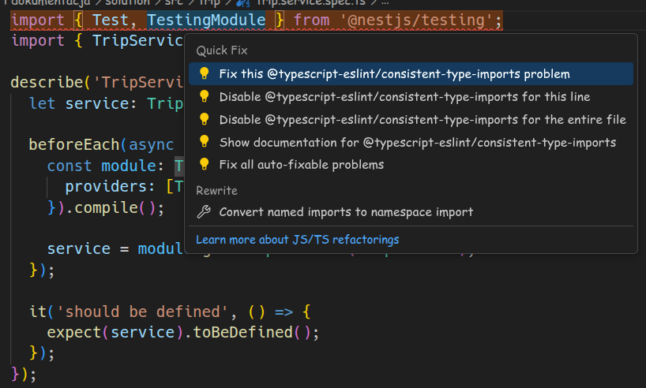
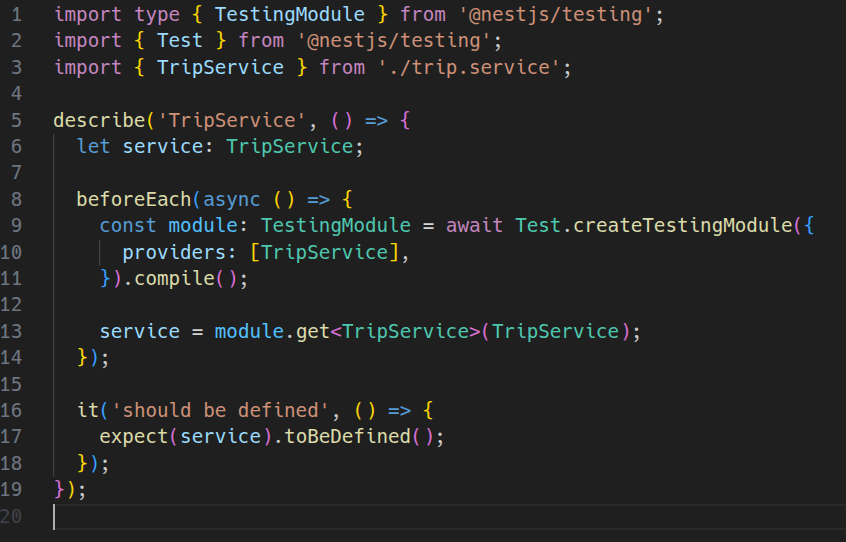

### Udokumentujmy automatycznie wszystko co udało nam się zrobić!

Wpierw dodajmy paczkę `@nestjs/swagger`, która zapewnia całą funkcjonalność potrzebną do generowania plików Swaggera i stworzenia frontendu Swagger UI:

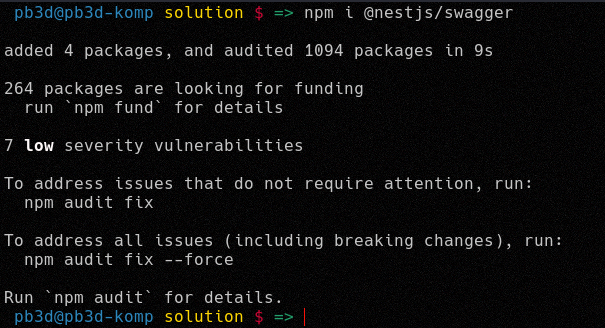

Następnie w głównym pliku aplikacji (`main.ts`) dodajemy następującą konfigurację:

```ts
import { NestFactory } from "@nestjs/core";
import { DocumentBuilder, SwaggerModule } from "@nestjs/swagger";

import { AppModule } from "./app.module";

async function bootstrap() {
  const app = await NestFactory.create(AppModule);

  const config = new DocumentBuilder()
    .setTitle("Wakacyjne API")
    .setDescription("Wakacyjne API description")
    .setVersion("1.0")
    .addTag("API")
    .addBearerAuth()
    .build();
  const documentFactory = () => SwaggerModule.createDocument(app, config);
  SwaggerModule.setup("api", app, documentFactory);

  await app.listen(process.env.PORT ?? 3000);
}
bootstrap();
```

To daje nam dostęp do Swagger UI, pod linkiem `http://localhost:3000/api`:

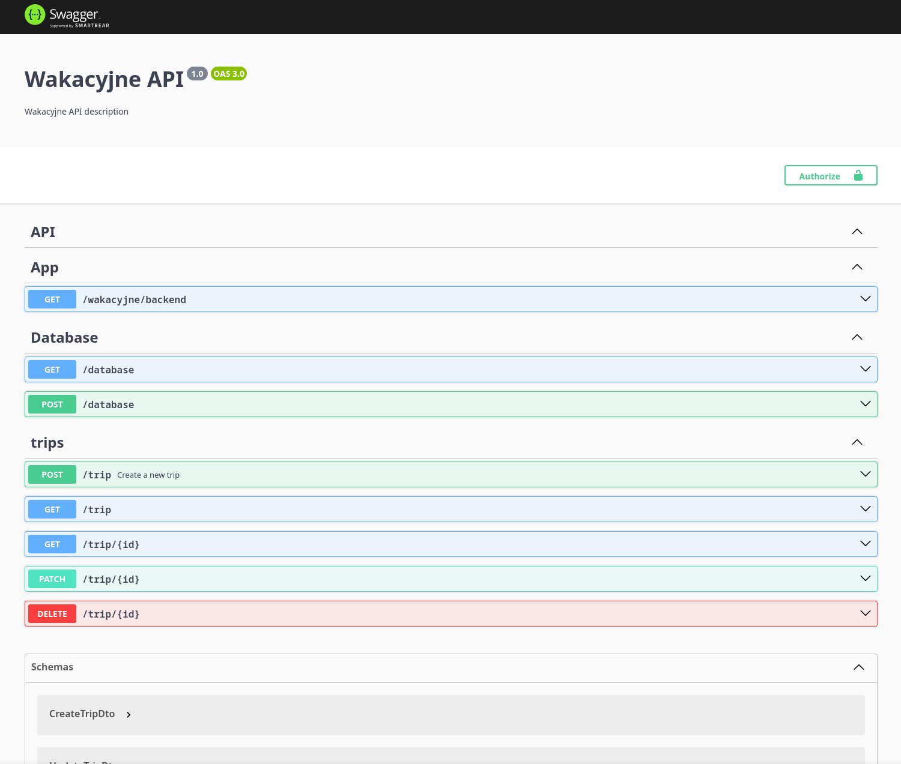

Teraz trzeba dodać dekoratory do endpointów oraz do naszych pól w Data Transfer Objectach, aby Swagger UI ładnie nam wszystko wyświetlił. Podpowiedzi w VsCodzie powinny bezproblemowo pokierować, aby dodać odpowiednie dekoratory do wszystkich pól. W dodatku do tego poniżej przedstawiam przykładowe "odekorowanie" endpointów oraz DTO:

_trip.controller.ts_

```ts
import {
  Body,
  Controller,
  Delete,
  Get,
  HttpCode,
  HttpStatus,
  Param,
  Patch,
  Post,
} from "@nestjs/common";
import { ApiOperation, ApiResponse, ApiTags } from "@nestjs/swagger";

import { CreateTripResponseDto } from "./dto/create-trip-reponse.dto";
import { CreateTripDto } from "./dto/create-trip.dto";
import { UpdateTripDto } from "./dto/update-trip.dto";
import { TripService } from "./trip.service";

@Controller("trip")
@ApiTags("trips")
export class TripController {
  constructor(private readonly tripService: TripService) {}

  @Post()
  @HttpCode(HttpStatus.CREATED)
  @ApiOperation({
    summary: "Create a new trip",
    description:
      "Add a trip to which you can supply new expenses and participants",
  })
  @ApiResponse({
    status: 201,
    description: "Trip created",
    type: CreateTripResponseDto,
  })
  async create(@Body() createTripDto: CreateTripDto) {
    return this.tripService.create(createTripDto);
  }

  @Get()
  @ApiOperation({
    summary: "Get all trips",
    description: "Retrieve a list of all trips in the system",
  })
  @ApiResponse({
    status: 200,
    description: "List of trips retrieved successfully",
    type: [CreateTripResponseDto],
  })
  async findAll() {
    return this.tripService.findAll();
  }

  @Get(":id")
  @ApiOperation({
    summary: "Get trip by ID",
    description: "Retrieve detailed information about a specific trip",
  })
  @ApiResponse({
    status: 200,
    description: "Trip details retrieved successfully",
    type: CreateTripResponseDto,
  })
  @ApiResponse({
    status: 404,
    description: "Trip not found",
  })
  async findOne(@Param("id") id: string) {
    return this.tripService.findOne(+id);
  }

  @Patch(":id")
  @ApiOperation({
    summary: "Update trip details",
    description: "Modify information for an existing trip",
  })
  @ApiResponse({
    status: 200,
    description: "Trip updated successfully",
    type: CreateTripResponseDto,
  })
  @ApiResponse({
    status: 404,
    description: "Trip not found",
  })
  async update(@Param("id") id: string, @Body() updateTripDto: UpdateTripDto) {
    return this.tripService.update(+id, updateTripDto);
  }

  @Delete(":id")
  @ApiOperation({
    summary: "Delete a trip",
    description: "Remove a trip and all its associated data from the system",
  })
  @ApiResponse({
    status: 200,
    description: "Trip deleted successfully",
  })
  @ApiResponse({
    status: 404,
    description: "Trip not found",
  })
  async remove(@Param("id") id: string) {
    return this.tripService.remove(+id);
  }
}
```

_create-trip.dto.ts_

```ts
import { ApiProperty, ApiPropertyOptional } from "@nestjs/swagger";

export class CreateTripDto {
  @ApiProperty()
  name: string;

  @ApiPropertyOptional()
  plannedBudget?: number;

  @ApiPropertyOptional({
    isArray: true,
  })
  expenses?: unknown[];

  @ApiPropertyOptional({
    isArray: true,
  })
  participants?: unknown[];
}
```

_update-trip.dto.ts_

```ts
import { PartialType } from "@nestjs/mapped-types";

import { CreateTripDto } from "./create-trip.dto";

export class UpdateTripDto extends PartialType(CreateTripDto) {
  name?: string;
  plannedBudget?: number;
  expenses?: unknown[];
  participants?: unknown[];
}
```

W efekcie dostaniemy taki wygląd naszego Swagger UI:

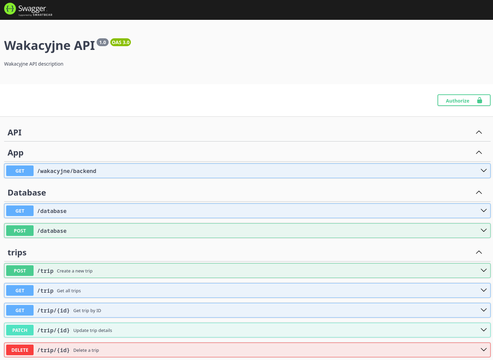

Teraz możemy nawet z poziomu frontendu przetestować naszą aplikacje!

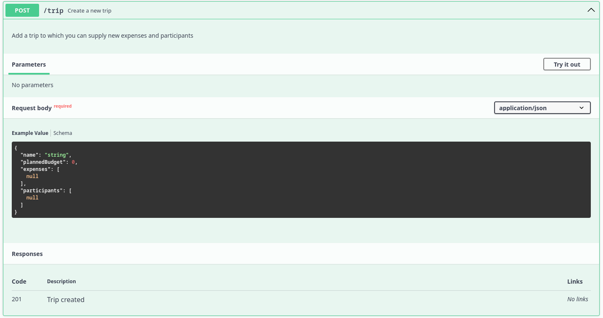
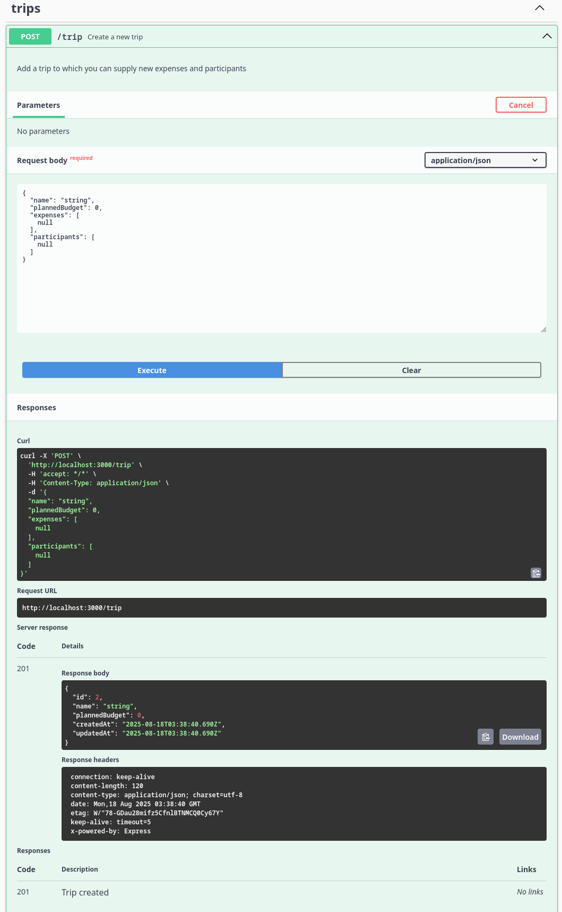

Jeżeli chcemy być fancy i ułatwić pracę deweloperom frontendowym, możemy też dodać przykład zwrotnej odpowiedzi dodając dodatkowe DTO:

_create-trip-reponse.dto.ts_

```ts
import { ApiProperty, ApiPropertyOptional } from "@nestjs/swagger";

export class CreateTripResponseDto {
  @ApiProperty()
  id: number;

  @ApiProperty()
  name: string;

  @ApiPropertyOptional()
  plannedBudget?: number;

  @ApiPropertyOptional({
    isArray: true,
  })
  expenses?: unknown[];

  @ApiPropertyOptional({
    isArray: true,
  })
  participants?: unknown[];

  @ApiProperty()
  createdAt: Date;

  @ApiProperty()
  updatedAt: Date;
}
```

Prezentuje się ono w efekcie tak w naszym UI:

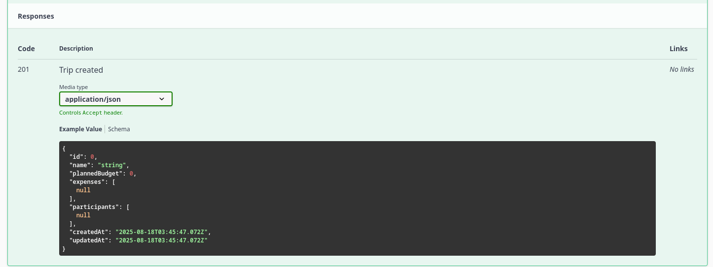

## Zadanie do wykonania

Zadanie do wykonania znajduje się [tutaj]()

## Materiały

- Link do [nagrania prezentacji](https://drive.google.com/file/d/11B5-nBFEfyG7EKjHFzQPQfBeVOXffB4J/view?usp=sharing) z wykładu
- https://docs.nestjs.com/first-steps
- https://docs.nestjs.com/controllers
- https://docs.nestjs.com/providers
- https://docs.nestjs.com/modules
- https://docs.nestjs.com/openapi/types-and-parameters
- https://docs.solvro.pl/sections/backend/poradniki/api/
- https://github.com/Solvro/backend-wakacyjne-api-2025
