## Elo żelo 👋

Witam w kolejnym rozdziale kursu "Od zera do backend developera". Dziś poznamy podstawy, niezbędne dla backend developera! Dokładna rozpiska po prawej.

## Sieć komputerowa


Zanim wyjaśnię czym jest sam internet, powiedzmy sobie, czym jest sieć komputerowa. Są to minimum dwa urządzenia (nie musi to być komputer-komputer, może być to równie dobrze telefon-drukarka). Chcielibyśmy, aby mogły one ze sobą “rozmawiać”. To właśnie umożliwia nam nasza sieć. Tak jak my, rozmawiając ze sobą używamy pewnych reguł, np. gramatycznych, tak samo sieć komputerowa wykorzystuje pewne protokoły i standardy komunikacji. Jak już wiem, jak skleić nasze cyfrowe zdania, trzeba je jakoś wypowiedzieć. Do tego wykorzystamy media transmisji danych, mówiąc prościej jest to na przykład pasmo sieci bezprzewodowej albo jakieś połączenie fizyczne (dwa komputery spięte kablem ethernetowym).

## Internet


Skoro wiemy już czym jest sieć komputerowa, możemy łatwo wyjaśnić czym jest internet. Jest to po prostu połączona sieć takich malutkich sieci. Dzięki niemu możemy między innymi nauczyć się, jak zostać backend developerem, nie wychodząc z domu.

## Jak działa aplikacja webowa?

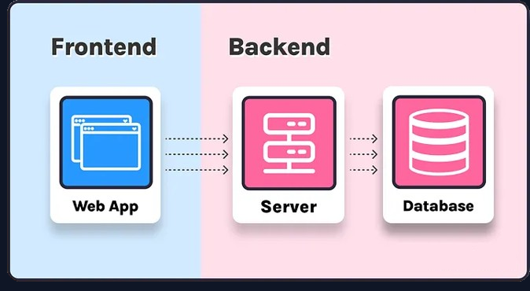
Aplikacja webowa jest programem (np. Facebook czy też epicka strona solvro.pwr.edu.pl), który uruchamiamy z przeglądarki, aplikację możemy podzielić sobie w następujący sposób:

- frontend, o którym dowiecie się więcej na wakacyjnym wyzwaniu frontendu odpowiada za to co widzimy i z czym możemy wejść w interakcję (weźcie pod uwagę, że jest do dość "płytka" definicja frontendu),
- backend (to o nas), co może okazać się szkoujące, odpowiada za to czego nie widzimy (przynajmniej bezpośrednio). Na to, czym dokładnie się zajmuje backend poświęcony jest następny podpunkt,
- baza danych, służąca do przechowywania danych, czyli cyfrowych informacji. Więcej o danych oraz ich przechowywaniu dowiecie się w następnym rozdziale.

## Czym zajmujemy się my (rola backendu w aplikacji webowej)

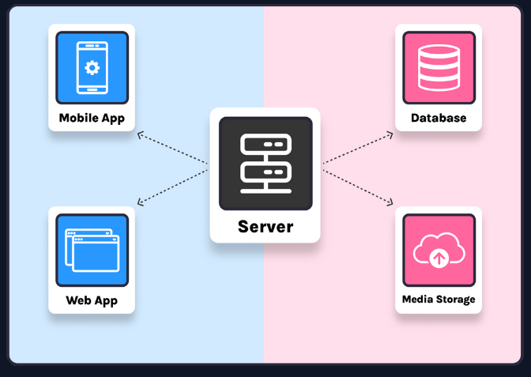
Rola backendu to o wiele więcej, niż przekazanie danych na front. Do naszych zadań należą:

- logika biznesowa - reguły, według których aplikacja ma działać (na przykładzie banku - przelew możemy wykonać tylko ze swojego konta),
- dostęp do bazy danych - otrzymując odpowiednie żądanie, szukamy w bazie danych odpowiednich informacji, jeżeli jest taka potrzeba, lekko przy nich “majstrujemy” i przekazujemy do frontendu, aby mógł je nam ładnie wyświetlić,
- autoryzacja i uwierzytelnianie - to również należy do zadań backendu, przykładowo w zależności od tego czy użytkownik jest zalogowany na stronę, udostępniamy jedynie skrawek danych lub całkowicie odmawiamy dostępu. Dzięki nam, losowa osoba nie może sprawdzić stanu naszego konta, czy też naszych konwersacji na facebook’u,
- z pozostałych czynności:
  - sprawdzamy czy przesłane dane są prawidłowe, np. podczas rejestracji,
  - wysyłamy maile z potwierdzeniem użytkownikom (np. po rejestracji),
  - wykonujemy działania powtarzalne, np. w każda niedziele wieczór, sprawdź kto nie odrobił zadania domowego do wyzwania i wyślij do koordynatorów,
  - łączymy się z innymi mikro serwisami - często lepiej skorzystać z istniejących rozwiązań i zintegrować je z naszą aplikacją, niż tworzyć je od zera.

## Działanie aplikacji na przykładzie

Teraz zbierzemy wszystko “do kupy”, na przykładzie wyświetlenia produktów w sklepie internetowym:

- frontend chcąc wyświetlić produkty, najpierw wysyła do nas zapytanie (dla przykładu, że chce otrzymać informację o wszystkich rowerach w sklepie),
- następnie, my wyciągamy z bazy danych informacje o wszystkich produktach z kategorią “rower”,
- przygotowujemy dane, jeżeli jest taka potrzeba, a następnie zwracamy dane w formacie JSON (np. nazwę, cenę, link do zdjęcia produktu),
- frontend przetwarza te dane i ładnie je przedstawia do wglądu dla użytkownika

## Czym jest API

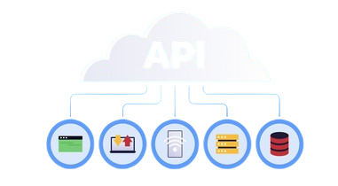
API (Application Programming Interface) mówiąc najprościej pozwala na połączenie ze sobą aplikacji . Nas będzie interesować połączenie części frontendowej z naszym systemem backendowym. To właśnie API obsługuje żądania, o których wspominałem wcześniej. Wysyłane oraz zwracane są w określonym formacie.

### REST

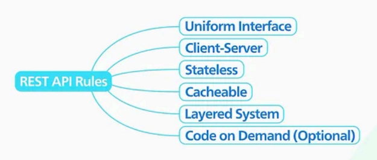
REST, czyli Representational State Transfer to styl architektury do tworzenia usług internetowych, który wykorzystuje protokół HTTP do komunikacji między klientem, a serwerem. Są to jedynie zasady, według których tworzy się API, a nie sztywna specyfikacja. Dokładnie opisana każda z tych zasad znajduje się na stronie https://restfulapi.net/. Omówimy sobie część z nich:

### Nazewnictwo ścieżek


Po pierwsze zwróćmy uwagę na prefix. Praktycznie w każdym przypadku powinien składać się z /api, a następnie wersji. Może się wydawać, że w danym momencie nie jest to potrzebne, ale przy aplikacjach, szczególnie komercyjnych jest to kluczowe. Głównie z tego powodu, że implementując nowe, niebanalne oraz przełomowe zmiany w danej funkcji moglibyśmy wywołać błędy w powiązanych aplikacjach używających naszego api (np. niezaktualizowana aplikacja mobilna).

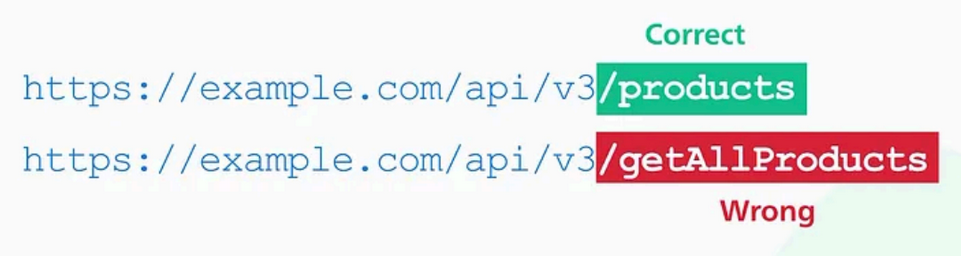
Po drugie nazewnictwo samych ścieżek. Ogólnie pierwsza część po prefixie powinna być nazwą zasobu, który zwracamy w liczbie mnogiej.

### Nagłówki (Headery)


Nagłówek (Header API) to dodatkowe informacje wysyłane wraz z żądaniem HTTP lub odpowiedzią API. Przenoszą one dane, które pomagają serwerowi i klientowi zrozumieć, jak przetwarzać żądanie i odpowiedź. Mogą one na przykład przekazywać informacje w jakim formacie przesyłamy dane, czy jesteśmy autoryzowani czy z jakiego urządzenia korzystamy.

### Metody

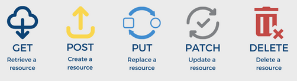
Metody - w prostym języku, służą do wyjaśnienia serwerowi, co chcielibyśmy, aby zrobił z naszymi informacjami. Do najczęściej wykorzystywanych metod należą:

- GET - chcemy otrzymać jakieś informacje z serwera,
- POST - chcemy umieścić na serwerze nowe dane,
- PUT/PATCH - chcemy zaktualizować dane na serwerze,
- DELETE - chcemy usunąć dane z serwera.

### Kody statusu

Kody statusu - informują nas o tym jak serwer odpowiedział na naszą “prośbę”. Kody mają trzy cyfry i dzielą się na następujące kategorie:

- 1\_\_ - informacyjne,
- 2\_\_ - sukces,
- 3\_\_ - przekierowanie,
- 4\_\_ - błąd po stronie klienta (frontend popsuł),
- 5\_\_ - błąd po stronie serwera (najczęściej, my coś popsuliśmy).

### Parametry (Query params)

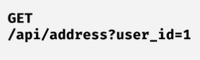
Jest to część adresu URL, która przekazuje dodatkowe informacje do serwera. Używa się ich najczęściej w zapytaniach HTTP GET, np. do:

- filtrowania,
- sortowania,
- paginacji,
- przekazywania danych z formularzy.

### Body

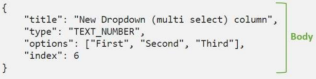
Jest to ta część zapytania/odpowiedzi, które zawiera “właściwą” treść naszego żądania, najczęściej w formacie JSON. To tamy, przykładowo umieszczamy obiekt, który chcemy zapisać w bazie danych.

### JSON

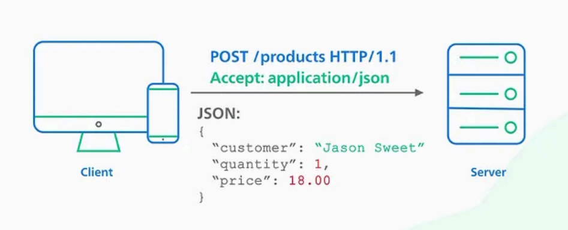
JSON to zwyczajnie format wymiany danych, używany do przesyłania danych między serwerem a klientem w aplikacjach internetowych, mimo swojej nazwy nie jest używany tylko w JavaScript’cie.

## Narzędzia developerskie (w przeglądarce)

Po długiej części teoretycznej nadszedł czas na trochę praktyki, ale najpierw krótki wstęp. Narzędzia deweloperskie pozwalają na inspekcję, debugowanie i optymalizację stron internetowych. Umożliwiają one analizę kodu HTML, CSS i JavaScript, badanie ruchu sieciowego (to nas interesuje najbardziej), pomiar wydajności oraz wiele innych aspektów działania witryny.

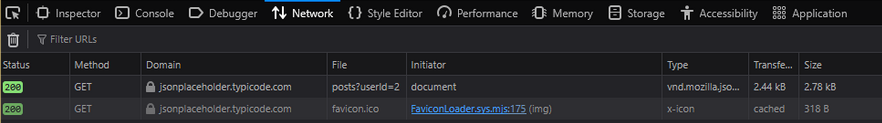
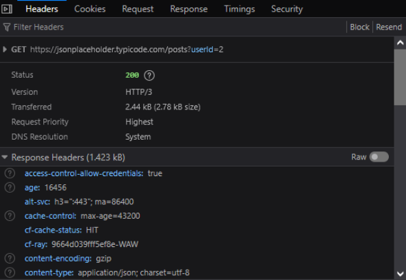

### Jak uruchomić narzędzia developerskie (w przeglądarce)

W zależności od wykorzystywanej przeglądarki, mogą istnieć różne możliwości, natomiast najczęściej wystarczy

- nacisnąć prawy przycisk myszy na stronę,
- następnie kliknąć “zbadaj” / “inspect”.
- nas najbardziej będzie interesować zakładka sieci (network), w której to znajdziemy wysyłane oraz odbierane żądania.
  Znajdziemy tam takie informacje, jak:
- status kodu odpowiedzi (status),
- metodę zapytania (method),
- domenę, z której odebrano odpowiedź (domain),
- body naszego zapytania/odpowiedzi (request/response),
- nagłówki (headers),
- ciastka (cookies),
- kilka mniej istotnych na ten moment rzeczy...

### Złap swój request

Uruchom narzędzia według powyższej instrukcji i odśwież/wejdź na dowolną stronę.
Zalecam wykorzystanie strony: https://jsonplaceholder.typicode.com/users?id=1

## NestJS (oraz inne frameworki)

Framework - w naszym kontekście chodzi o zestaw gotowych komponentów, narzędzi oraz konwencji, które ułatwiają tworzenie oprogramowania. Możemy to porównać do układania puzzli czy budowania z Lego, gdyż łączymy w logiczny sposób zdefiniowane elementy.

### NestJS

NestJS właśnie jest takim frameworkiem, służącym do tworzenia aplikacji od strony serwera. Napisany jest w języku TypeScript przez Kamila Myśliwca (Polska gurom) w 2017 roku.

## Setup NestJS

Dzięki cudom współczesnej techniki, nie musimy tworzyć całego projektu ręcznie, a skorzystamy z zainstalowanego wcześniej NestCLI. Jeżeli jednak jeszcze tego nie zrobiłeś to tutaj znajdziesz instrukcję: https://docs.nestjs.com/cli/overview

- do utworzenia projektu wykorzystamy polecenie:

```js
nest new fajny_projekt_123

```

- następnie zostaniemy zapytani o wybór menedżera pakietów - my wybieramy opcję npm. Proces tworzenia może chwilę potrwać, gdyż pobierane są pakiety niezbędne do działania aplikacji.

Aby uruchomić aplikację, przechodzimy do ścieżki wcześniej utworzonego projektu i korzystamy z komendy:

```js
npm run start
```

lub

```js
npm run start:dev
```

dla trybu developerskiego (zalecane podczas pisania kodu)

Domyślnie, aplikacja uruchamia się na porcie 3000, jeżeli jest on zajęty (np. przez inne aplikacje uruchomione na komputerze, to wyskoczy nam błąd). Aby zmienić port należy dokonać zmiany w pliku main.ts.

### Instalacja Solvro Config

Solvro Config, stworzony przez członka naszego koła (shoutout dla Bartka), służy do konfiguracji narzędzi ułatwiających nam pisanie czystego kodu:

[Link do instrukcji step-by-step](https://github.com/Solvro/lib-web-solvro-config)

W tym miejscu, aby oszczędzić wam przykrości, odsyłam również do poradnika jak prawidłowo korzystać z gh:

[Zasady działania z Git i GitHub w Solvro](https://docs.solvro.pl/git-github/solvro)

### Pierwszy kontroler

Jeżeli wykonałeś powyższe kroki, przyszedł czas, aby pomajstrować przy kodzie.

```js
//app.controller.ts
import { Controller, Get } from '@nestjs/common';
import { AppService } from './app.service';

@Controller()
export class AppController {
  constructor(private readonly appService: AppService) {}

  @Get()
  getHello(): string {
    return this.appService.getHello();
  }
}
```

Czym dokładnie jest kontroler, dowiecie się w trzecim rozdziale. Na ten moment wystarczy wam wiedzieć, że tutaj ustalamy co aplikacja ma zrobić, gdy klient wyśle zapytanie pod konkretny endpoint. Jak widać nestowy generator wykonał większość roboty za nas. Wyjaśnię natomiast co tu się dzieje:

- utworzona została klasa kontrolera, której to metody służą do obsługi zapytań.
- dekorator @Controller() służy do oznajmienia nest’owi jaką rolę pełni poniższa klasa, jako jego argument możemy dodać fragment URL’a (dla całej grupy),
- konstruktor, mówiąc w skrócie, sprawia że cała aplikacja korzysta z tej samej instancji serwisu.
- getHello() to funkcja wywoływana, gdy wyślemy zapytanie pod endpoint metodą GET, tutaj tak samo w dekoratorze możemy podać kolejny fragment ścieżki (będzie to w kolejności hierarchicznej - najpierw fragment z kontrolera potem z metody),
- jak widać endpoint ten zwraca wartość z funkcji getHello z zaimportowanego appService, o tym również w trzecim rozdziale, wiedzcie natomiast że dobrą praktyką jest, że wszelkie operacje na danych wykonują się tam (podczas wykonywania zadania domowego, właśnie tam to będziecie robić),

Zarówno do klasy kontrolera jak i jego metod możemy dodawać wiele różnych dekoratorów, pokażę wam przykładowo jak zmienić kod statusu:

Importujemy “HttpCode” z “@nestjs/common” oraz dekorujemy nasz endpoint w następujący sposób,

```js
// app.controller.ts
import { Controller, Get, HttpCode } from '@nestjs/common';
import { AppService } from './app.service';

@Controller()
export class AppController {
  constructor(private readonly appService: AppService) {}

  @HttpCode(999)
  @Get()
  getHello(): string {
    return this.appService.getHello();
  }
}
```

```js
// app.service.ts
import { Injectable } from "@nestjs/common";

@Injectable()
export class AppService {
  getHello() {
    const example_message = {
      example_key: "example_value",
      another_key: "another_value",
    };
    return example_message;
  }
}
```

_Wnętrze funkcji getHello zostało ręcznie zmienione, to normalne że u ciebie jest coś innego._

Tutaj jak widać dosyć podobna sytuacja, mamy klasę serwisu oraz jej metodę, tym razem operującą na danych. Widać tutaj inny dekorator @Injectable(), służy on do tego o czym wcześniej wspominałem, tj. jedna instancja serwisu dla całej aplikacji.

## Inne narzędzia developerskie

Jeżeli macie przeczucie, że testowanie działania waszego API nie jest zbyt wygodne z poziomu przeglądarki, to macie racje. Rozwiązaniem tego problemu są liczne dedykowane narzędzia, takie jak bruno, insomnia oraz postman (jest ich o wiele więcej). Dzięki nim możemy ręcznie sprawdzić, “czy wszystko śmiga” lub też zautomatyzować ten proces.

### Postman

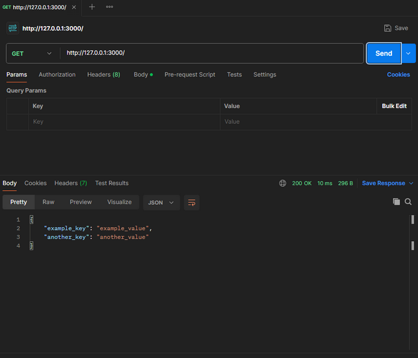
Tak wygląda UI naszego klienta, na samej górze widać URL, pod które wysyłamy zapytanie oraz metodę z której korzystamy. Jako że nasza aplikacja działa lokalnie, naszym prefixem jest [http://127.0.0.1:3000/](https://example.com/) (localhost).
Czym jest ten dziwny prefix? Jest to specjalny adres, nazywany loopback, w skrócie służy on do wysłania informacji do samego siebie.
Poniżej, możemy ustawić parametry, nagłówki, autoryzację oraz body zapytania.
Na samym dole zobaczymy odpowiedź na nasze zapytanie, czyli status code, rozmiar danych, czas obsługi zapytania, body, nagłówki oraz ciastka.

## Zadanie domowe i materiały

[Treść zadania domowego (GitHub)](https://github.com/Solvro/backend-wakacyjne-wyzwanie-2025/blob/main/1.%20Podstawy%20API/1.md)

### Materiały

[Wstęp do NestCLI (tekstowe)](https://docs.nestjs.com/cli/overview)

[Instalacja NestCLI (wideo)](https://drive.google.com/file/d/1haKdpe5u8ePJog0tXijM8kOn4IZlUIqn/view?usp=drive_link)

[Instalacja oraz korzystanie z SolvroConfig (tekstowe) ](https://github.com/Solvro/lib-web-solvro-config)

[Setup projektu NestJS (tekstowe)](https://docs.nestjs.com/first-steps)

[Setup projektu NestJS (wideo)](https://drive.google.com/file/d/1R1PGNzrwN4ua2SV56aqyEnKTNNuSlWIL/view?usp=drive_link)

[Wstęp do struktury projektu NestJS (wideo)](https://drive.google.com/file/d/1uTsq-gW2FL82YL9wwbWEJ2-JNgPUSWni/view?usp=drive_link)

[Kody statusu (tekstowe)](https://docs.nestjs.com/controllers#status-code)

[Kody statusu (wideo)](https://drive.google.com/file/d/16-F3cDllND9ChB9wGvqrFb3CQLRGNumt/view?usp=drive_link)

[Ścieżki/routing (tekstowe)](https://docs.nestjs.com/controllers#routing)

[Ścieżki/routing (wideo)](https://drive.google.com/file/d/1KPdWjlX9C8l-aKP1fBnUz9srhVVH5Ebb/view?usp=drive_link)

[Poradnik Postman (wideo)](https://youtu.be/MFxk5BZulVU?si=gblBwtnMNUn1TJcC)
