W tym dokumencie dowiesz się, jak generować i modyfikować Linki w domenie [link.solvro.pl](https://link.solvro.pl), oraz jak sprawdzać ich metryki.

Drukując QRki na jakichkolwiek materiałach promocyjnych warto korzystać z naszych krótkich Linków, gdyż nie tylko pozwalają one na śledzenie zasięgów, ale również pozwalają modyfikować ich cel!

## Logowanie

Panel administracyjny naszego serwisu do skracania Linków znajduje się pod adresem [skracacz-linka.solvro.pl](https://skracacz-linka.solvro.pl).
Dostęp jest możliwy **tylko przez SolvroVPN**!

Jeżeli domena panelu administracyjnego wyświetla ci komunikat podobny do poniższego, to najprawdopodobniej SolvroVPN nie jest aktywny na twoim urządzeniu.
W celu uzyskania dostępu do SolvroVPN (lub w przypadku innych problemów) śmiało napisz na odpowiednim kanale sekcji DevOps.

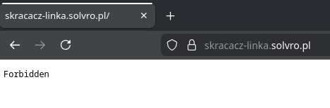
_Klasyczny ekran odmowy dostępu_

Po pomyślnym załadowaniu panelu administracyjnego zobaczysz listę skonfigurowanych serwerów - domyślnie powinien być skonfigurowany jeden o nazwie "Skracacz Linka".
Wybierz ten serwer klikając na przycisk.

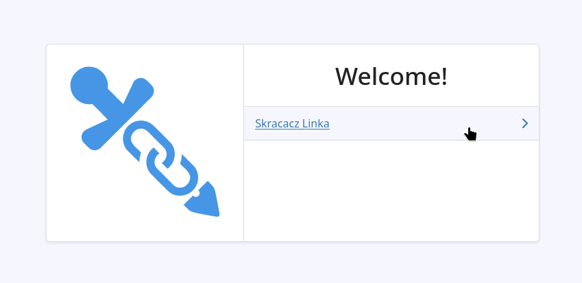
_Wybór serwera_

Nawet jeżeli pomyślnie załadował\*ś panel administracyjny, po wybraniu serwera może wyświetlić ci się błąd połączenia.
W takim wypadku ponownie sprawdź, czy SolvroVPN jest aktywny na twoim urządzeniu i odśwież stronę - po pierwszym załadowaniu panel pozostaje w pamięci przeglądarki, i załaduje się nawet bez połączenia z SolvroVPN, jednak konfiguracja serwera już nie będzie możliwa poza naszą siecią.

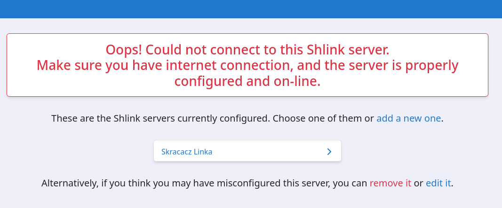
_Epic login failure_

## Nowy Linek

By utworzyć nowego Linka, wybierz zakładkę "Create short URL" po lewej.

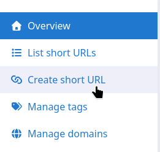
_Wyżej wspomniana zakładka_

Wypełnij formularz: Wpisz docelowy URL (1), wybierz tagi (2), i ustaw nazwę linka (3), a nastepnie wyślij (4).

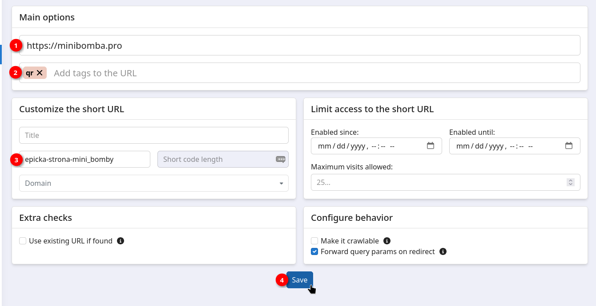
_Formularz tworzenia nowego Linka_

Pojawi się komunikat potwierdzający utworzenie Linka, wraz z możliwością jego skopiowania.

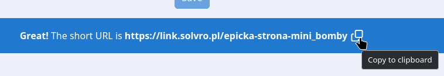
_Pomyślne utworzenie Linka_

### Generowanie kodu QR

By utworzyć kod QR nowo utworzonego Linka, wróć do listy Linków.

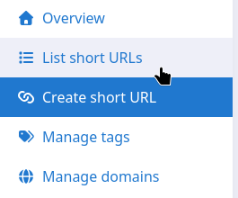
_Powrót do listy Linków_

Znajdź odpowiedniego Linka i wybierz z menu "QR code".

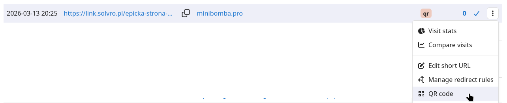
_Menu otwierania menu generowania kodu QR_

Dostosuj parametry kodu QR i go pobierz.

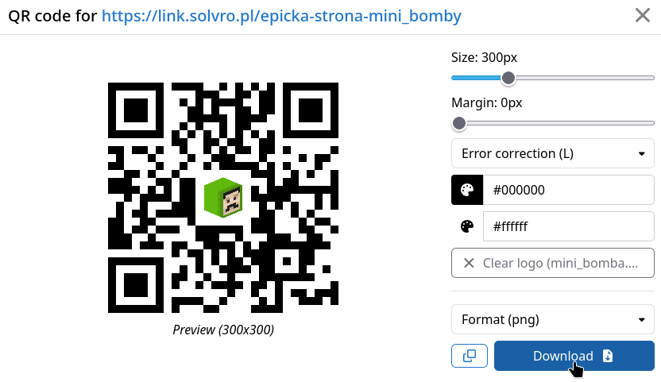
_Generowanie kodu QR_

## Modyfikowanie istniejącego Linka

By zmodyfikować istniejącego Linka, przejdź do listy Linków.

_Lista Linków_

Znajdź odpowiedniego Linka na liście i wybierz z menu "Edit short URL".

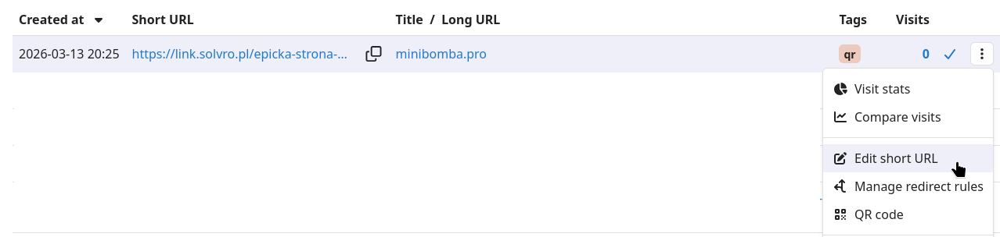
_Przejście do edycji Linka_

Dokonaj wymaganych zmian i zapisz.

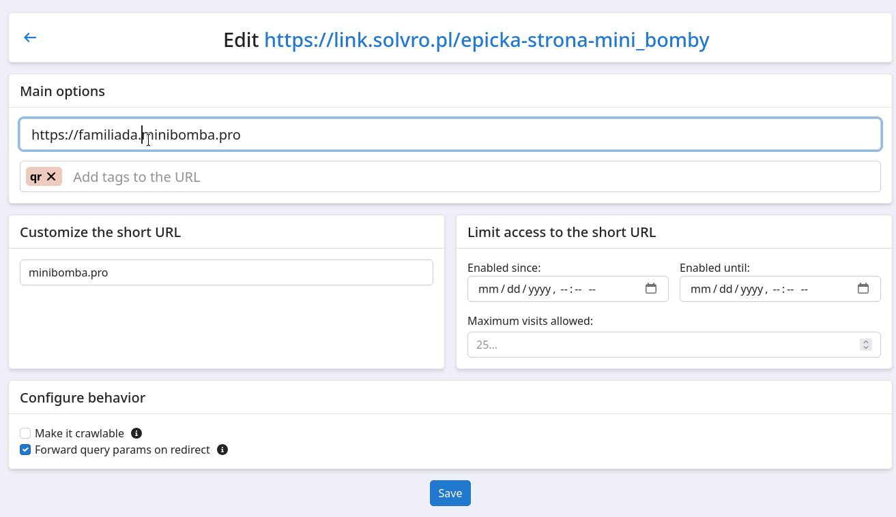
_Edycja Linka_

## Podgląd statystyk Linka

By sprawdzić statystyki Linka, przejdź do listy Linków.

_Lista Linków_

Znajdź odpowiedniego Linka na liście i wybierz z menu "Visit stats".

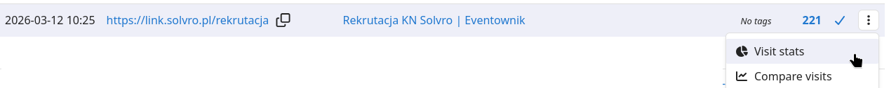
_Przejście do statystyk Linka_

wyklikaj jakieś fajne statystyki czy coś idk

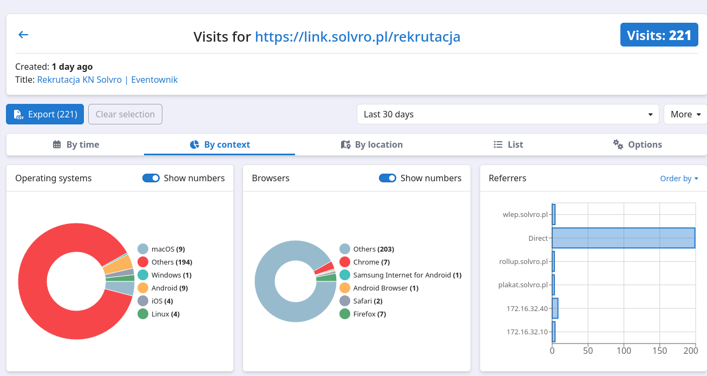
_jakieś fajne statystyki, chyba, może_

## Usuwanie Linka

By usunąć Linka, przejdź do listy Linków.

_Lista Linków_

Znajdź odpowiedniego Linka na liście i wybierz z menu "Delete short URL".

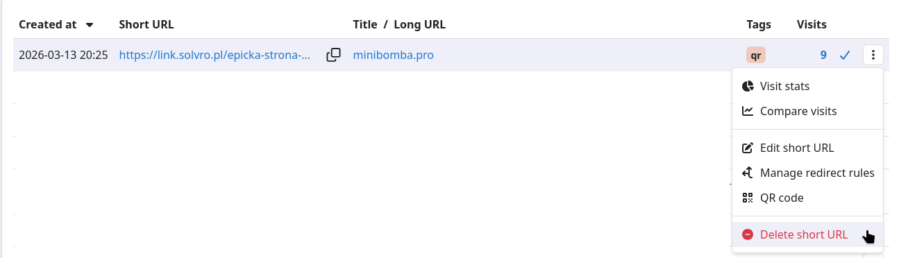
_Usuwanie Linka_
