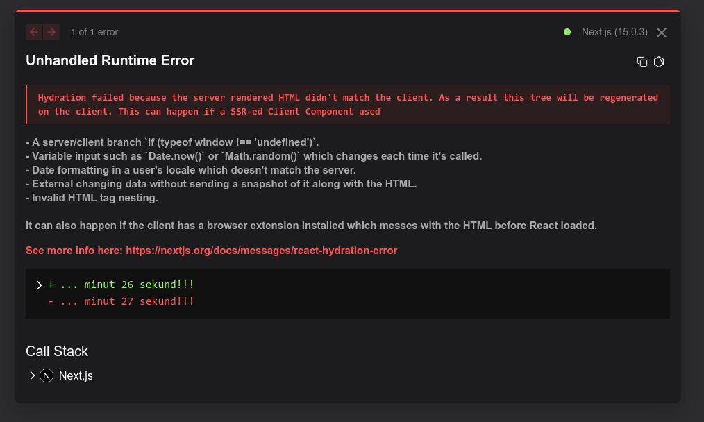

W tej sekcji znajdziesz najpopularniejsze błędy i sekcję FAQ.

## Częste błędy

### Używanie useEffect tam gdzie nie trzeba

useEffect służy do synchronizowania stanu z zewnętrznym systemem (ref. dokumentacja reacta), jeśli w useEffecie nie macie odwołania do zewnętrznego systemu (localStorage, api serwera, inne api przeglądarki) to znaczy, że go źle użyliście, przykładowy zły kod:

```jsx
function handleMuscleClick(muscle: string) {
  setSelectedMuscles((prevSelectedMuscles) => {
    if (prevSelectedMuscles.includes(muscle)) {
      return prevSelectedMuscles.filter((m) => m !== muscle);
    } else {
      return [...prevSelectedMuscles, muscle];
    }
  });
}

useEffect(() => {
  table.getColumn("targetMuscle")?.setFilterValue(selectedMuscles);
}, [selectedMuscles, table]);
```

Tutaj synchronizujemy `selectedMuscles` z filtrowana wartościa z tabelce, tabelka żyje w świecie reacta i nie jest zewnętrznym systemem i równie dobrze możemy to zrobić w ten sposób:

```jsx
function handleMuscleClick(muscle: string) {
  const newSelectedMuscles = selectedMuscles.includes(muscle)
    ? prevSelectedMuscles.filter((m) => m !== muscle)
    : [...prevSelectedMuscles, muscle];

  table.getColumn("targetMuscle")?.setFilterValue(newSelectedMuscles);
  setSelectedMuscles(newSelectedMuscles);
}
```

Teraz jest bardzo jasne, że po kliknięciu na mięsień, zostaje też zupdate’owana tabelka.

Ten przykład jeszcze nie jest taki zły, przy 1 useEffectcie dość łatwo się połapać co się dzieje, przy 11 robi się już kłopot i raz u mnie w pracy przez coś takiego padła produkcja 😭

### Nieużywanie lub nadużywanie `useMemo`

Hook `useMemo` pozwala na zapamiętanie wyniku funkcji obliczeniowej między renderami komponentu, co może pomóc w optymalizacji wydajności aplikacji. Jest używany głównie w przypadku "drogich" obliczeń (obliczenia, które swoją złożonością mają istotny wpływ na wydajność), które nie muszą być wykonywane na nowo przy każdym renderze.

Składnia:

```jsx
const memoizedValue = useMemo(() => computeValue(a, b), [a, b]);
```

- **computeValue**: Funkcja zwracająca wynik obliczeń.
- **[a, b]**: `useMemo` ponownie obliczy wartość tylko wtedy, gdy jedna z zależności w tej tablicy się zmieni.

#### Kiedy używać `useMemo`?

- Przy "kosztownych" obliczeniach, takich jak złożone przekształcenia dużych ilości danych.
- Kiedy wynik obliczeń jest wielokrotnie używany w danym renderze (np. w innych hookach).
- Przy obliczeniach, które zależą od dynamicznie zmieniających się danych.

#### Kiedy nie używać `useMemo`?

- Jeśli obliczenia są szybkie i nie mają zauważalnego wpływu na wydajność.
- Gdy dodanie useMemo bardziej komplikuje kod niż przynosi korzyści.
- Gdy zależności często się zmieniają, co może prowadzić do częstych ponownych obliczeń.

:::tip
Nie należy go używać na siłę. Najpierw upewnij się, że istnieje faktyczny problem z wydajnością, zanim go zastosujesz.
:::

## FAQ

### Co to Server Components i po co ich używać?

RSC (React Server Components) to komponenty, których kodzik jest wykonywany WYŁĄCZNIE po stronie serwera i ani gram javascriptu nie idzie do przeglądarki, to są obecnie domyślne komponenty w Nextjs 13-15. Ułatwiają pobieranie danych z serwera, bo nie trzeba np. wyświetlać stanu loadingu, od razu otrzymujemy gotowe dane, możemy wykonywać zapytania do bazki od razu w kodzie komponentu co jest mega wygodne. Minus taki, że nie możecie tutaj używać żadnych hooków ani obsługiwać eventów, do tego są potrzebne Client Components.
tl;dr:
Kiedy używać RSC?
Zawsze
Kiedy używać Client Components?
Wtedy kiedy nie możecie RSC (czyli potrzebujecie hooków itp)

Dogłębniej opisane to jest tutaj: <https://nextjs.org/docs/app/building-your-application/rendering/composition-patterns>

### Jak działają Client Components?

Wbrew intuicji początkujących one są też wykonywane po stronie serwera (<https://github.com/reactwg/server-components/discussions/4>) i serwer wysyła gotowy html wraz z javascriptem, który potem jest wykonywany po stronie klienta i następuje proces hydracji, czyli React "przejmuje" html, który dostał i sam zaczyna go obsługiwać.

Polecam bardzo opis z dokumentacji Nextjs, dobrze to opisali: <https://nextjs.org/docs/app/building-your-application/rendering/client-components>

### Co to za błąd hydracji w React/Next.js?

Jeśli używaliście SSR (server-side-rendering) z hydracją po stronie klienta (czyli możliwość zachowania reaktywności strony przy jak największym renderowaniu po stronie serwera), to może napotkaliście się z błędem w stylu `Hydration failed`:



Dzieje się to, gdy jakakolwiek część DOM-u ma inną wartość po stronie serwera niż po stronie klienta. Innymi słowy -- wtedy, kiedy używacie kodu niedeterministycznego względem okresu, w jakim zachodzi hydracja.

Przykładami sytuacji, które mogłoby to wywołać to **używanie dat**, np przy countdownie lub **używanie wartości losowo wygenerowanych**.

#### Sugerowane podejścia

1. Renderowanie niedeterministycznych wartości wyłącznie po stronie klienta
   Zanim nastąpi hydracja, zwróć wersję komponentu bez treści dynamicznej. Gdy komponent zostanie w pełni załadowany, użyj `useEffect` aby zaktualizować komponent, co dzieje się po stronie klienta.

   ```tsx
   function HydratedComponent() {
     const [isLoaded, setIsLoaded] = useState(false);
     const [currentDate, setCurrentDate] = useState(new Date());
     useEffect(() => {
       setIsLoaded(true);
       setCurrentDate(new Date());
     }, []);

     if (!isLoaded) return "Loading...";
     return currentDate.toLocaleDateString();
   }
   ```

2. Tymczasowe zaokrąglanie wartości, aby w czasie hydracji nie zmienaiały się
   W przypadku dat, można użyć przybliżenia w takim stopniu, żeby w przewidywanym czasie załadowania strony nie uległo ono zmianie.

   ```tsx
   /** Rounds the current date to the nearest `accuracy` milliseconds. */
   const getRoundedDate = (accuracy = 60000) =>
     new Date(Math.round(new Date().getTime() / accuracy) * accuracy);

   function HydratedComponent() {
     const [currentDate, setCurrentDate] = useState(getRoundedDate());
     return currentDate.toLocaleString();
   }
   ```

   :::caution
   W podanym powyżej przykładzie istnieje możliwość, że strona zostanie załadowana idealnie w momencie, gdy zaokrąglenie obecnej daty nie będzie deterministyczne.

   Przykład: użytkownik odwiedzi stronę o `16:20:29.5`, więc serwer zaokrągla datę do 16:20:00. Przesyłanie z serwera skryptów JS trwa około sekundy więc kod klienta uruchamia się o `16:20:30.5`, czyli w zaokrągleniu 16:21:00. W tym momencie wywala nam błąd ponieważ wygenerowany DOM klienta różni się od DOM-u serwera.

   Zauważcie, że używanie innej strategii zaokrąglania nie pozbyłoby się tego problemu: zamiana `round` na `floor` lub `ceil` oznaczyłaby, że problematyczną godziną byłaby `16:20:59.5`.

   Jeśli wymagana jest stuprocentowa niezawodność, nie należy korzystać z tej metody.
   :::

Metoda #2 działa w przypadku wartości, które można w jakimś stopniu zaokrąglać lub czynić mniej dokładnymi. W związku z tym, dla wartości losowo wygenerowanych (np. `Math.random()`), zaleca się stosowanie metody #1.
