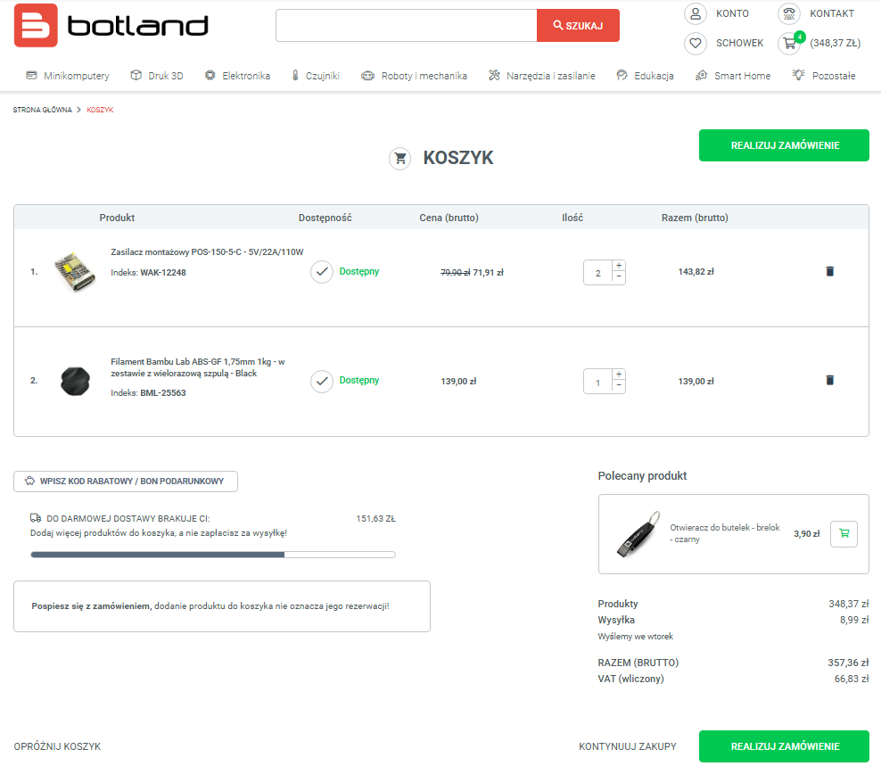
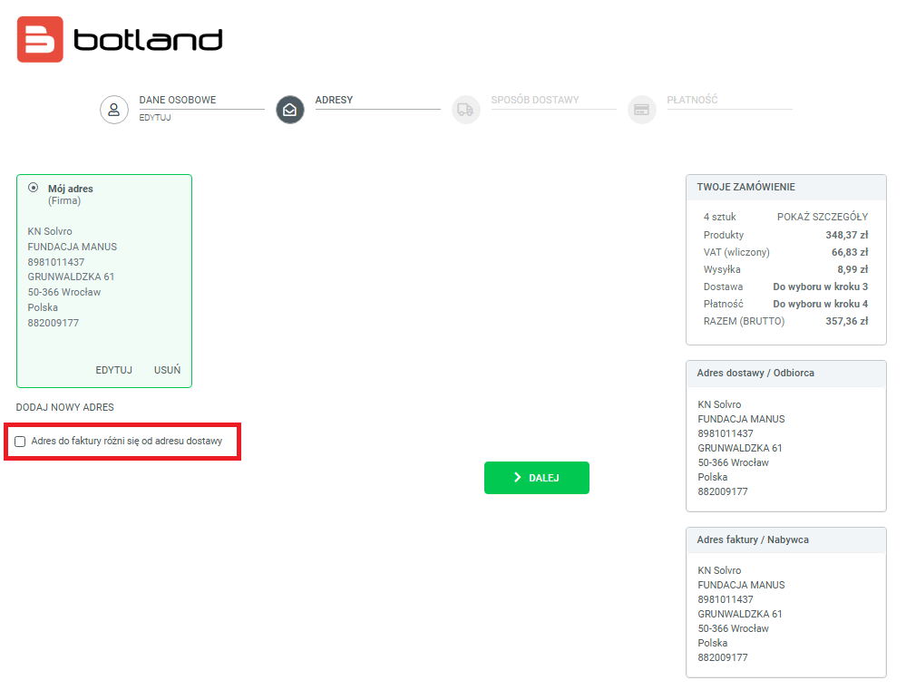
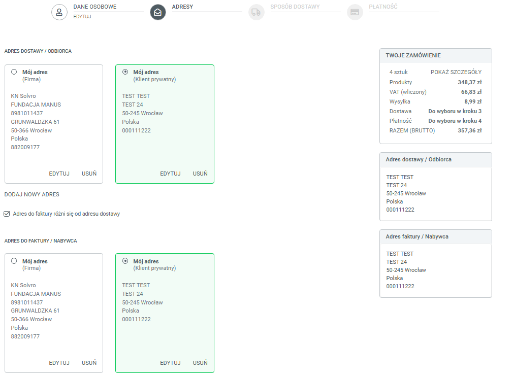

## Wprowadzenie

Elo żeloo!
Czas na zakupy z Botlandem! 🎉 Tutaj masz kilka wskazówek, jak to zrobić sprawnie i bez stresu. Bądź z nami krok po kroku! 😉

## Na Początek

🔑 Musisz mieć dostęp do konta Solvro w Botlandzie, żeby otrzymać zniżki. Jeśli potrzebujesz danych logowania, skontaktuj się z Zarządem, najlepiej z Szymonem - the privileged god. 🌟 Informacja o jednolitym menedżerze haseł również pojawi się tu, jak tylko będzie gotowa!

## Jak To Zrobić?

1️⃣ Wejdź na stronę https://botland.com.pl/ i zaloguj się swoimi danymi.

2️⃣ Dodaj produkty do koszyka - pamiętaj, że inni też mogą je przeglądać, więc zapisz swoje wybory!
📌 Tak wygląda widok koszyka:

📌Nie zapomnij, że kody rabatowe Solvro aplikują się automatycznie.

4️⃣ Przejdź do realizacji płatności.

🚨 WAŻNE! Musisz zmienić adres faktury (nie usuwać!)

1. Zaznacz opcję „Adres do faktury różni się od adresu dostawy”.
2. Zmień dane tak, by nie wystawiać faktury na Fundację Manus ani na Politechnikę Wrocławską.
3. Tak samo zmień adres dostawy, jeśli jest inny.

📌 Zaznacz inny adres:

📌Końcowo to wygląda tak:

#### 5. Następnie wybieramy dostawę i płatność

👉 Wybierasz sposób dostawy i płatności – nic więcej nie trzeba robić.

#### 6. Pamiętaj o usunięciu swojego adresu

📌 Jeśli nie chcesz, by Twój adres został w systemie i był widoczny dla innych, usuń go z panelu adresów po złożeniu zamówienia.
