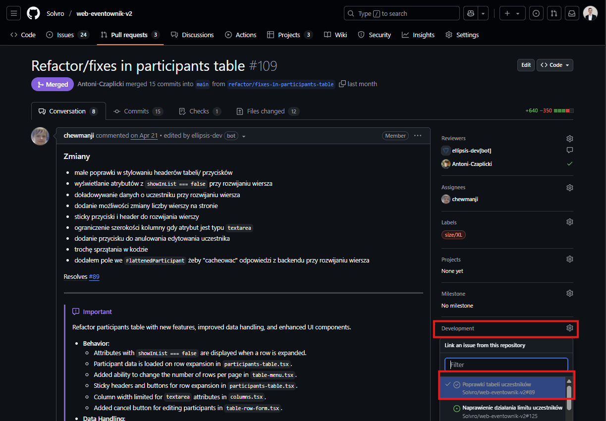
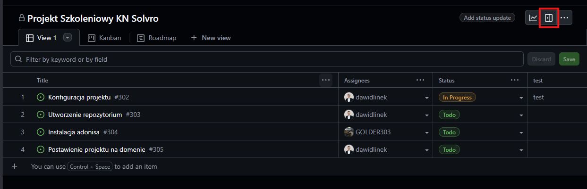
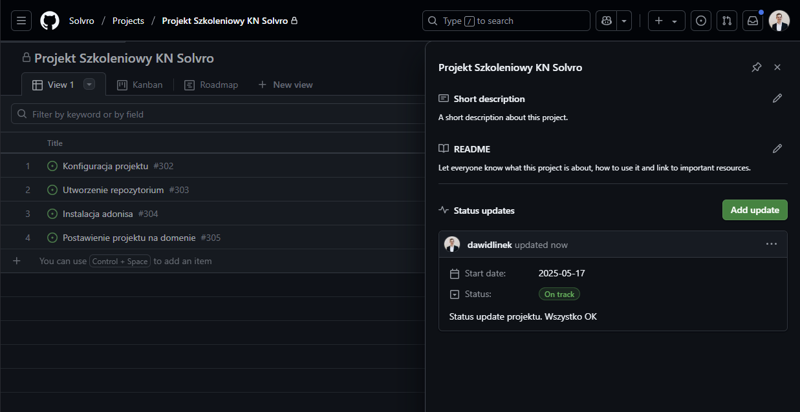
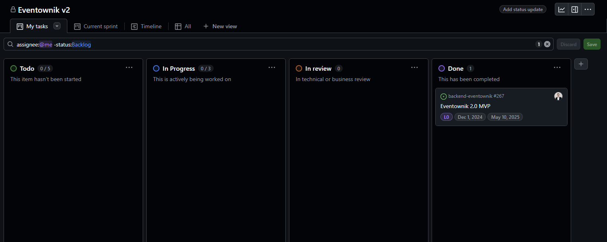
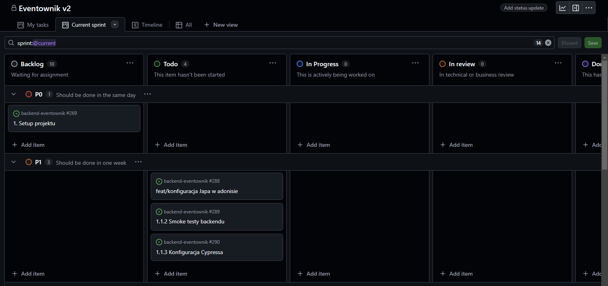
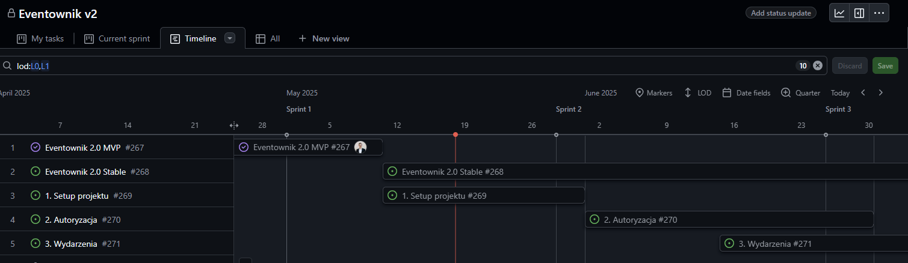
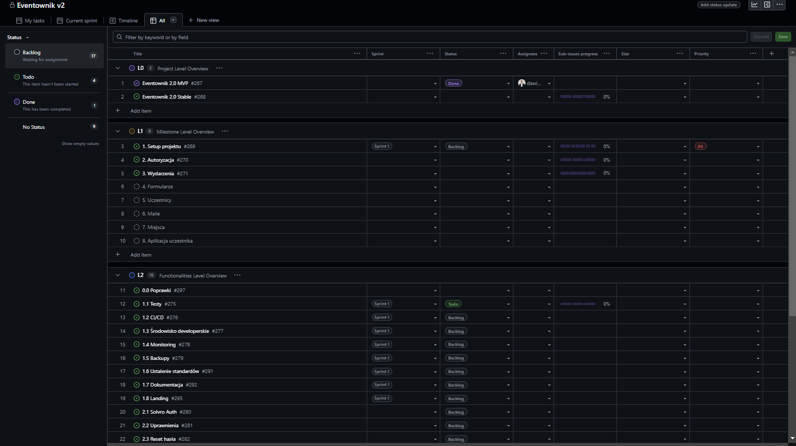
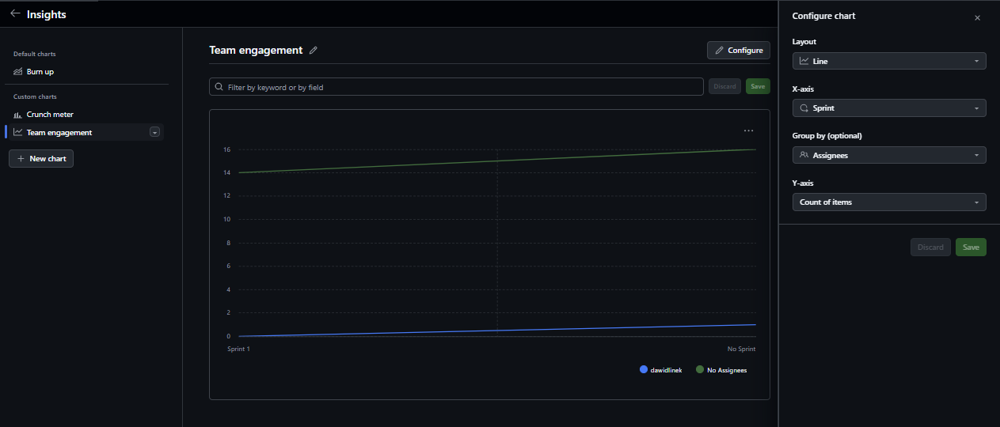
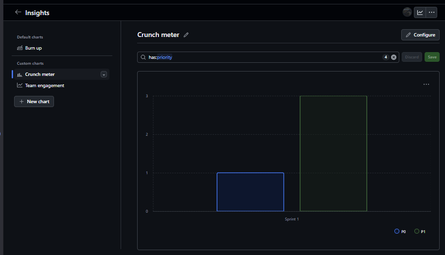

import { Steps } from "@astrojs/starlight/components";

## Wstęp

Github jest główną platformą, na której rozwijamy projekty w KN Solvro. Jedną z funkcji jest właśnie Github Projects. Rolą PM i Techleada jest głównie planowanie, rozdzielanie i nadzorowanie pracy zespołu, a Github Projects jest idealnym narzędziem umożliwiającym dokładnie to.

W pierwszej części przyjrzymy się obiektywnym możliwościom Github Projects, gdzie w drugiej części będą pokazane propozycje ujednolicenia zarządzania projektami w KN Solvro.

## Linki

- https://docs.github.com/en/issues/planning-and-tracking-with-projects
- https://docs.github.com/en/issues/planning-and-tracking-with-projects/learning-about-projects/about-projects
- https://www.youtube.com/watch?v=oPQgFxHcjAw
- https://www.youtube.com/watch?v=Z4vRGhZInL8

## TLDR

Zarządzanie projektami na Github Projects odbywa się za pomocą zadań, które mogą mieć niestandardowe atrybuty, a następnie za pomocą widoków i filtrów możemy dopasować wyświetlanie tych zadań w zależności od potrzeby.

<Steps>
1. Utwórz projekt z [szablonu](https://github.com/orgs/Solvro/projects/48)
2. W ustawieniach dodaj odpowiedni zespół
3. W ustawieniach skonfiguruj pola niestandardowe potrzebne twojemu projektowi
4. Skonfiguruj widoki pamiętając o różnych perspektywach członków zespołu
5. Utwórz zadania jako issue powiązane z danym repo 
6. Przypisz atrybuty i osoby odpowiedzialne 
7. Bieżąco monitoruj przebieg projektu

</Steps>

## Poradnik

### Tworzenie projektu

Projekt możemy utworzyć zarówno z poziomu danego repozytorium jak i z poziomu całej organizacji. Przechodząc pod adres https://github.com/orgs/Solvro/projects widzimy zielony przycisk New Project. Pokaże nam się okno do wyboru predefiniowanych szablonów, ale chcąc lepiej zrozumieć Github Projects powinniśmy wybrać pusty szablon. Do szablonu projektu Solvro przejdziemy w drugiej części tego poradnika.

W kolejnym kroku powinniśmy podpiąć dany projekt pod repozytoria. Tą akcję wykonujemy z poziomu danego repozytorium, przechodząc do zakładki Projects i klikając "Link a project", gdzie następnie możemy wybrać wcześniej utworzony projekt. Alternatywnie z tego poziomu można również utworzyć projekt, jeśli repozytorium już istnieje.

### Ustawienia projektu i dostępów

W ustawienia projektu możemy przejść klikając w projekcie w prawy górny róg, a następnie "settings".

Wyświetlą nam się wtedy ustawienia projektu, gdzie możemy wpisać nazwę, krótki opis oraz długi opis projektu. Na samym dole znajduje się widoczność projektu, która powinna być ustawiona na public.

W zakładce manage acess zarządzamy dostępem do projektu, czyli kto może go wyświetlać, a kto edytować. Z reguły zespół powinien być dodany jako write bądź admin, a cała grupa Solvro jako read.

### Pola

Jedna z dwóch bardzo potężnych funkcjonalności Github Projects. Tak zwane atrybuty umożliwiają nam skonfigurowanie projektu konkretnie pod nasze potrzeby. Z poziomu ustawień po lewej stronie mamy sekcję Custom fields, a obok niej przycisk "+ New Field". Po kliknięciu wybieramy, nazwę oraz typ atrybutu.

#### Pola tekstowe

Pola tekstowe są najbardziej uniwersalnym polem na wpisanie czegokolwiek, o ile mieści się w jednej linijce. Przykładem może być pole "Powiązanie ze strategią", gdzie wpisujemy po przecinku poszczególne symbole działań i mierników, na które dane zadanie oddziałuje.

#### Pola liczbowe

Są to pola, do których możemy wpisać tylko liczby. Przykładem może być budżet czy story pointy.

#### Pola daty

Ten typ pola umożliwia ustawienie daty z dokładnością co do dnia. Przykładem może być data rozpoczęcia i data zakończenia zadania.

#### Pola wyboru

Jedno z najczęściej używanych typów pól. Umożliwia zdefiniowanie możliwych wartości wraz z ich opisami i kolorami. Przykładem może być Priorytet.

#### Pola iteracji

Używane w zwinnym zarządzaniu projektami pole iteracji pozwala skonfigurować długość iteracji, na której podstawie będą generowały się iteracje. Następnie przypisując je do danego zadania programiści wiedzą, że np. dane zadanie powinno zostać wykonane w tym miesiącu. Github project dużą część pracy robi za nas, ale również umożliwia ręczne nazywanie i definiowanie iteracji.

#### Pole statusu

Jedno z pól standardowych, predefiniowanych przez githuba, których nie możemy usunąć. Pod spodem jest ono polem wyboru z zdefiniowanymi statusami. Domyślnie są to Todo, In progress i Done, ale istnieje opcja ich modyfikacji.

#### Pole sub-issues

Github umożliwia zagnieżdżanie zadań, tworząc wiele poziomów szczegółowości. W ustawieniach tego pola możemy tylko zmienić sposób i kolor wyświetlania powiązania zadań podrzędnych

#### Pole assignees

O ile to pole nie jest wyświetlane w ustawieniach to pokazuje się przy każdym zadaniu. Są do najzwyczajniej osoby przypisane do danego zadania, gdzie można wybrać jedną lub wiele osób.

### Tworzenie zadań

Przechodząc w główny widok projektu powinna pokazać nam się tabela. Jest to nic innego jak lista zadań, którą rozpisujemy, a następnie przypisujemy do danej osoby i repozytorium. W pierwszej kolejności klikamy na pierwszą komórkę i wpisujemy nazwę zadania

Pojawią nam się dwie opcje draft i issue. Wersje robocze (draft) nie wymagają przypisania do repozytorium, ale niestety posiadają dużo mniej funkcjonalności. Zaleca się wybranie "Create new issue", gdzie będziemy musieli wybrać repozytorium, do którego dane zadanie zostanie przypisane. Następnie mamy możliwość wpisania opisu i wyboru wartości wcześniej zdefiniowanych pól.

Po lewej stronie mamy historię zadania, która wraz z kolejnymi krokami będzie się aktualizowała, a poniżej miejsce na dyskusję.

Po prawej stronie mamy do wyboru atrybuty projektowe, osoby, które będą wykonywały dane zadanie, czy relacje z innymi zadaniami. Na dole mamy również opcję przeniesienia zadania z jednego repozytorium do innego.

Programiści podczas pracy będą mieli widoczny dany issue, którego powinni podpiąć do danego pull request tym samym tworząc pełną integrację pomiędzy kodem, a zadaniami.

### Podpinanie zadań do PR

Po utworzeniu zadania powinniśmy przypomnieć zespołowi, że po utworzeniu Pull Requesta ze zmianami należy podpiąć go do Issue, którego dotyczy. Można to zrobić albo z pozycji PR, albo z pozycji Github Projects. W obu miejscach po prawej stronie znajduje się pole Development, gdzie możemy powiązać PR z projektem.

Uwaga! Nie wybieramy pola Projects, ponieważ utworzy nam to nową pozycję w projekcie. Ta opcja jest przydatna tylko, jeśli zrobiliśmy coś co nie było zaplanowane w projekcie i chcemy poinformować o tym PM.

### Widoki

Domyślna lista zadań jest odpowiednia do pewnego momentu. W pewnej skali nie jesteśmy w stanie dalej zarządzać projektem posiadając wszystko w jednej liście. Github Projects pomaga rozwiązać nam ten problem za pomocą personalizowanych i konfigurowalnych widoków, które możemy dopasować do naszych potrzeb. Widoki możemy dodawać na górze projektu klikając "New view" i wybierając layout.

#### Table

Tak jak pisałem wcześniej jest to po prostu lista zadań. Nie mniej jednak w ustawieniach umożliwia podział na grupy.

W konfiguracji Fields możemy wybrać, które pola są wyświetlane w tabeli. Następnie możemy skonfigurować grupowanie, które zastosowane np. do statusów wygląda w tabeli tak:

Następnie możemy wybrać sortowanie oraz slicing. Pole slice by pozwala nam na dostęp do szybkich filtrów po lewej stronie. Zastosowanie samego Slice by po np. statusie wygląda następujaco

#### Board

Kanban jako jedna z metodyk zarządzania projektami. Jej główną cechą jest skupienie się na wizualizacji zadań. Tworząc widok w kanban domyślnie otrzymamy poniższy widok, gdzie zadaniami zarządzamy po prostu przeciągając kafelki:

Tu również możemy zastosować grupowanie i slice by. Dodatkowo w konfiguracji możemy wybrać, po którym polu definiowane są kolumny.

Z innych ciekawych opcji przy każdej kolumnie możemy ustawić limit zadań w danym statusie. Jest to przydatne do kontrolowania przeładowania zespołu.

#### Roadmap

Ten widok jest przydatny do bardziej kaskadowego zarządzania projektem, gdzie widzimy przebieg projektu w czasie. Umożliwia on również grupowanie i slice by, a z dodatkowych opcji możemy zdefiniować wyświetlany horyzont czasowy i ustawić, które pola definiujemy jako start i koniec zadania.

#### Filtry

Na przestrzeni github project możemy ustawiać filtry w poszczególnych widokach i wykresach, o których trochę więcej potem. Pomiędzy wyborem widoku, a faktycznymi zadaniami znajduje się bardzo potężne miejsce do konfiguracji filtrów. Wpisując np. `status:Todo` pokażą nam się tylko zadania ze statusem Todo. Posiadamy również dynamiczne filtry takie jak `iteration:@current`, gdzie zawsze wyświetli nam się tylko obecna iteracja.

Możemy korzystać również z personalizacji, gdzie wpisując `assignee:@me` każdy członek zespołu będzie widział tylko swoje zadania.

Po każdej zmianie musimy pamiętać o kliknięciu zapisz w prawym rogu, aby zmiany były widoczne dla każdego członka zespołu.

### Wykresy

Wykresy z poziomu zarządczego pozwalają na wizualizację kluczowych parametrów projektu. Może być to np. obciążenie pracą lub dynamika realizacji zadań z jednej na drugą iteracją. W prawym górnym rogu klikamy na ikonę wykresu.

Następnie pokaże nam się jeden z domyślnych wykresów z opcją do utworzenia kolejnych. Jako przykładowy wykres utworzymy "Ilość zadań w danej iteracji z podziałem na osoby", gdzie dość wyraźnie będziemy widzieli kto z upływem czasu zrobił ile zadań. Po utworzeniu i nazwaniu wykresu przechodzimy w jego konfigurację, gdzie wybieramy typ wykresu, osie oraz opcjonalnie grupowanie.

### Aktualizacja statusów

W prawym górnym rogu możemy przejść w zakładkę aktywność naszego projektu. Tam oprócz długiego i krótkiego opisu możemy dodawać cykliczne aktualizacje projektu.

Tam możemy dodać aktualizację statusu wraz z datą i opisem. Jest to bardzo prosty sposób, aby z perspektywy czasu zobaczyć co działo się w projekcie.

## Rekomendacje

O ile wcześniejsze punkty dotyczyły obsługi Github Projects i mam nadzieję, że na tym etapie już jesteście w stanie dostosować projekt do swoich potrzeb, to w tym punkcie chciałbym przekazać wam kilka rekomendacji co do konfiguracji projektu. Rekomendowany szablon projektu nazywa się [Solvro Project Template](https://github.com/orgs/Solvro/projects/48) i umożliwia szybkie rozpoczęcie projektu wg. rekomendacji KN Solvro.

### Level of detail

Tzw. LOD dotyczy ilości szczegółów i warstw projektu. Każdy projekt posiada bardzo wysokopoziomowe zadania, które mogą być zapisane w postaci kroków milowych z konkretnie określoną datą, zarówno w postaci faz projektu np. “Faza inicjacji”, jak i projektowych np. “Wypuszczenie MVP” czy “Połączenie z innym projektem”. Na samym dole mamy zadania elementarne, które przypisane do konkretnego programisty są do zrobienia zazwyczaj w kilka godzin np. “Implementacja formularza rejestracji”,”Implementacja formularza logowania”,”Implementacja exportu do excela” itd. Pomiędzy tymi etapami znajdują się często poziomy, które do tej pory nie były brane pod uwagę w Github Projects.

W celu usprawnienia zarządzania LOD proponuję utworzenie niestandardowego atrybutu LOD w formie selecta z opcjami do wyboru L0, L1, L2, L3 itd. oznaczające poziom szczegółowości.

- L0 tyczy się całego projektu i będzie głównie używane przez zarząd w celu koordynacji wielu projektów. Ten poziom może być również wykorzystywany dla marki ToPWR, gdzie posiada ona centralny komitet sterujący, a na samą markę składa się kilka projektów.
- L1 są poszczególnymi kamieniami milowymi i najważniejszymi eventami w trakcie trwania projektu.
- L2 i dalej należą do interpretacji zespołu w zależności od skali projektu.

Przykład działania danego systemu, gdyby zaimplementowano w projekcie Eventownik:

- L0 - Produkt Eventownik
- L1 - Obsługa wydarzenia od strony organizatora, Obsługa wydarzenia od strony uczestnika
- L2 - Funkcjonalność maili, Funkcjonalność zapisów, Funkcjonalność autoryzacji
- L3 - Implementacja wysyłania maili na trigger, Implementacja wysyłania maili manualnych, Implementacja wyświetlania formularza, Implementacja widoku logowania itd.

W ten sposób w zależności od projektu można tworzyć warstwy szczegółów potrzebne w poszczególnych momentach i dla poszczególnych osób. Po zaimplementowaniu pola w ustawieniach projektu możemy przypisywać go do zadań. Co więcej możemy definiować relacje pomiędzy poziomami, co w praktyce pozwala nam zwizualizować WBS (Work Breakdown Structure).

Do zakresów działań wL0, L1 zazwyczaj przypisujemy sztywne daty planowanego rozpoczęcia i zakończenia, gdzie zadania L2 i L3 będą realizowane w ramach sprintów.

Jednym z problemów może być zdecydowanie do jakiego repozytorium należą issue wyższego poziomu. Proponowanym rozwiązaniem jest utworzenie repozytorium `pm-[nazwa projektu]`, gdzie będą przypisywane wszystkie zadania niepowiązane bezpośrednio z kodem.

### Priorytetyzacja

Utworzenie prostego pola niestandardowego Priority z następującymi wartościami

- P0 - zadania z tym statusem powinny być zrobione tego samego dnia
- P1 - zadania z tym statusem powinny być zrobione w przeciągu tygodnia
- P2 - zadania z tym statusem powinny być zrobione w przeciągu miesiąca

W ramach danego sprintu pozwoli to lepiej zarządzać kolejnością pracy.

### Perspektywy

Używając widoków powinniśmy się wczuć w członków naszego zespołu i przygotować widoki odpowiadające każdej roli.

#### My tasks

Widok zawierający zawsze tylko zadania danego członka zespołu. Widok w formie Kanban, tylko ze statusami dot. realizacji czyli Todo, In progress, InReview, Done.

#### Current sprint

Widok zawierający zadania realizowane w danym sprincie umożliwi planowanie i monitorowanie postępów w danym miesiącu. Wymaga dodania pola niestandardowego typu iteration oznaczającego dany sprint. Widok również w stylu kanban, ale wyświetlający zadania całego zespołu oraz z podziałem na priorytety, które można łatwo zmieniać.

#### Timeline

Widok zawierający wysoko poziomowe zadania np. L0, L1 pozwala zespołowi zwizualizować ogół projektu w czasie zarówno kierownictwu, ale również całemu zespołowi, który często chce wiedzieć co dalej.

#### All

Widok tabelaryczny w którym znajdują się wszystkie zadania z podziałem na LOD oraz status. W tabelce znajdują się informacje o obecnym sprincie, przypisanej osobie, rozmiarze oraz priorytecie. Jest to najbardziej szczegółowy widok zadań pozwalający zaplanować poszczególne obszary projektu.

### Monitoring

W celu lepszego monitoringu projektu rekomenduję utworzenie kilku wykresów reprezentujących stan projektu.

#### Zaangażowanie zespołu w poszczególnych sprintach

Pozwoli na zbadanie aktywności poszczególnych osób w zadaniach w danym kolejnych sprintach. Dodatkowo pokaże ile zadań przypadało na dany sprint.

#### Crunch meter

Wykres intensywności priorytetów, który może być również implementowany jako wskaźnik crunchu pokazuje ile zadań w danym sprincie posiadało jaki priorytet. W gestii zarządzających projektem jest odpowiednie wybalansowanie zadań, aby nie wrzucać wszystkiego na priorytet P0 ASAP PILNE.

### Przechowyanie wiedzy projektowej

Github Projects umożliwia przechowywanie wiedzy o projekcie w postaci updatów. Są to pisemne aktualizacje wraz z statusem projektu, które w perspektywie pozwolą przechować i przekazać wiedzę o najważniejszych wydarzeniach w projekcie. Zalecamy zapisywanie tam najważniejszych informacji np. o milestonach oraz zmianach kadrowych.

## Zakończenie

Github Projects mimo swojej prostoty znacznie ułatwia zarządzanie projektami i skraca dystans pomiędzy zarządzaniem, a programowaniem. Dobra znajomość tego narzędzia umożliwi sprawną pracę z zespołem i dowiezienie projektu bez zbędnego stresu. Końcowo pamiętajmy, aby to narzędzie pomagało nam, a nie my narzędziu.
