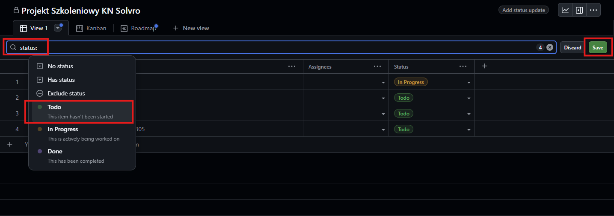

import { Card } from "@astrojs/starlight/components";
import { Steps } from "@astrojs/starlight/components";
import { LinkCard } from "@astrojs/starlight/components";

## Wstęp

Github jest główną platformą, na której rozwijamy projekty w KN Solvro. Jesną z funckcji jest właśnie github projects. Rolą PM i Techleada jest głównie planowanie, rozdzielanie i nadzorowanie pracy zespołu, a github projects jest idealnym narzędziem umożliwiającym dokładnie to.

W pierwszej części przyjżymy się obiektywnym możliwością github projects, gdzie w drugiej części będą pokazane propozycje ujednolicenia zarządzania projektami w KN Solvro.

## Poradnik

### Tworzenie projektu

Projekt możemy utworzyć zarówno z poziomu danego repozytorium jak i z poziomu całej organizacji. Przechodząc pod adres https://github.com/orgs/Solvro/projects widzimy zielony przycisk New Project. Pokaże nam się okno do wyboru predefiniowanych szablonów, ale chcąc lepiej zrozumieć github projects powinniśmy wybrać pusty szablon. Do szablonu projektu Solvro przejdziemy w drugiej części tego poradnika.

W kolejnym kroku powinniśmy podpiąć dany projekt pod repozytoria. Tą akcję wykonujemy z poziomu danego repozytorium, przechodząc do zakładnki Projects i klikając "Link a project", gdzie następnie możemy wybrać wcześniej utworzony projekt. Alternatywnie z tego poziomu można również utworzyć projekt, jeśli repozytorium już istnieje.

### Ustawienia projektu i dostępu

W ustawienia projektu możemy przejść klikając w projekcie w prawy górny róg, a następnie "settings".

Wyświetlą nam się wtedy ustawienia projektu, gdzie możemy wpisać nazwę, krótki opis oraz długi opis projektu. Na samym dole znajduje się widoczność projektu, która powinna być ustawiona na public.

W zakładce manage acess zarządzamy dostępem do projektu, czyli kto może go wyświetlać, a kto edytować. Z reguły zespół powinien być dodany jako write bądź admin, a cała grupa Solvro jako read.

### Pola

Jedna z dwóch bardzo potężnych funkcjonalności github projects. Tak zwane atrybuty umożliwiają nam skonfigurowanie projektu konkretnie pod nasze potrzeby. Z poziomu ustawień po lewej stronie mamy sekcję Custom fields, a obok niej przycisk "+ New Field". Po kliknięciu wybieramy, nazwę oraz typ atrybutu.

#### Pola tekstowe

Pola tekstowe są najbardziej uniwersalnym polem na wpisanie czegokolwiek, o ile mieści się w jednej linijce. Przykładem może być pole "Powiązanie ze strategią", gdzie wpisujemy po przecinku poszczególne symbole działań i mierników, na które dane zadanie oddziałuje.

#### Pola liczbowe

Są to pola, do których możemy wpisać tylko liczby. Przykładem może być budżet czy story pointy.

#### Pola daty

Ten typ pola umożliwia ustawienie daty z dokładnością co do dnia. Przykładem może być data rozpoczęcia i data zakończenia zadania.

#### Pola wyboru

Jedno z najczęściej używanych typów pól. Umożliwia zdefiniowanie możliwych wartości wraz z ich opisami i kolorami. Przykładem może być Priorytet.

#### Pola iteracji

Używane w zwinnym zarządzaniu projektami pole iteracji pozwala skonfigurować długość iteracji, na której podstawie będą generowały się iteracje. Następnie przypisując je do danego zadania programiści wiedzą, że np. dane zadanie powinno zostać wykonane w tym miesiącu. Github project dużą część pracy robi za nas, ale również umożliwia ręczne nazywanie i definiowanie iteracji.

#### Pole statusu

Jedno z pól standardowych, predefiniowanych przez githuba, których nie możemy usunąc. Pod spodem jest ono polem wyboru z zdefiniowanymi statusami. Domyślnie są to Todo, In progess i Done, ale istnieje opcja ich modyfikacji.

#### Pole sub-issues

Github umożliwia zagnieżdżanie zadań, tworząc wiele poziomów szczegółowości. W ustawieniach tego pola możemy tylko zmienić sposób i kolor wyświetlania powiązania zadań podrzędnych

#### Pole assignees

O ile to pole nie jest wyświetlane w ustawieniach to pokazuje się przy każdym zadaniu. Są do najzwyczajniej osoby przypisane do danego zadania, gdzie można wybrać jedną lub wiele osób.

### Tworzenie zadań

Przechodząc w główny widok projektu powinna pokazać nam się tabela. Jest to nic innego jak lista zadań, którą rozpisujemy, a następnie przypisujemy do danej osoby i repozytorium. W pierwszej kolejności klikamy na pierwszą komórkę i wpisujemy nazwę zadania

Pojawią nam się dwie opcje draft i issue. Wersje robocze (draft) nie wymagają przypisania do repozytorium, ale niestety posiadają dużo mniej funkcjonalności. Zaleca się wybranie "Create bew issue", gdzie będziemy musieli wybrać repozytorium, do którego dane zadanie zostanie przypisane. Następnie mamy możliwość wpisaia opisu i wyboru wartości wcześniej zdefiniowanych pól.

Po lewej stronie mamy historię zadania, która wraz z kolejnymi krokami będzie się aktualizowała, a poniżej miejsce na dyskusję.

Po prawej stronie mamy do wyboru atrybuty projektowe, osoby, które będą wykonywały dane zadanie, czy relacje z innymi zadaniami. Na dole mamy również opcję przeniesienia zadania z jednego repozytorium do innego.

Programiści podczas pracy będą mieli widoczny dany issue, którego powinni podpiąć do danego pull request tym samym tworząc pełną integrację pomiędzy kodem, a zadaniami.

### Widoki

Domyślna lista zadań jest odpowiednia do pewnego momentu. W pewnej skali nie jesteśmy w stanie dalej zarządzać projektem posiadając wszystko w jednej liście. Github projects pomaga rozwiązać nam ten problem za pomocą personalizowanych i konfigurowalnych widoków, które możemy dopasować do naszych potrzeb. Widoki możemy dodawać na górze projektu klikając "New view" i wybierając layout.

#### Table

Tak jak pisałem wcześniej jest to po prostu lista zadań. Nie mniej jednak w ustawieniach umożliwia podział na grupy.

W konfiguracji Fields możemy wybrać, które pola są wyświetlane w tabeli. Następnie możemy skonfigurować grupowanie, które zastosowane np. do statusów wygląda w tabeli tak:

Następnie możemy wybrać sortowanie oraz slicing. Pole slice by pozwala nam na dostęp do szybkich filtrów po lewej stronie. Zastosowanie samego Slice by po np. statusiw wygląda następujaco

#### Board

Kanban jako jedna z metodyk zarządzania projektami. Jej główną cechą jest skupienie się na wizualizacji zadań. Tworząc widok w kanban domyślnie otrzymamy poniżeszy widok, gdzie zadaniami zarządzamy po prostu przeciągając kafelki:

Tu również możemy zastosować grupowanie i sliceby. Dodatkowo w konfiguracji możemy wybrać, po którym polu definiowane są kolumny.

Z innych ciekawych opcji przy każdej kolumnie możemy ustawić limit zadań w danym statusie. Jest to przydatne do kontrolowanie przeładowania zespołu.

#### Roadmap

Ten widok jest przydatny do bardziej kaskadowego zarządzania projektem, gdzie widzimy przebiej projektu w czasie. Umożliwia on rówineż grupowanie i slice by, a z dodatkowych opcji możemy zdefiniować wyświetlany horyzont czasowy i ustawić, które pola definiujemy jako start i koniec zadania.

#### Filtry

Na przestrzeni github project możemy ustawiać filtry w poszczególnych widokach i wykresach, o których trochę więcej potem. Pomiędzy wyborem widoku, a faktycznymi zadaniami znajduje się bardzo potężne miejsce do konfiguracji filtrów. Wpisując np. 'status:Todo' pokażą nam się tylko zadania ze statusem Todo. Posiadamy również dynamiczne filtry takie jak `iteration:@current`, gdzie zawsze wyświetli nam się tylko obecna iteracja.

Możemy korzystać również z personalizacji, gdzie wpisując `assignee:@me` każdy członek zespołu będzie widział tylko swoje zadania.

Po każdej zmianie musimy pamiętać o kliknięciu zapisz w prawym rogu, aby zmiany były widoczne dla każdego członka zespołu.

### Wykresy

Wykresy z poziomu zarządczego pozwalają na wizualizację kluczowych parametrów projektu. Może być to np. obciążenie pracą lub dynamika realizacji zadań z jednej na drugą iteracją. W prawym górnym rogu klikamy na ikonę wykresu.

Następnie pokaże nam się jeden z domyślnych wykresów z opcją do utworzenia kolejnych. Jako przykładowy wykres utworzymy "Ilość zadań w danej iteracji z podziałem na osoby", gdzie dość wyraźnie będziemy widzieli kto z upływem czasu zrobił ile zadań. Po utworzeniu i nazwaniu wykresu przechodzimy w jego konfigurację, gdzie wybieramy typ wykresu, osie oraz opcjonalnie grupowanie.

### Aktualizacja statusów
