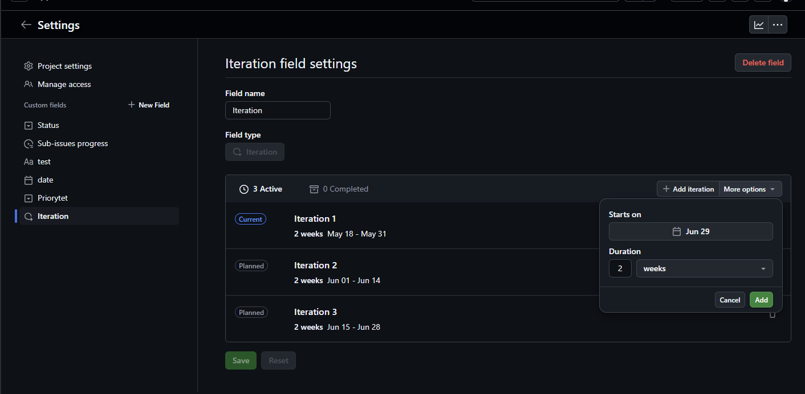

import { Card } from "@astrojs/starlight/components";
import { Steps } from "@astrojs/starlight/components";
import { LinkCard } from "@astrojs/starlight/components";

## Wstęp

Github jest główną platformą, na której rozwijamy projekty w KN Solvro. Jesną z funckcji jest właśnie github projects. Rolą PM i Techleada jest głównie planowanie, rozdzielanie i nadzorowanie pracy zespołu, a github projects jest idealnym narzędziem umożliwiającym dokładnie to.

W pierwszej części przyjżymy się obiektywnym możliwością github projects, gdzie w drugiej części będą pokazane propozycje ujednolicenia zarządzania projektami w KN Solvro.

## Poradnik

### Tworzenie projektu

Projekt możemy utworzyć zarówno z poziomu danego repozytorium jak i z poziomu całej organizacji. Przechodząc pod adres https://github.com/orgs/Solvro/projects widzimy zielony przycisk New Project. Pokaże nam się okno do wyboru predefiniowanych szablonów, ale chcąc lepiej zrozumieć github projects powinniśmy wybrać pusty szablon. Do szablonu projektu Solvro przejdziemy w drugiej części tego poradnika.

W kolejnym kroku powinniśmy podpiąć dany projekt pod repozytoria. Tą akcję wykonujemy z poziomu danego repozytorium, przechodząc do zakładnki Projects i klikając "Link a project", gdzie następnie możemy wybrać wcześniej utworzony projekt. Alternatywnie z tego poziomu można również utworzyć projekt, jeśli repozytorium już istnieje.

### Ustawienia projektu i dostępu

W ustawienia projektu możemy przejść klikając w projekcie w prawy górny róg, a następnie "settings".

Wyświetlą nam się wtedy ustawienia projektu, gdzie możemy wpisać nazwę, krótki opis oraz długi opis projektu. Na samym dole znajduje się widoczność projektu, która powinna być ustawiona na public.

W zakładce manage acess zarządzamy dostępem do projektu, czyli kto może go wyświetlać, a kto edytować. Z reguły zespół powinien być dodany jako write bądź admin, a cała grupa Solvro jako read.

### Pola

Jedna z dwóch bardzo potężnych funkcjonalności github projects. Tak zwane atrybuty umożliwiają nam skonfigurowanie projektu konkretnie pod nasze potrzeby. Z poziomu ustawień po lewej stronie mamy sekcję Custom fields, a obok niej przycisk "+ New Field". Po kliknięciu wybieramy, nazwę oraz typ atrybutu.

#### Pola tekstowe

Pola tekstowe są najbardziej uniwersalnym polem na wpisanie czegokolwiek, o ile mieści się w jednej linijce. Przykładem może być pole "Powiązanie ze strategią", gdzie wpisujemy po przecinku poszczególne symbole działań i mierników, na które dane zadanie oddziałuje.

#### Pola liczbowe

Są to pola, do których możemy wpisać tylko liczby. Przykładem może być budżet czy story pointy.

#### Pola daty

Ten typ pola umożliwia ustawienie daty z dokładnością co do dnia. Przykładem może być data rozpoczęcia i data zakończenia zadania.

#### Pola wyboru

Jedno z najczęściej używanych typów pól. Umożliwia zdefiniowanie możliwych wartości wraz z ich opisami i kolorami. Przykładem może być Priorytet.

#### Pola iteracji

Używane w zwinnym zarządzaniu projektami pole iteracji pozwala skonfigurować długość iteracji, na której podstawie będą generowały się iteracje. Następnie przypisując je do danego zadania programiści wiedzą, że np. dane zadanie powinno zostać wykonane w tym miesiącu. Github project dużą część pracy robi za nas, ale również umożliwia ręczne nazywanie i definiowanie iteracji.

#### Pole statusu

Jedno z pól standardowych, predefiniowanych przez githuba, których nie możemy usunąc. Pod spodem jest ono polem wyboru z zdefiniowanymi statusami. Domyślnie są to Todo, In progess i Done, ale istnieje opcja ich modyfikacji.

#### Pole sub-issues

Github umożliwia zagnieżdżanie zadań, tworząc wiele poziomów szczegółowości. W ustawieniach tego pola możemy tylko zmienić sposób i kolor wyświetlania powiązania zadań podrzędnych

### Draft vs Issue

### Widoki

### Wykresy

### Aktualizacja statusów
