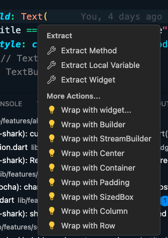
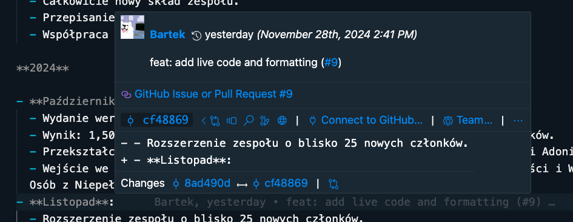
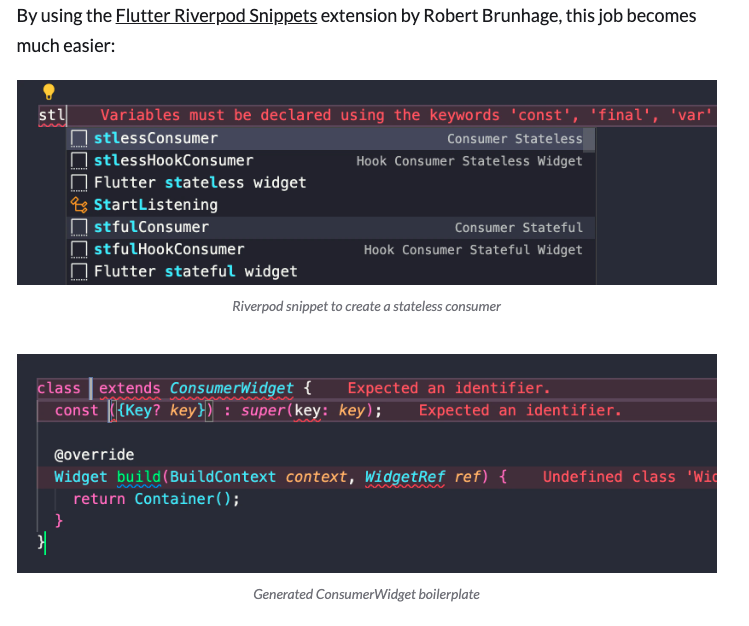

Hejo żelo! Witamy w Handbooku Flutterowca od Solvro. To miejsce, gdzie staramy się zebrać wszystko i jeszcze trochę, co wiemy o programowaniu we Flutterze - z głównym naciskiem na platformy mobilne (ale nie tylko).

Poradnik jest dość subiektywny - zachęcamy do dyskusji nad dowolnym rozdziałem - _issues i pr'ki są mile widziane_.

<https://github.com/Solvro/web-solvro-docs>

## Wymagania wstępne (czyli czego spodziewamy się po czytelniku)

Zakładamy, że masz już jakieś pojęcie o frameworku [Flutter](https://docs.flutter.dev/) - nie musisz być ekspertem, ale dobrze by było, żebyś kojarzył, czym mniej więcej jest i do czego służy. Docelowo poradnik ma nauczyć Cię zarówno podstaw, jak i bardziej zaawansowanych aspektów. Nie tłumaczy jednak wszystkiego.

Dobrze też, jeśli masz już trochę doświadczenia w programowaniu funkcyjnym i obiektowym. Najlepiej w języku [Dart](https://dart.dev/), ale większość mainstreamowych języków programowania powinna być wystarczającą bazą do zrozumienia większości rozdziałów.

Szczególnie dobrą podstawą są języki z [silnym typowaniem](https://pl.wikipedia.org/wiki/Typowanie_silne) i null safety takie jak typescript lub kotlin. Składnia Darta celowo łączy elementy z innych popularnych języków takich jak (java/type)script, C++, python czy java, żeby każdy mógł się w nim szybko odnaleźć.

## Słowo wstępne

Flutter jest relatywnie młody i z racji swojej wieloplatformowości, jest podatny na wpływy z innych technologii. Migracje programistów z różnych środowisk wznoszą do Fluttera różnorodne nawyki, architektury i naleciałości.

Szczególnie widoczne są wpływy z obydwóch mobilnych natywnych platform Android i iOS oraz webówki (głównie Reacta). W efekcie Flutter często nie narzuca jedynego słusznego rozwiązania na wiele aspektów programowania, szczególnie w kwestii architektury aplikacji i zarządzania stanem.

Dlatego ten handbook stara się wyraźnie zaznaczać, kiedy prezentowane rozwiązania są obiektywne i powszechnie uznawane, a kiedy wkraczamy w obszary bardziej subiektywne - oparte na wyborach i preferencjach Solvro i ToPWR, Jednocześnie staramy się wspominać o innych najpopularniejszych alternatywach uznawanych przez społeczność Fluttera.

:::note
Disclaimer: Handbook jest w początkowej fazie rozwoju, więc wymagania i słowo wstępne mogą być trochę oderwane od rzeczywistości.
:::

## Środowisko

### System operacyjny

Jeżeli chcesz wypuszczać apki na iOS/macOS to bez inwestycji w komputerek z jabłkiem się nie obejdzie (możesz próbować postawić maszynę wirtualną, jest to możliwe, ale nie najłatwiejsze).

Na szczęście dzięki wieloplatformowości możesz pisać we Flutterze i testować na Androidzie, a większość funkcjonalności będzie działać na obu systemach (nie wszystkie, ale dostosowanie tego pod koniec nie powinno być trudne).

Z "tańszych" OS-ów polecam bardziej Linuxa niż Windowsa, ale ostateczny wybór należy do Ciebie.

O Linuxie i WSLu możesz przeczytać więcej w napisanym przez specjalistę [Web Development Handbook](/sections/frontend/onboarding/#wsl). Praca na Linuxie jest zwykle wygodniejsza niż na Windowsie, ale nie jest to wymagane.

:::tip[Link dla kolegi]
Losowa instrukcja instalacji wirtualki macOS: <https://antyweb.pl/wirtualny-macos-na-windows-10-dziala-imessage-icloud-i-inne>

**Disclaimer**: Jest to niezgodne z licencją macOS i robisz to na własną odpowiedzialność.
:::

### Edytor / IDE

Osobiście polecam [Visual Studio Code](https://code.visualstudio.com/) - kiedy zaczynałem, miał on najlepiej działające wtyczki pod Fluttera. Trochę mniej popularny jest [Android Studio](https://developer.android.com/studio?hl=pl), który i tak musi być zainstalowany na urządzeniu, aby móc przetestować apkę na Androidzie. Parę lat temu jego wtyczki były trochę bardziej toporne - mogło się to jednak w międzyczasie zmienić.

Inne edytory to śmierć, ale to już wasza sprawa.

Poniżej znajdziesz listę wtyczek oraz ustawień do VSCode, które ułatwią lub wręcz umożliwią Ci pracę. Najpierw jednak trzeba zainstalować Fluttera.

## Instalacja Fluttera

Flutter, w przeciwieństwie do na przykład technologii zbudowanych na JSie, ma dość jednolite środowisko. Momentami problemem może być jego wieloplatformowość i to, że pod spodem musi zależeć od natywnych mobilnych (Android/iOS), desktopowych lub webowych warstw. Na szczęście sama flutterowa warstwa jest już dość jednolita i nie ma np. 15 różnych środowisk uruchomieniowych, kilku standardów czy sposobów rozwiązywania ścieżek itp. Tutaj środowisko jest jedno, a jego kierunek rozwoju jest dość silnie wytyczany przez Flutter and Dart team w Google (_z małą gwiazdką o Flocku_). A sposoby na jego instalację są właściwie tylko dwa:

### Instalacja bezpośrednia 1:1 z dokumentacją

Wszystko jest dokładnie opisane w [oficjlanych docsach Fluttera](https://flutter.dev/docs/get-started/install), ale w dużym skrócie będziesz potrzebował:

- Fluttera i Darta
- Android Toolchain / Android Studio
- iOS Platform / XCode (tylko na Macu)
- (opcjonalnie) Symulatory iOS i/lub Androida

### Instalacja przez [FVM (Flutter Version Manager)](https://fvm.app/) - polecane

Wadą pierwszej metody jest to, że Flutter jest zainstalowany globalnie i jeżeli pracujesz nad kilkoma projektami, to musisz używać jednej wersji Fluttera. FVM pozwala na zainstalowanie wielu wersji Fluttera i łatwe przełączanie między nimi.

Dlatego moim zaleceniem jest zainstalowanie FVM i korzystanie z niego od samego początku: <https://fvm.app/documentation/getting-started/installation>.
Jeśli zdecydujesz się na FVM, to Fluttera ani Darta nie musisz instalować globalnie, bo FVM zrobi to za Ciebie.
Nadal jednak musisz zainstalować Android Studio i XCode, zgodnie z instrukcją z dokumentacji Fluttera.

:::caution
Nie polecam instalacji Fluttera zarówno globalnie, jak i za pomocą FVM, bo te instancje mogą się ze sobą gryźć. Jak chcesz się przenieść z globalnej instalacji na FVM, to polecam najpierw odinstalować globalnego Fluttera.
:::

:::note
Jeśli korzystasz z FVM, trzeba proxować wszystkie komendy przez dodanie przedrostka `fvm`:

```shell
fvm flutter doctor

fvm flutter {command}

fvm dart {command}
```

Można też ustawić aliasy/symlinki w terminalu, żeby nie pisać `fvm` za każdym razem. Instrukcje znajdziesz w docsach: <https://fvm.app/documentation/guides/running-flutter>
:::

## Jak ustawić VSCode'a do pracy z Flutterem

Creditsy: Część tego rozdziału jest zainspirowana solidną [sugestią od Andrea](https://codewithandrea.com/articles/vscode-shortcuts-extensions-settings-flutter-development/).
Jest to jednak moja wariacja na ten temat.

### Wtyczki

Moim zdaniem wszystkie wtyczki z tej listy to większy lub mniejszy must have.

- [Oficjalna wtyczka do Fluttera](https://marketplace.visualstudio.com/items?itemName=Dart-Code.flutter):
  - [Oficjalne docsy](https://docs.flutter.dev/tools/vs-code) (polecam przeczytać)
    :::tip
    Dwie kwestie, o których ludzie często zapominają to:
    1. Wbudowane snippety. Na przykład wystaczy napisać `stl` i nacisnąć tab, żeby dostać szablon `StatelessWidget`u.
    2. Refactoring assistant: `Cmd + Shift + R` i możemy na przykład okalać widget, na którym jesteśmy w `Column`.
       
       :::
- [Oficjalna wtyczka do Darta](https://marketplace.visualstudio.com/items?itemName=Dart-Code.dart-code)
- [Better Comments](https://marketplace.visualstudio.com/items?itemName=aaron-bond.better-comments): Kolorowe komentarze.
- [Error Lens](https://marketplace.visualstudio.com/items?itemName=usernamehw.errorlens): Podświetla błędy w kodzie w przejrzysty sposób.
- [GitLens](https://marketplace.visualstudio.com/items?itemName=eamodio.gitlens): Fajny Git Blame (widać kto popsuł daną linijkę).
  
- GitHub Copilot: Każdy wie co to jest, polecam załatwić sobie darmową licencję studencką.
- [DartPad Theme](https://marketplace.visualstudio.com/items?itemName=Alejandro-FA.vscode-theme-dartpad): Fajny theme, inspirowany dartpadem (oficjalnym playgroundem do Darta).
- [Version Lens](https://marketplace.visualstudio.com/items?itemName=pflannery.vscode-versionlens): Podpowiada, która paczka w pubspecie ma dostępną nowszą wersję.
- [Riverpod Snippets](https://marketplace.visualstudio.com/items?itemName=robert-brunhage.flutter-riverpod-snippets):
  - Skróty do Riverpoda
  - Wystarczy napisać kilka znaków i wstawia nam template
    
- [dart-import](https://marketplace.visualstudio.com/items?itemName=luanpotter.dart-import): Komenda do sprzątania i formatowania importów. `Cmd + Shift + P -> Fix Imports`
  
- [Image preview](https://marketplace.visualstudio.com/items?itemName=kisstkondoros.vscode-gutter-preview): Pokazuje wizualizacje assetów.
- [Flutter Color](https://marketplace.visualstudio.com/items?itemName=circlecodesolution.ccs-flutter-color): Koloruje kolorki flutterowe (są też bardziej uniwersalne wtyczki, ale Flutter ma format`0xAARRGGBB` więc często mają konkretne problemy).
- [Flutter Icons](https://marketplace.visualstudio.com/items?itemName=AntoineGtr.flutter-icons): Ikonki do edytora.

### Ustawienia

Ważne ustawienia, które warto dodać do `settings.json` - w kontekście Flutter Developmentu:

1. Fix all errors on Save

   ```json
   "[dart]": {
           "editor.codeActionsOnSave": {
               "source.fixAll": true
           }
       }
   ```

2. Format on Save

   ```json
   "[dart]": {
     "editor.formatOnSave": true
   }
   ```

3. Bracked Pair Colorization

   ```json
   "[dart]": {
       "editor.bracketPairColorization.enabled": true
   }
   ```

4. Preview Flutter UI Guides

   ```json
   "dart.previewFlutterUiGuides": true

   ```

5. Enable Sticky Scroll

   ```json
   "editor.stickyScroll.enabled": true,
   ```

6. Enable file nesting for auto-generated Dart files

   ```json
   "explorer.fileNesting.patterns": {
       "*.dart": "${capture}.g.dart, ${capture}.freezed.dart, ${capture}.gr.dart, ${capture}.tailor.dart, ${capture}.gform.dart",
       "*.graphql": "${capture}.graphql.dart"
   },
   "explorer.fileNesting.enabled": true,
   "explorer.fileNesting.expand": false,
   ```

Pokazałbym Ci moje całe ustawienia, ale jest tam za dużo śmieci. Możesz sobie zerknąć na nie tutaj: <https://gist.github.com/simon-the-shark/1c99f3e6f45f9af7903bad11d4dc105a>

:::note
Jeśli koszystasz z FVM, to musisz jeszcze ustawić, żeby VSCode automatycznie wykrywał instancję z FVM w tym projekcie. Instukcja: <https://fvm.app/documentation/guides/vscode>
:::

## Jak ustawić Android Studio do pracy z Flutterem

**_Nie planuję tego opisywać. Jak ktoś jest fanem JetBrainsów to poproście Mikołaja._**

Mogę tylko podrzucić linkacza, ale nawet nie czytałem: <https://codewithandrea.com/articles/intellij-keyboard-shortcuts-flutter-development/>

## Flutter Aliasy

Nie ma jednych powszechnie przyjętych jak np. do [Gita](https://kapeli.com/cheat_sheets/Oh-My-Zsh_Git.docset/Contents/Resources/Documents/index), ale Andrea proponuje kilka podstawowych: <https://codewithandrea.com/tips/useful-aliases-flutter-dev/>

```shell
alias fclean="flutter clean"
alias fpg="flutter pub get"
alias fpu="flutter pub upgrade"
alias frun="flutter run"

alias brb="dart run build_runner build -d"
alias brw="dart run build_runner watch -d"

alias fpgbrb="fpg && brb"
alias fpgbrw="fpg && brw"

alias pinst="pod install"
alias pru="pod repo update"
```

:::caution
Jeśli używasz FVM i nie włączyłeś proxy (patrz wyżej), to musisz dodać `fvm` przed każdym aliasem.

```shell
alias fclean="fvm flutter clean"
alias fpg="fvm flutter pub get"
alias fpu="fvm flutter pub upgrade"
alias frun="fvm flutter run"


alias brb="fvm dart run build_runner build -d"
alias brw="fvm dart run build_runner watch -d"

alias fpgbrb="fpg && brb"
alias fpgbrw="fpg && brw"

alias pinst="pod install"
alias pru="pod repo update"
```

:::
