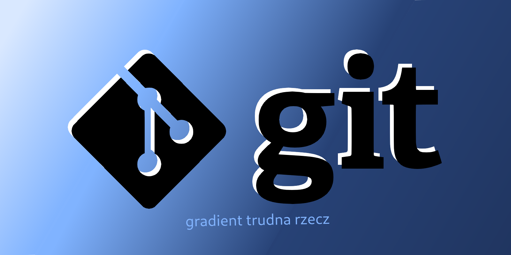

Ten poradnik jest dla osób, które chcą nauczyć się lub odświeżyć swoją wiedzę z podstaw gita lub GitHuba. Omówimy tu ich podstawowe funkcje.

- Git jest to **System Kontroli Wersji** (ang. Version Control System) - must-have, jeżeli pracujesz w zespole oraz nieoceniona pomoc w jednoosobowych projektach.
- GitHub natomiast to platforma, która pozwala tworzyć, dzielić się z innymi i zarządzać repozytoriami git, co ułatwia współpracę z innymi oraz stanowi swoiste portfolio dla programisty.

import { Aside } from "@astrojs/starlight/components";

<Aside type="tip" title="Disclaimer">
  Jeżeli potrafisz już używać tych narzędzi, a chcesz zobaczyć jak udzielać się
  na GitHubie KN Solvro to zajrzyj tutaj: [Jak używać githuba?](/github)
</Aside>

#### Spis treści

1. [Jak używać gita](/solvro/podstawy-gita/git)
1. [Jak korzystać z GitHuba](/solvro/podstawy-gita/github)
