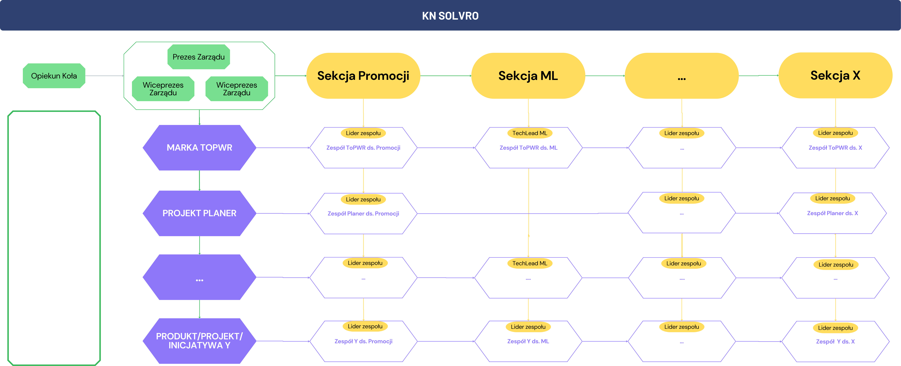

import {
  Steps,
  Card,
  CardGrid,
  LinkCard,
  Aside,
} from "@astrojs/starlight/components";

## Koncept

Koło Naukowe Solvro zrzesza obecnie ponad 100 aktywnych członków. Wraz z dynamicznym rozwojem organizacji pojawiło się kluczowe pytanie: jak skutecznie zarządzać tak licznym zespołem i równocześnie dbać o rozwój zarówno umiejętności miękkich, jak i twardych?

Na przestrzeni lat testowaliśmy różne rozwiązania organizacyjne, wyciągając z nich cenne wnioski. Ostatecznie postawiliśmy na strukturę macierzową, która pozwala każdemu członkowi działać jednocześnie w sekcji (gdzie pod opieką doświadczonego przewodniczącego rozwija umiejętności techniczne) oraz w projekcie, w którym te umiejętności przekłada się na praktykę i łączy z doskonaleniem kompetencji miękkich. Co więcej, w każdym projekcie może funkcjonować wiele zespołów z różnych sekcji, dzięki czemu efektywna współpraca i realizacja ambitnych celów stoją otworem przed każdym członkiem Koła.

<Card title="Aktywny członek" icon="openCollective">
  Aktywnym członkiem KN Solvro jest każda osoba, która w danym semestrze
  zrealizowała co najmniej jedno zadanie operacyjne wyznaczone przez
  przewodniczącego sekcji lub Product Ownera. Aktywni członkowie mają prawo
  głosu podczas walnych zgromadzeń, posiadają dostęp do zasobów koła, mogą
  uczestniczyć w spotkaniach i wyjazdach. Jeśli obowiązek ten nie zostanie
  spełniony, po zakończeniu semestru dana osoba jest usuwana ze struktur i
  zasobów Koła. Wyjątek stanowią członkowie honorowi, którzy – mimo że zachowują
  dostęp do zasobów KN Solvro i mogą uczestniczyć w spotkaniach oraz walnych
  zgromadzeniach - to nie posiadają prawa do głosowania.
</Card>

## Sekcje

Każda sekcja posiada swojego przewodniczącego, który posiadając znaczne doświadczone przewodzi działaniom dziedzinowym. Jest w ciągłym kontakcie z liderami zespołów wchodzącymi w skład projektów, a wraz z innymi przewodniczącymi i zarządem wypełnia strategię KN Solvro. Przewodniczący sekcji są powoływani i odwoływani przez zarząd głosem większości.

<Card title="Obowiązki i uprawnienia sekcji" icon="starlight">
- Organizacja wyjazdów na konferencje tematyczne
- Organizacja wyjazdów tematycznych
- Organizacja szkoleń dla członków sekcji
- Organizacja tematycznych Solvo Talków
- Organizacja integracji dla członków sekcji
- Planowanie kwartalnych celów operacyjnych
- Działania promocyjne sekcji
- Dokumentacja działań sekcji
- Pozyskiwanie partnerów
- Headhunting nowych członków
- Zarządzanie kanałami komunikacji sekcji
- Współpraca z innymi sekcjami
- Wspieranie rozwoju produktów

</Card>

### Promocja

Marketing, promocja i aktywność w mediach społecznościowych są kluczowe w
budowaniu rozpoznawalności KN Solvro. Członkowie tej sekcji dbają
o spójny wizerunek organizacji, planują kampanie informacyjne i reklamowe,
współpracują z partnerami oraz tworzą materiały promocyjne. Dzięki ich
zaangażowaniu KN Solvro dociera do coraz szerszego grona odbiorców, wzbudza
zainteresowanie w środowisku akademickim i poza nim, a także dba o to, by
wszystkie działania były realizowane w spójnej, atrakcyjnej oprawie.

### Machine Learning

Napędzana innowacją sekcja machine learningu zajmuje się praktycznym
wdrażaniem metod uczenia maszynowego – od klasycznych algorytmów, przez
bardziej złożone modele, aż po najnowsze techniki przetwarzania języka
naturalnego. Głównym językiem programowania jest tutaj Python, który umożliwia
analizę danych, tworzenie prototypów oraz rozwijanie zaawansowanych rozwiązań
AI. Grupa dąży do ciągłego poszerzania wiedzy i opracowywania nowych sposobów
wykorzystania machine learningu w różnych obszarach działalności KN Solvro.

### Mobile

Sekcja mobile rozwija aplikacje na urządzenia mobilne, które ułatwiają życie na naszej uczelni. Korzystając z nowoczesnej i multiplatformowej technologii Flutter (Dart), członkowie tworzą intuicyjne i funkcjonalne rozwiązania na obydwie główne platformy mobilne iOS i Android. W sekcji działają też programiści o backgroundzie natywnym (Swift, Kotlin), którzy chcą poszerzać swoje horyzonty w świecie cross-platform.

### Frontend

Sekcja frontend przenosi wizję i wymagania dotyczące aplikacji KN Solvro
prosto do przeglądarek użytkowników. Korzystając przede wszystkim z frameworka
Next.js, jej członkowie tworzą estetyczne, funkcjonalne i responsywne
interfejsy, które sprawiają, że korzystanie z systemów Koła Naukowego jest
przyjemne i intuicyjne. Zespół stale eksploruje nowe rozwiązania, aby pozostać
na czele innowacji w świecie technologii webowych.

### Backend

Pod maską każdej aplikacji KN Solvro pracuje sekcja backend, która – choć
często niewidoczna dla końcowego użytkownika – odpowiada za sprawne
gromadzenie, przetwarzanie i udostępnianie danych. Posługując się głównie
Node.js, członkowie sekcji tworzą kluczowe elementy architektury, umożliwiające
szybką i niezawodną komunikację między serwerami a klientami.

### Devops

Sekcja devops stanowi fundament działalności Koła Naukowego Solvro, dbając o
serwery, konfigurację, ciągłą integrację i wdrażanie (CI/CD) oraz skalowalność
rozwiązań. Działając „w cieniu”, jej członkowie czuwają nad niezawodnością i
dostępnością całej infrastruktury, tak aby aplikacje i usługi KN Solvro
docierały do użytkowników bez przestojów czy problemów. Dbanie o nowoczesne
procesy wdrożeniowe, utrzymanie fizycznych serwerów i architekturę chmurową to
jedne z najważniejszych elementów ich pracy.

### UI/UX

Wszelkie aspekty wizualne i sposób, w jaki użytkownik korzysta z aplikacji KN
Solvro, są efektem pracy sekcji UI/UX. Zespół tworzy spójne makiety i designy,
a także opracowuje wytyczne projektowe, które przekładane są później na realne
produkty. Dzięki ich kreatywnemu podejściu i dbałości o detale, rozwiązania
Koła Naukowego są nie tylko funkcjonalne, ale również estetyczne i przyjemne w
użytkowaniu.

### Zarządzanie

Sekcja zarządzania skupia osoby zainteresowane zarządzaniem i Product Ownerów,
dla których priorytetem jest skuteczne prowadzenie projektów i rozwoju
inicjatyw KN Solvro. Zespół czuwa nad terminową realizacją zadań, klarowną
komunikacją i harmonijną współpracą pomiędzy wszystkimi sekcjami. Ważnym
elementem ich działalności jest także rozwijanie umiejętności miękkich, takich
jak przywództwo i organizacja pracy, które pozwalają na efektywne zarządzanie
każdym aspektem funkcjonowania Koła.

## Produkty

Produkty KN Solvro są główną manifestacją naszej działalności. Każdym produktem zarządza Product Owner, który wraz z liderami poszczególnych zespołów nadzoruje rozwój danego produktu lub projektu.

<Card title="Obowiązki i uprawnienia projektów" icon="starlight">
- Organizacja wyjazdów na konferencje w projekcie
- Organizacja wyjazdów w projekcie
- Organizacja szkoleń dla członków projektu
- Organizacja Solvo Talków o projekcie
- Organizacja integracji dla członków projektu
- Planowanie kwartalnych celów operacyjnych
- Działania promocyjne projektu
- Dokumentacja działań projektu
- Pozyskiwanie partnerów
- Zarządzanie kanałami komunikacji projektu
- Współpraca z sekcjami i innymi projektami
- Analiza oczekiwań interesariuszy projektu

</Card>

### ToPWR

Flagowa marka KN Solvro, której efektem jest innowacyjny system informacyjny. Jest to kompleksowe rozwiązanie obejmujące szereg serwisów i narzędzi integrujących informacje ważne dla społeczności Politechniki Wrocławskiej. Na pierwszy plan wysuwa się aplikacja mobilna ToPWR, zapewniająca studentom oraz pracownikom łatwy dostęp do praktycznych danych, takich jak licznik dni do sesji, mapy uczelni czy zapełnienie parkingów. Aplikacja jest rozwijana w nowoczesnej technologii Flutter i funkcjonuje jako projekt open source. Za obsługę i przechowywanie kluczowych zasobów odpowiada Backend ToPWR, który powstał w modelu innowacji otwartej i udostępnia dane innym usługom systemu. Uzupełnieniem całości jest ToPWR Web dla Kół i Organizacji Studenckich, oferujący organizacjom narzędzia do aktualizacji informacji o swojej działalności i publikacji nowości, oraz ToPWR Parking API Wrapper, czyli most łączący nowe aplikacje z starszym systemem parkingowym uczelni. Dodatkowo, rozwijane są Skrypty pomocnicze ToPWR, automatyzujące pozyskiwanie danych o organizacjach studenckich, i ToPWR SKS, czyli rozwiązanie backendowe dostarczające aktualnych informacji o Strefie Kultury Studenckiej, w tym o menu stołówkowym oraz zapełnieniu SKS, z wykorzystaniem innowacyjnej metody szacowania liczby użytkowników na podstawie danych sieciowych.

<LinkCard
  title="Więcej o ToPWR"
  href="https://solvro.pwr.edu.pl/portfolio/to-pwr/"
/>

### PromoCHATor

Zaawansowany chatbot wykorzystujący algorytmy uczenia maszynowego i technologie rekomendacyjne do wspomagania procesu wyboru promotora pracy dyplomowej. Na podstawie analizy dorobku naukowego oraz specjalizacji kadry dydaktycznej, rozwiązanie proponuje studentom potencjalnych promotorów dopasowanych do zdefiniowanych przez nich zainteresowań. Projekt jest rozbudowany o przyjazny interfejs webowy ułatwiający interakcję z systemem, a zestaw skryptów (scrapperów) pozwala na sprawne pozyskiwanie i aktualizowanie informacji o pracownikach uczelni oraz ich publikacjach. Dzięki temu, PromoCHATor wspiera studentów w podejmowaniu ważnej decyzji akademickiej, usprawnia komunikację na linii student–promotor i stanowi kolejny krok w kierunku inteligentnych asystentów edukacyjnych.

<LinkCard title="Sprawdź promoCHATora" href="https://promochator.solvro.pl" />

### Planer

Aplikacja webowa, która rewolucjonizuje planowanie harmonogramu zajęć na Politechnice Wrocławskiej. Dzięki integracji z API USOS i autorskim scraperem, narzędzie automatycznie pobiera plany zajęć, dając jednocześnie możliwość ich elastycznej modyfikacji i dopasowania do indywidualnych potrzeb użytkownika. Intuicyjny interfejs ułatwia zarządzanie czasem, umożliwiając wyeliminowanie żmudnych czynności związanych z ręcznym układaniem planu. Popularność wersji beta, z której skorzystało już ponad 5 tysięcy studentów, świadczy o dużym zapotrzebowaniu na podobne rozwiązania, a premierze oficjalnej wersji będzie towarzyszyć szeroko zakrojona promocja.

<LinkCard
  title="Więcej o Planerze"
  href="https://solvro.pwr.edu.pl/portfolio/planer/"
/>

### Aplikacja Juwenaliowa

Aplikacja informacyjna na Juwenalia 2025 na Politechnice Wrocławskiej, pozwoli uczestnikom w jednym miejscu znaleźć wszystkie istotne informacje o koncertach, imprezach i pozostałych atrakcjach. Aplikacja ma działać w sposób elastyczny, zapewniając dostęp do kluczowych funkcji, także w trybie offline, oraz wypełniając wytyczne WCAG 2.1, co zagwarantuje przyjazność rozwiązania osobom z niepełnosprawnościami. Rozbudowana strategia marketingowa, uwzględniająca aktywną promocję i nowoczesny charakter aplikacji, przyczyni się do zwiększenia rozpoznawalności Politechniki Wrocławskiej jako organizatora barwnych i dostępnych dla wszystkich wydarzeń.

### LED Cube

LED Cube stanowi innowacyjną platformę dla wszystkich pasjonatów technologii i sztuki cyfrowej, którzy pragną tworzyć trójwymiarowe animacje na kostkach LED. Projekt łączy kilka kluczowych elementów: symulator webowy pozwala na testowanie i wspólną pracę nad algorytmami bez konieczności posiadania fizycznej kostki, backend umożliwia przesyłanie gotowych animacji do rzeczywistych urządzeń oraz ich zarządzanie, a sama Fizyczna kostka 3D (w różnych rozmiarach) prezentuje wyjątkowy, efektowny sposób wizualizacji danych i będzie służyć jako atrakcyjna instalacja promocyjna na Wydziale. Dzięki takiemu podejściu, LED Cube łączy programowanie, kreatywność i interaktywną zabawę, otwierając szereg możliwości w obszarze cyfrowego designu.

<LinkCard
  title="Więcej o LED Cube"
  href="https://solvro.pwr.edu.pl/portfolio/ledcube/"
/>

### Eventownik

Aplikacja dedykowana społeczności akademickiej Politechniki Wrocławskiej, której głównym celem jest usprawnienie i zautomatyzowanie organizacji wydarzeń uczelnianych. Narzędzie pozwala szybko stworzyć rejestrację na event z możliwością zapisów grupowych, przyczyniając się do eliminacji chaotycznych i czasochłonnych metod zgłoszeń. Jednocześnie ułatwia pracę organizatorom, automatyzując powtarzalne zadania i zapewniając czytelną prezentację list uczestników. Dzięki współpracy z rozmaitymi organizacjami studenckimi, Eventownik przyczynia się do integracji i profesjonalizacji życia akademickiego, sprawiając, że Politechnika Wrocławska umacnia wizerunek uczelni nowoczesnej i otwartej na innowacje.

<LinkCard
  title="Więcej o Eventowniku"
  href="https://solvro.pwr.edu.pl/portfolio/eventownik/"
/>

### Strona Zespołu W4

Projekt realizowany we współpracy z Wydziałem Informatyki i Telekomunikacji, obejmujący stworzenie witryny internetowej dla Pracowni Systemów Cyberfizycznych. Ma ona prezentować informacje o pracownikach, wspierać przepływ danych o wydarzeniach oraz stanowić przyjazną platformę do dyskusji. Dzięki temu, zespół w prosty sposób będzie mógł publikować aktualności, dzielić się wynikami pracy, a także utrzymywać kontakt z osobami zainteresowanymi rozwojem technologii cyberfizycznych.

### Fizyczni

Platforma internetowa skierowana przede wszystkim do uczniów szkół średnich oraz studentów pierwszego roku studiów technicznych, która ma na celu ułatwić zrozumienie fizyki przez pryzmat praktycznych zastosowań i doświadczeń. Dzięki przystępnej formie nagrań wideo oraz wyjaśnieniom teorii w kontekście eksperymentów, platforma dąży do zmiany postrzegania fizyki jako trudnego, często zniechęcającego przedmiotu. Projekt jest dodatkowo wsparciem dla młodzieży przygotowującej się do matury, oferując materiały edukacyjne, rozwiązania zadań i omówienie metod tworzenia modeli matematycznych opisujących rzeczywistość. Współpraca z SKNF Bozon z Akademii Górniczo-Hutniczej w Krakowie zapewnia wysoki poziom merytoryczny.

<LinkCard
  title="Więcej o Fizycznych"
  href="https://solvro.pwr.edu.pl/portfolio/fizyczni/"
/>

## Inne organy

### Zarząd

Główny organ decyzyjny Koła Naukowego Solvro, odpowiedzialny za strategiczne planowanie i nadzór nad wszystkimi działaniami organizacji. W jego skład wchodzą 3 osoby, gdzie na czele z Prezesem zarządu, tworzą Executive Board. Zarząd dba o koordynowanie prac przewodniczących sekcji i produktów, ustala główne kierunki rozwoju KN Solvro oraz podejmuje decyzje dotyczące budżetu i współpracy z partnerami. Poprzez ścisłą współpracę z innymi sekcjami i organami koła, zarząd zapewnia spójność działań i dba o długofalowy rozwój organizacji.

<LinkCard title="Więcej o obecnym zarządzie" href="/solvro/viii_board" />

### Opiekun

Dr. inż. Piotr Syga będący pracownikiem uczelni, pełni rolę mentora dla Koła Naukowego Solvro. Wspiera studentów swoją wiedzą i doświadczeniem, kierując ich na właściwe ścieżki rozwoju, a także pomaga im w nawiązywaniu kontaktów naukowych i biznesowych. Pełniąc funkcję łącznika z władzami uczelni, opiekun czuwa nad utrzymaniem wysokiej jakości działania oraz dba o zachowanie standardów naukowych i etycznych.

<LinkCard
  title="Więcej o opiekunie KN Solvro"
  href="https://wit.pwr.edu.pl/wydzial/struktura-organizacyjna/pracownicy/piotr-syga"
/>

### Członkowie honorowi

Członkowie honorowi to wyróżnione osoby, które poprzez
swój wkład w działalność KN Solvro zasłużyły na specjalne uznanie. Status
otrzymuje się na koniec swojej działalności w KN Solvro pod warunkiem aktywnej
wieloletniej działalności. Tytuł uprawnia do dostępu do zasobów koła po
zakończeniu aktywnej działalności. Nadanie statusu członka honorowego przez zarząd jest
wyrazem wdzięczności i uznania dla kluczowych postaci, które wspierały Koło
Naukowe i wniosły istotny wkład w jego historię.

<LinkCard title="Członkowie KN Solvro" href="https://solvro.pwr.edu.pl/team/" />

### Walne zgromadzenie

Walne zgromadzenie stanowi najwyższą władzę w strukturze Koła Naukowego Solvro, w
której każdy członek aktywny ma prawo głosu. Jest to forum, na którym podejmuje
się najważniejsze decyzje dotyczące funkcjonowania i przyszłości organizacji –
między innymi przyjmuje sprawozdania zarządu, wybór nowego zarządu czy wprowadza
zmiany w regulaminie. Walne zgromadzenie zwoływane jest regularnie przynajmniej
raz na rok działalności, a uczestnictwo w nim daje możliwość realnego wpływu na
rozwój KN Solvro oraz integrację społeczności koła.

### Komisja rewizyjna

Komisja rewizyjna jest organem kontrolnym Koła Naukowego Solvro, który
weryfikuje poprawność działań zarządu, przestrzeganie statutu oraz prawidłowe
gospodarowanie środkami finansowymi. Jej członkowie, niezależni od władz
wykonawczych, przeprowadzają audyty i kontrole wewnętrzne, by zapewnić
rzetelność prowadzonych operacji. Dzięki pracy komisji rewizyjnej organizacja
utrzymuje wysoki standard funkcjonowania, a członkowie KN Solvro mają
gwarancję transparentności i odpowiedzialności za podejmowane decyzje.
Członkami Komisji rewizyjnej zazwyczaj zostają bardzo doświadczeni członkowie
po pełnieniu funkcji przewodniczącego lub zarządu. Jest to jedyny organ, w
którym może działać członek honorowy.
