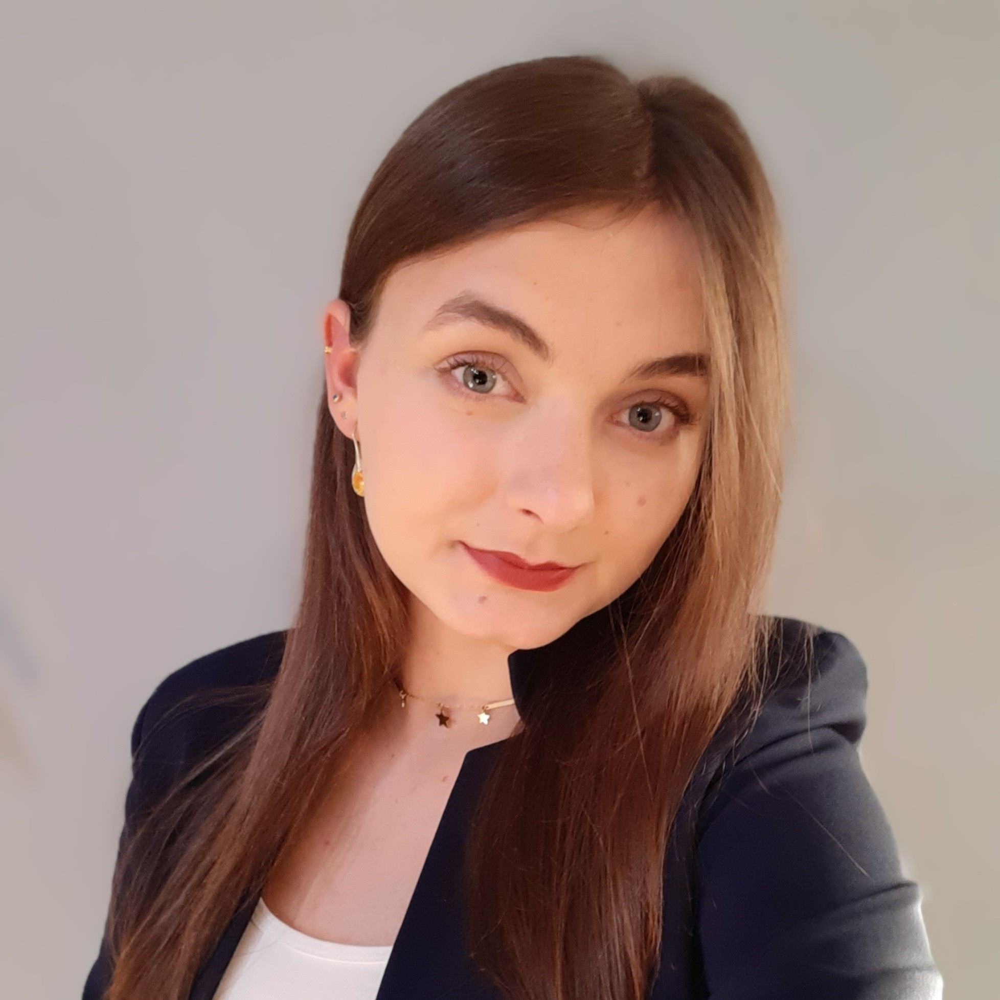

import {
  Steps,
  Card,
  CardGrid,
  LinkCard,
  Aside,
} from "@astrojs/starlight/components";

## Skład

<CardGrid>
  <Card title="Dawid Linek">
  Łącząc w sobie pasję do informatyki i zarządzania podczas wiosennych wyborów został wybrany Prezesem VII Zarządu. Fan Laravela, ale jest również obyty z innymi technologiami. Lubi gotowanie, narty i dokumentację :)
  </Card>
  
<Card title="Szymon Kowaliński">Wiceprezes VII Zarządu. W Solvro przewodzi sekcją Mobile i zaraża innych pasją do Fluttera, choć nie jest to jedyna technologia na jego tech stacku. Trenuje wioślarstwo i robienie code review na czas.</Card>
  

  <Card title="Wiktoria Mróz">Przed objęciem funkcji Wiceprezeski VII Zarządu pełniła rolę Przewodniczącej Młodzieżowej Rady Miejskiej, a także uzyskała stypendium dla Dziewczyn w STEM. Obecnie rozwija się w obszarze Machine Learning. Lubi quizy i teleturniej Jeden z Dziesięciu.</Card>
  
 
</CardGrid>

## Plan działania

<LinkCard
  title="Strategia KN Solvro"
  href="/solvro/strategy"
  description="Długoterminowy plan strategiczny dyktujący działania KN Solvro."
/>
Ze strategii KN Solvro wyznaczyliśmy następujące cele taktyczne:

### S1. Cyfryzacja życia studenckiego PWR

#### Taktyczny S1.T1: Zbudowanie dostępnej żywej bazy wiedzy o Politechnice Wrocławskiej

Głównie za pomocą marki ToPWR chcemy zbudować bazę wiedzy o naszej uczelni.
Otwierając ją na aktualizacje przez inne jednostki, chcemy stać się najaktualniejszym uporządkowanym źródłem informacji o życiu studenckim PWR.

#### Taktyczny S1.T2: Umożliwienie prostego spersonalizowanego dostępu do danych o Politechnice Wrocławskiej

Realizując S1.T1. jesteśmy świadomi, że zgromadzenie ogromnych ilości informacji sprawi, że ich przyswojenie przez przeciętnego studenta będzie niemal niemożliwe.
Tworząc aplikacje, API i innowacyjne rozwiązania AI chcemy zapewnić przystępny dostęp do potrzebnych informacji o PWR.

#### Taktyczny S1.T3: Aplikacje przez studentów dla studentów

Rozwiązania IT są istotnym elementem podczas cyfryzacji życia studenckiego na Politechnice Wrocławskiej.
Naszym celem jest pomoc studentom poprzez tworzenie aplikacji webowych, mobilnych oraz innych końcowych rozwiązań, które znajdują zastosowanie w ich codziennym życiu.

### S2. Wspomaganie studentów w zakresie IT

#### Taktyczny S2.T1: Regularny cykl wydarzeń

Organizacja regularnych wydarzeń, takich jak "Solvro Talk" prowadzone przez członków, "Solvro Talk z praktykiem" oraz coroczna konferencja WITKoN, pozwala na rozwój zarówno uczestników, jak i społeczności akademickiej.
Wydarzenia te integrują studentów, promują wymianę wiedzy oraz umacniają wizerunek KN Solvro jako organizacji wspierającej edukację i innowację w IT.

#### Taktyczny S2.T2: Dostępna infrastruktura IT

Zapewnienie dostępu do infrastruktury IT, takiej jak własne serwery, kredyty obliczeniowe czy procedury dzielenia się zasobami, wspiera rozwój projektów studenckich i inicjatyw technologicznych.
Infrastruktura ta umożliwia studentom zdobywanie praktycznych umiejętności, ułatwia realizację projektów i wzmacnia technologiczną bazę uczelni.
Wiedząc jak ciężko jest uzyskać moc obliczeniową, we współpracy z administracją i władzami Politechniki Wrocławskiej chcemy utworzyć drogę do łatwego pozyskania potrzebnych zasobów.

#### Taktyczny S2.T3: Łącznik w zakresie IT dla innych organizacji

KN Solvro odgrywa rolę pośrednika w zakresie IT, oferując doradztwo techniczne, wsparcie w realizacji projektów oraz organizację szkoleń z umiejętności twardych dla innych organizacji studenckich.
Dzięki temu promujemy współpracę między jednostkami, podnosimy poziom kompetencji technologicznych na uczelni i wspieramy społeczność akademicką w realizacji jej celów.

### S3. Stabilny wzrost i działanie KN Solvro

#### Taktyczny S3.T1: Budowa kultury organizacyjnej

Tworzenie silnej kultury organizacyjnej poprzez integracje, spotkania, system nagród i wyróżnień dla członków motywuje do zaangażowania i buduje przyjazne środowisko.
Dzięki temu organizacja rozwija się nie tylko technologicznie, ale także pod względem relacji i współpracy między członkami.

#### Taktyczny S3.T2: Przekazywanie wiedzy i kompetencji

Przekazywanie wiedzy i kompetencji w KN Solvro opiera się na systematycznych wewnętrznych szkoleniach rozwijających zarówno umiejętności techniczne, jak i miękkie, co wspiera rozwój członków i utrzymanie wysokich standardów działania.
System rodzica, obejmujący mentoring i indywidualne wsparcie, ułatwia nowym członkom wdrożenie się w organizację i budowanie relacji.
Równocześnie, kompleksowa i aktualizowana dokumentacja projektów oraz procesów operacyjnych zapewnia płynne przejmowanie obowiązków, minimalizując ryzyko utraty kluczowej wiedzy organizacyjnej.

#### Taktyczny S3.T3: Pozytywny i popularny zewnętrzny obraz KN Solvro

Poprzez uczestnictwo w wydarzeniach, promowanie organizacji za pomocą gadżetów i efektywnych kampanii marketingowych oraz nawiązywanie relacji z interesariuszami KN Solvro buduje rozpoznawalność i reputację jako lider wśród kół naukowych.
Dzięki temu przyciągamy nowych członków, partnerów i możliwości rozwoju. Przez nasze akcje na scenie krakowej i międzynarodowej reprezentujemy Politechnikę Wrocławską jako hub innowacyjności.

## SWOT

<CardGrid>
<Card title="Mocne strony" icon="star"> 
  

    
Adaptacja i dynamika

    KN Solvro działa zwinnie, potrafiąc dostosować się do warunków zewnętrznych. 
    Bieżące nadzorowanie działań i wydarzeń zarówno wewnętrznych, jak i zewnętrznych, 
    wraz z przekazywaniem uprawnień do reagowania niżej, pozwala elastycznie 
    reagować na zmieniające się otoczenie.
  

  

    
Profesjonalizm zaangażowanych osób

    Część członków KN Solvro posiada znaczne doświadczenie zawodowe, które chętnie 
    przekazują dalej. Warto podczas rekrutacji zwracać uwagę na osoby nie tylko z 
    dużymi umiejętnościami technicznymi, ale także na te z rozwiniętymi 
    kompetencjami miękkimi.
  

  

    
Popularność

    Dzięki tworzonym aplikacjom i aktywnościom, KN Solvro jest rozpoznawalne szeroko poza 
    Wydziałem Informatyki i Telekomunikacji. Realizacja kolejnych inicjatyw
    dodatkowo umocni wizerunek Koła i zwiększy jego zasięg.
  

  

    
Wielodziedzinowość

    KN Solvro zrzesza pasjonatów z różnych dziedzin, łącząc najpopularniejsze technologie 
    (m.in. frontend, backend, mobile, machine learning). Takie połączenie specjalizacji 
    pozwala na tworzenie kompleksowych i innowacyjnych rozwiązań w środowisku akademickim.
  

</Card>

<Card title="Słabe strony" icon="warning">
  

    
Skala

    Dynamiczny rozwój i wzrost liczby członków (ponad 100 w 7 sekcjach na
    listopad 2024) może prowadzić do problemów z komunikacją i zarządzaniem.
    Należy dążyć do usprawnienia wymiany informacji i procesów organizacyjnych.
  

  

    
Przeciążenie poszczególnych członków

    Często to najbardziej doświadczeni członkowie są odpowiedzialni za kilka
    projektów naraz, co prowadzi do wypalenia. Warto wdrożyć narzędzia do
    rozdzielania zadań, a także zadbać o priorytetyzację i delegowanie.
  

  

    
Umiejętności miękkie

    Choć studenci posiadają duże umiejętności techniczne, to wciąż istnieje pole
    do rozwoju w zakresie kompetencji miękkich (np. komunikacja, teamwork).
    Rozmowy 1:1, szkolenia oraz integracje mogą wspierać ten obszar.
  

</Card>

<Card title="Szanse" icon="rocket">
  

    
Koło Strategiczne

    Tytuł Koła Strategicznego Politechniki Wrocławskiej to ogromny prestiż –
    przyciąga potencjalnych partnerów i umożliwia skuteczniejsze pozyskiwanie
    środków zewnętrznych oraz rozwój ambitnych projektów.
  

  

    
Skalowalność

    Oprogramowanie tworzone przez KN Solvro może osiągnąć duży zasięg na
    uczelni, a nawet poza nią. Wystarczy dobrze zaprojektować i wdrożyć projekt,
    aby dotarł do większości studentów i potencjalnie był wykorzystywany przez
    kolejne roczniki. W przeciwieństwie do projektów fizycznych, oprogramowanie
    można skalować praktycznie w nieskończoność.
  

  

    
Innowacja otwarta

    Prowadząc otwarte repozytoria (Open Source) i otwartą dokumentację
    projektów, KN Solvro umożliwia innym organizacjom i jednostkom rozwijanie
    dalszych rozwiązań, opierając się na wypracowanych fundamentach.
  

  

    
Współpraca międzywydziałowa

    Współpraca z innymi wydziałami i jednostkami uczelnianymi (np. Samorząd,
    Biuro Karier, AIP) pozwala na poszerzanie kompetencji i rozwijanie projektów
    z różnych dziedzin oraz pozyskiwanie kolejnych aktywnych członków.
  

  

    
Możliwość rozszerzenia działalności międzynarodowej

    Udział w hackathonach lub konferencjach za granicą to szansa na nawiązanie
    nowych partnerstw, pozyskanie innowacyjnych pomysłów i zaprezentowanie
    dokonań KN Solvro w szerszej perspektywie, co może prowadzić do dalszych
    prestiżowych projektów międzynarodowych.
  

</Card>

<Card title="Zagrożenia" icon="error">
  

    
Wahania zaangażowania

    Motywacja członków bywa zmienna, szczególnie w okresach sesji i dużego obciążenia 
    zajęciami. Istotne jest stworzenie warunków sprzyjających długofalowej aktywności.
  

  

    
Wygaszenie się starszych członków

    Gdy najbardziej doświadczeni członkowie kończą studia, pojawia się ryzyko utraty 
    kluczowego know-how. Wdrożenie systemu przekazywania wiedzy (np. dokumentacja, 
    system rodzica, mentoring) staje się tu kluczowe.
  

  

    
RODO i kwestie prawne

    Brak odpowiednich zabezpieczeń w projektach (np. brak polityk prywatności, 
    niedopilnowanie kwestii prawnych) może narazić Koło na konsekwencje prawne 
    i utratę zaufania społeczności.
  

    

    
Niejasna i złożona współpraca z Działem Informatyzacji

    Brak jednolitych procedur i trudności w kontaktach z administracją PWR, a w szczególności Działem Informatyzacji mogą 
    opóźniać realizację projektów i utrudniać wprowadzanie innowacji. Dodatkowo, 
    niewystarczające wsparcie lub niejednoznaczna komunikacja ze strony władz 
    uczelni może spowalniać dalszy rozwój KN Solvro.
  

</Card>
</CardGrid>

## Kluczowe inicjatywy

### I1. Restrukturyzacja KN Solvro

Rozpoczęta w 2024 roku restrukturyzacja ma na celu usprawnienie działania Koła poprzez uporządkowanie ról, procesów i odpowiedzialności.
Każda sfera od struktury organizacyjnej, przez sposoby komunikacji, po prowadzenie projektów i długoterminowy plan strategiczny została przenalizowana i zrestrukturyzowana.
Restrukturyzacja obejmuje także wprowadzenie klarownej ścieżki kariery w Kole – od nowego członka, przez lidera projektu, aż po zarząd.

### I2. Wzięcie udziału w konkursie o Koło Strategiczne Politechniki Wrocławskiej

W ramach programu Koło Strategiczne Politechniki Wrocławskiej, organizacje studenckie z całej uczelni rywalizują o prestiżowy tytuł potwierdzający wyjątkową aktywność i wpływ na środowisko akademickie.
Dla KN Solvro udział w konkursie to nie tylko szansa na dodatkowe finansowanie, ale przede wszystkim na wzmocnienie wizerunku, nawiązanie nowych kontaktów i promocję innowacyjnych projektów w całej społeczności akademickiej.

### I3. Wakacyjne wyzwanie

Wakacyjne wyzwanie to inicjatywa mająca na celu zaangażowanie członków i kandydatów do Koła w okresie przerwy wakacyjnej.
Uczestnicy otrzymują zadania i warsztaty dostosowane do swoich umiejętności (frontend, backend, ML), które pozwalają im rozwinąć się praktycznie, a przy okazji wspólnie realizować mini-projekty.
Dzięki temu rozwiązaniu nowi członkowie jeszcze przed początkiem semestru poznają kulturę KN Solvro i stawiają pierwsze kroki w tworzeniu realnych aplikacji. Pełni to również rolę trzeciej rekrutacji KN Solvro.

### I4. Konferencja Kół Naukowych i Aktywnych Studentów WITKoN 2024

Konferencja WITKoN gromadzi najaktywniejsze organizacje studenckie oraz przedstawicieli władz wydziałowych i uczelnianych. KN Solvro jako jeden z głównych organizatorów i pomysłodawców stawia na warsztaty, prezentacje oraz panele dyskusyjne, które inspirują i integrują środowisko akademickie.
WITKoN jest również idealnym miejscem do wypromowania projektów Koła oraz znalezienia sojuszników lub sponsorów dla przyszłych inicjatyw.

### I5. Rozpoczęcie projektu z fizycznym trwałym efektem (hardware)

W odpowiedzi na potrzebę poszerzenia kompetencji o rozwiązania sprzętowe, KN Solvro planuje wdrożyć projekt hardware’owy w postaci ledowej kostki 3D, która będzie promowała koło stojąc w budynkach Wydziału.
Dzięki takiemu działaniu członkowie Koła mają okazję rozwijać się w obszarach elektroniki i inżynierii, a sama uczelnia zyskuje innowacyjne rozwiązanie widoczne w przestrzeni fizycznej.

### I6. Aktualizacja identyfikacji wizualnej KN Solvro

Mimo, że bazowe kolory i główny kształt logo pozostaną te same, KN Solvro potrzebuje odświeżenia designu, by spójnie odzwierciedlać energię i profesjonalizm Koła.
Kluczowym elementem jest stworzenie ujednoliconych materiałów — od szablonów prezentacji, przez gadżety, aż po plakaty czy posty w social media.
Dzięki temu członkowie i partnerzy mają szybko rozpoznawalne oraz estetycznie spójne elementy graficzne, podkreślające innowacyjny charakter i wieloletnią tradycję KN Solvro, bez rezygnacji ze znanych dotychczas kolorów i logo.

### I7. Zmiana formy rekrutacji

Przyjrzenie się procesowi rekrutacji i zmiany w jej formacie będą miały na celu przyciągnięcie większej liczby zaangażowanych studentów, lepsze rozeznanie w możliwych kandydatach i automatyzację żmudnych procesów.
Powrót do roli rodzica, startowa dokumentacja i sprawny okres wdrożeniowy mają na celu mniejszą rotację utalentowanych członków.

## Działania operacyjne

<LinkCard
  title="Cele operacyjne 25Q1"
  href="https://github.com/orgs/Solvro/projects/3/views/7?filterQuery=iteration%3A25Q1"
/>

## Podsumowanie

<CardGrid>
  <Card title="VII Zarząd">
  Kadencja naszego zarządu była niesamowicie ciekawa. Zaczynając od niszowej organizacji IT w rok udało nam się zbudować największe Koło Naukowe na Politechnice Wrocławskiej, a do tego zdobyć prestiżowy tytuł Strategicznego Koła Naukowego. Z tego miejsca po raz ostatni bardzo dziękuję wszystkim zaangażowanym, bo to właśnie wy jako następne pokolenie ambitnych utalentowanych studentów jesteście naszym największym sukcesem.

Dawid Linek - Prezes VII Zarządu

  </Card>
 
</CardGrid>

### Sprawozdanie planu taktycznego

#### Taktyczny S1.T1: Zbudowanie dostępnej żywej bazy wiedzy o Politechnice Wrocławskiej

W ramach tego celu chcieliśmy zbudować żywą dostępną bazę wiedzy o Politechnice Wrocławskiej. Udało nam się to wykonać głównie za pomocą:

- Marki ToPWR, gdzie gromadzimy dane o parkingach, budynkach, menu i zapełnieniu sks, poradnikach dla nowych osób i wiele więcej.
- W ramach produktu Planer zebraliśmy dane o siatkach godzin oraz ocenach prowadzących.
- W ramach produktu Promochator zebraliśmy dane o pracach dyplomowych i promotorach.

#### Taktyczny S1.T2: Umożliwienie prostego spersonalizowanego dostępu do danych o Politechnice Wrocławskiej

Posiadając dane w powyższej celu chcieliśmy umożliwić przystępne ich przyswojenie. Cel został zrealizowany poprzez:

- Utworzenie API ToPWR, które zostało udostępnione np. Samorzadowi studenckiemu
- Cała aplikacja ToPWR, która przystępnie prezentuje dane o naszej uczelni.
- Promochator, który implementując technologie AI rekomenduje promotorów na podstawie zainteresowań studenta.
- Planer, który pokazuje siatki godzin (i do pewnego czasu opinie) dla danego studenta.
- Testownik, który umożliwiał dostępo do quizów dot. zakresu danego przedmiotu.

#### Taktyczny S1.T3: Aplikacje przez studentów dla studentów

Tworząc aplikacje przez studentów dla studentów podjęliśmy się produktów

- Eventownik
- Planer
- ToPWR
- Testownik
- PromoCHATor
- LedCube\*
- CatchQR\*

\*Projekty zakończone niepowodzeniem

Wśród studentów jesteśmy coraz to bardziej rozpoznawalni, gdzie naszych rozwiązań w 2024 roku używało ponad 30 000 użytkowników, a wyświetlenia idą w setki tysięcy.

#### Taktyczny S2.T1: Regularny cykl wydarzeń

- 21 Solvro Talków
- Konferencja Kół Naukowych i Aktywnych Studentów WITKoN 2024

Solvro organizuje i uczestniczy w wydarzeniach. Niestety z regularnością wyglądało średnio.

#### Taktyczny S2.T2: Dostępna infrastruktura IT

- Pozyskanie ~5k PLN kredytów AWS
- Zbudowanie stacji obliczeniowej o wartości ~10k
- Uzyskanie 2 serwerów w WCSS
- Uzyskanie serwera niezależnego na OVH
- Uzyskanie serwera na SeoHost o wartości ~4k
- Złożenie wniosku strategicznego o serwer

Obecna struktura spełnia wymagania naszych aplikacji i nie odbyło się żadne ubicie serwera ze względu na ruch. Zostały podjęte inicjatywy mające na celu restrukturyzację naszej infrastruktury, ale działania zostały przekazane nowemu zarządowi.

#### Taktyczny S2.T3: Łącznik w zakresie IT dla innych organizacji

- Utrzymanie strony internetowej LEM Wrocław
- Mentorzy i Jury na BEST Hacks 2024
- Konferencja Kół Naukowych i Aktywnych Studentów WITKoN 2024
- Projekt Eventownik
- Aplikacja Juwenalia
- ToPWR

Obecnie wśród organizacji studenckich Solvro ma bardzo dobrą opinie, przez co dostajey coraz to więcej ofert współpracy z coraz to nowszymi kołami.

#### Taktyczny S3.T1: Budowa kultury organizacyjnej

W ramach tego celu pozstał podjęty szereg działań, które końcowo zbudowały zaangażowaną grupę osób w Solvro, które chętnie dzielą się wiedzą i przyczyniają się do rozwoju organizacji. Kilka kluczowych inicjatyw w ramach tego celu zawierało:

- Realizację wlep
- Realizację merchu (bluzy i skarpetki)
- Przeprowadzenie 3 rekrutacji zwiększając liczbę członków z ~30 do 120.
- Realizacja przypinek dla kierowników kończących projekt
- Ustandaryzowanie statusu członka honorowego i wprowadzenie oficjalnego pożegnania wraz z figurką.
- Wprowadzenie co-miesięcznych spotkań stacjonarnych i integracji
- Postawienie na cykliczne stacjonarne spotkania zespołów projektowych
- Uzyskanie biura do spotkań
- Przeprowadzenie ponad 45 cyklcznych weekly
- Zorganizowanie 2 wyjazdów integracyjno-szkoleniowych
- Zwrócenie uwagi na spotkania miękkie typu wizyjne i retrospekcja.
- Wprowadzenie rozmów 1:1 w ramach sekcji
- Reaktywacja systemu rodzica
- Dynamiczny wzrost aktywności na githubie i discordzie

#### Taktyczny S3.T2: Przekazywanie wiedzy i kompetencji

Za naszej kadencji udało się wprowadzić szereg rozwiązań wspomagających sprawne przekazanie wiedzy i kompetencji, co jest kluczowe do budowania kolejnych pokoleć członków Solvro. Możemy do nich zaliczyć m.in.:

- Restrukturyzacja dysku, maila i githuba
- Sformalizowanie sekcji względem przekazywania umiejętności twardych
- Utworzenie docs.solvro.pl
- 21 Solvro Talks
- Zdobycie kursów i newsletterów technologicznych
- Wakacyjne wyzwanie i kurs "Od zera do backend developera"
- Rozmowy 1:1 i system rodzica
- Hackatony sekcji
- Kompleksowe przekazanie władzy

#### Taktyczny S3.T3: Pozytywny i popularny zewnętrzny obraz KN Solvro

Udało się zbudować popularny obraz KN Solvro, gdzie naszych aplikacji użyło 30K użytkowników oraz osiągnęliśmy 216K wyświetleń na social mediach. Pokazywaliśmy się wszędzie, gdzie tylko się na, a szczególnie:

- Zrealizowaliśmy materiały promocyjne w tym plakaty, rollupy i wlepy
- 21 postów na naszym blogu
- ~20 razy pojawiliśmy sie na stronie Wydziału Informatyki i Telekomunikacji
- 3 razy pojawiliśmy sie na stronie Politechniki Wrocławskiej
- 7 razy pojawiliśmy się w newsletterze studenckim
- ~100 postów na fb (w tym 11 relacji i dwa filmy)
- ~40 postów na instagramie (z czego ~30 relacji)
- Mieliśmy wystąpienie w radiu luz i innych radiach/gazetach
- Pojawiliśmy się na DAS, WAS, DAWIT, Spotkaniu Choinkowym
- Kilka z Solvro Talkow było otwatych dla studentów
- Konferencja WITKoN
- Redesign strony internetowej KN Solvro
- 8 Prac Naukowych
- Uczestnictwo w PP-RAI 2024 Warszawa
- Uczestnictwo w FlutterCon Europe 2024 Berlin
- Uczestnictwo i wygrana na HackYeah 2024 Kraków
- Uczestnictwo w ML in PL Warszawa
- Uczestnictwo w 4Developers Wrocław
- Uczestnictwo i IDEAHACK IDEAS NCBR Warszawa
- Uczestnictwo w Szlachetnej Paczce 2024 razem z LEM Wrocław
- Zorganizowaliśmy Wakacyjne Wyzwanie Solvro
- W ramach DeepFake Monitor objęliśmy pieczę nad grupą studentów cyberbezpieczeństwa we współpracy z Identt
- Reprezentowaliśmy Solvro w Radzie Uczelnianych Organizacji Studenckich
- ZŁożenie wniosku Unite! Seed Fund
- Złożenie wniosku FAST z Wrocławskiego Centrum Akademickiego
- Nawiązaliśmy dobre kontakty z administracją PWR w tym z Wydziałem W4, Działem Informacyzacji, Centrum Współpracy Międzynarodowej, Działem Wsparcia Aktywności Studenckiej i wiele więcej.
- Zostanie Strategicznym Kołem Naukowym Politechniki Wrocławskiej

### Sprawozdanie inicjatyw strategocznych

#### I1. Restrukturyzacja KN Solvro

Z uwagi na gwałtowny rozrost oraz przestarzałe procesy koło wymagało restrukturyzacji. Odbyła się ona poprzez:

- Ustanowienie misji, wizji i wartości KN Solvro
- Utworzenie długoterminowanego planu strategicznego Solvro wraz z celami strategicznymi, taktycznymi i operacyjnymi
- Przekształcenie na strukturę macierzową i ustanowienie sekcji
- Położyliśmy nacisk na interdyscyplinarność zbierając ludzi z innych wydziałów, otwierając projekty poprzez kilka sekcji oraz zachęcanie osób do działania w kilku sekcjach.
- Restrukturyzacja systemu społecznego nastąpiła poprzez S3.T1
- Restrukturyzacja systemu technicznego nastąpiła poprzez innowację otwartą
- Po analizie otoczenia zwróciliśmy większą uwagę na sektor "Władze", z którą udało się poprzez ostatni rok zbudować bardzo dobre relacje uczestnicząc w spotkaniach m.in z kierowniczką DWAS, prodziekanem ds. Studenckich Wydziału Infomatyki dr hab. inż. Paweł Wachel i Komunikacji, wice dyrektorem Działu Informatyzacji dr inż. Rafałem Tadaszakiem, z Prorektorem ds. Informatyzacji prof. dr hab. inż. Tomasz Nowakowskim, spotkanie z Prorektorem ds. Studenckich dr inż. Piotrem Górskim i JM Rektorem prof. dr hab. inż. Arkadiuszem Wójsem
- Rozszerzyliśmy nasz zakres działalności o projekty poza Politechniczne typu Unite! czy FAST WCA
- Zwiększyliśmy specjalizację ról w organizacji, co oznacza, że wyznaczamy coraz to bardziej specyficzne role np. osoba odpowiedzialna za discorda, przewodniczących sekcji itd.
- Został nałożony nacisk na teambuilding i restrospekcje
- Została wprowadzona ustandaryzowana dokumentacja projektowa w postaci Karty Projektu. Proces główny w postaci wytwarzania oprogramowania został sformalizowany.
- Uprawnienia do podejmowania decyzji zostały przekazane w dół, gdzie po zorganizowaniu szkolenia z administracją w teori jesteśmy w stanie lepiej skalować nasze działania.
- Po wykonaniu badań OCAI został zdiagnozowany typ kultury organizacyjnej dążącej do Klanu i Adhokracji. Zostały podjęte akcje wspierające ten rozwój.
- System celów kwartalnych pozwolił utworzenie grupy członków aktywnych, a jednocześnie rozwój organizacji przez "100 małych kroczków". Skuteczność wynosiła ~50%.

#### I2. Wzięcie udziału w konkursie o Koło Strategiczne Politechniki Wrocławskiej

Poświęcone tygodnie pracy, 50 stron dokumentacji, obrona KS przed komisją CKFDS spowodowały uzyskanie tytułu Strategicznego Koła Naukowego Politechniki Wrocławskiej i 65 tys. zł w dofinansowaniu.

Sam tytuł umożliwił dużo szerszy dostęp np. do plakatowania całego kampusu oraz zwiększył rozpoznawalność Solvro.

#### I3. Wakacyjne wyzwanie

Wakacyjne wyzwanie miało na celu poprawę sytuacji hrowej w KN Solvro. Zostały przeprowadzeone kilku miesięczne kursy frontend i backend, gdzie następnie osoby miały możliwość dołączenia do Solvro. Inicjatywa stanowiła 3 rekrutację KN Solvro i odbiła się bardzo pozytywnym echem.

W ramach I3 został utworzony kurs "Od zera do backend developera", który stanowił bazę rozwoju backendowego i tranzycji na adonis.js

#### I4. Konferencja Kół Naukowych i Aktywnych Studentów WITKoN 2024

We współpracy z TK Games, WRSS W4 została zorganizowana konferencja wydziałowa. Stanowiła ona bardzo pozytywny punkt we współracy z władzami wydziałowymi. Dodatkowo zapoczątkowało cykliczną serię wydarzeń i w 2025 wydarzenie jest powtarzane.

#### I5. Rozpoczęcie projektu z fizycznym trwałym efektem (hardware)

Utworzenie sekcji hardware przyniosło utworzyło benefity w postaci drukarki 3d oraz początkowego sprzetu umożliwiającego realizację gadżetów promocyjnych i figurek. Posiadając drukarkę mieliśmy uzasadnienie do otrzymania biura na stałe.

Jeśli chodzi o projekt LED Cube to aktualnie jest on uznany za zakończony niepowodzeniem. Ze strony zespołu projekt był totalną klapą, natomiast z perspektywy koła wniósł on znaczną ilość wartości, mimo braku osiągnięcia głównego celu. Uważam, że sam koncept pomysłu jest dalej zasadny do kontynuowania, ale z nowym managementem i zespołem.

#### I6. Aktualizacja identyfikacji wizualnej KN Solvro

Identyfikacja została zaktualizowana i zmieniona na bardziej nowoczesną. Na podstawie identyfikacji zostały utworzone projekty, gadżety, plakaty, posty i grafiki, więc możemy uznać ją za zasymilowaną.

Dalej brakuje sformalizowania identyfikacji w brand booku, ale to pozostawiam kolejnemu Zarządowi.

#### I7. Zmiana formy rekrutacji

Forma rekrutacji została zmieniona na 3 stopniwą rekrutację obejmującą wstępny formualrz, zadanie rekrutacyjne i opcjonalną rozmowę.

Skupiając się również na kreatywnej promocji udało się zwiększyć liczbę zgłoszeń z 17 na wiosnę do 123 zgłoszeń na jesień.

### Sprawozdanie mierników

#### M1. Liczba użytkowników rozwiązań i aplikacji KN Solvro

- Eventownik 1.0 - brak danych
- Eventownik 2.0 - 1.07k użytkowników, 6.75k wyświetleń
- Promochator - 474 użytkowników, 2.33k wyświetleń
- Docs - 1.02k użytkowników, 7.69k wyświetleń
- Planer - 14.1k użytkowników, 102k wyświetleń
- Webpage - 11.8k użytkowników, 53.8k wyświetleń
- Testownik - 3.78k użytkowników, 22.9k wyświetleń
- ToPWR - 1 466 pobrań android, 1200 pobrań IOS, łącznie 2666 pobrań

Łącznie ~ 35k użytkowników, ~200k wyświetleń

#### M2. Liczba wyświetleń materiałów promocyjnych KN Solvro

- 94k wyświetleń na facebooku, 6k zasięcy, 2.6k interakcji
- 8817 wyświetleń na instagramie, 766 zasięcu, 376 interakcji
- 60k wyświetleń na linkedin, 1269 reakcji
- 53.8k wyświetleń na stronie

Łącznie ~216 tysięcy wyświetleń.

#### M3. Liczba wydarzeń międzynarodowych, w których uczestniczyło KN Solvro

- FlutterCon Berlin 2024
- PP-RAI 2024
- HackYeah 2024

#### M4. Liczba wydarzeń międzynarodowych zorganizowanych przez KN Solvro

Nasi członkowie pomagali przy oraganizacji konferencji o klasyfikacji międzynarodowej ML in PL

Trwa również organizacja wyjazdu do Austrii w ramach grantu Unite!

#### M5 Liczba wydarzeń krajowych, w których uczestniczyło KN Solvro

- 4Developers Wrocław
- IDEAHACK IDEAS NCBR
- Warszawskie Dni Informatyki

#### M6 Liczba wydarzeń krajowych zorganizowanych przez KN Solvro

- WITKoN 2024
- Wyjazd do Lubawki
- Solvro Talki z Praktykami
- Wyjazd do Szklarskiej Poręby
- Wyjazd do firmy Identt

#### M7 Liczba wydarzeń uczelnianych, w których uczestniczyło KN Solvro

- Dni Aktywności Studenckiej
- Adapciak
- DAWIT - Dnia Aktywności Wydziału Informatyki i Telekomunikacji
- Rejs Aktywności Studenckiej
- ErgoSlide Challenge 2024 Mistrzostwa Politechniki Wrocławskiej
- Szklachetna Paczka z LEM
- GAS, WAS, Spotkanie Choinkowe

#### M8 Liczba nagród zdobytych przez KN Solvro

- II miejsce na ErgoSlide Challenge 2024
- I miejsce w kategorii Artificial Intelligence open task HackYeah 2024

#### M9 Liczba publikacji naukowych członków KN Solvro

- Wojciech Cebula\*, Marta Kuchciak, Marcin Sieradzki, Katarzyna M. Białas, Michał Kędziora - Using brain-computer interface and artificial intelligence algorithms for language learning. W: Advances in Computational Collective Intelligence : 16th International Conference, ICCCI 2024 Leipzig, Germany, September 9–11, 2024 : proceedings. Pt. 1 / eds. Ngoc Thanh Nguyen
- Dawid Wolkiewicz\*, Marek Bazan, Tomasz Gniazdowski, Juliusz Sarna, Maciej E. Marchwiany - Large language models for data extraction in slot-filling tasks. W: System Dependability - Theory and Applications : Proceedings of the Nineteenth International Conference on Dependability of Computer Systems DepCoS-RELCOMEX, July 1-5, 2024, Brunów, Poland / eds. Wojciech Zamojski i in.. Cham : Springer, cop. 2024. s. 1-18.
  (Lecture Notes in Networks and Systems, ISSN 2367-3389; vol. 1026)
- Rafał Rejek - inz. Digital Forensic Analysis of Android Messenger Application
- Dawid Wolkiewicz*, Piotr Syga* Image-based soundtrack generation with diffusion model. W: Proceedings of the 5th Polish Conference on Artificial Intelligence (PP-RAI’2024) : 5th Polish Conference on Artificial Intelligence, 18-20.04.2024 Warsaw, Poland / red. Jacek Madziuk, Adam Żychowski, Mikołaj Małkiński. Warsaw University of Technology : Warszawa, 2024. s. 438-444.
- Wielopolski, Patryk, Oleksii Furman\*, and Maciej Zięba. 2024. "NodeFlow: Towards End-to-End Flexible Probabilistic Regression on Tabular Data" Entropy 26, no. 7: 593. https://doi.org/10.3390/e26070593
- Dawid Wolkiewicz - inż. Image-based soundtrack generation
- Wielopolski, P., Furman, O.\*, Stefanowski, J., & Zięba, M. (2024). Probabilistically Plausible Counterfactual Explanations with Normalizing Flows. Frontiers in Artificial Intelligence and Applications, 392, 954–961. https://doi.org/10.3233/FAIA240584.
- Wielopolski P, Furman O\*, Stefanowski J, Zięba M. Unifying Perspectives: Plausible Counterfactual Explanations on Global, Group-wise, and Local Levels. arXiv preprint arXiv:2405.17642. 2024 May 27.

#### M10 Liczba innowacyjnych rozwiązań wypracowanych przez KN Solvro

- DeepFake Monitor
- PromoCHATor
- ToPWR

#### M11 Liczba informacji o KN Solvro, które ukazały się w mediach

- 21 postów na naszym blogu
- ~20 razy pojawiliśmy sie na stronie Wydziału Informatyki i Telekomunikacji
- 3 razy pojawiliśmy sie na stronie Politechniki Wrocławskiej
- 7 razy pojawiliśmy się w newsletterze studenckim
- ~100 postów na fb (w tym 11 relacji i dwa filmy)
- ~40 postów na instagramie (z czego ~30 relacji)
- ~4 audycje w radiu
- Ukazanie się w gazecie Uniwestytetu Opolskiego
- Sporadyczne wzmianki w innych mediach

#### M12 Liczba warsztatów, szkoleń, kursów i innych działań edukacyjnych prowadzonych przez KN Solvro

- Wakacyjne Wyzwanie
- 21 Solvro Talk
- Wewnętrzne ahckatony
- Mentorzy BEST Hacks
- WITKoN
- Docs Solvro
- DeepFake Monitor
- Kurs “Od zera do Backend Developera”

#### M13 Budżet KN Solvro, z naciskiem na środki finansowe i barter spoza Politechniki Wrocławskiej

Rok budżetowy 2024:

- Środki finansowe z PWr: 20 816 zł
- Środki finansowe spoza PWr: 17 948 zł
- Wartość barteru: 34 851 zł

Rok budżetowy 2025:

- Pozyskano 65k w wniosku strategicznego
- Pozyskano 10k z wniosku grantowego Śmigło na projekt LED Cube
- Pozyskano 15k EUR, 64k PLN z wniosku grantowego Unite!
- Pozyskano 2.5k z budżetu dziekana na konferencję WITKoN
- Pozyskano barter w postaci jedzenia i picia na wydarzenia wewnętrzne oraz koszulek Ulam Labs

#### M14 Liczba członków aktywnie działająca w KN Solvro

- 93 członków na stan 8 marca 2025
- 123 członków na stan 31 marca 2025 (po rekrutacji)
- Frekwencja na weekly rotacyjna poniżej 50%.
- Discord: ~100 wiadomości w kwietniu 2024, ~7000 wiadomości w marcu 2025. Łącznie >20k wiadomości
- Discord: 10 autorów w kwietniu 2024, 74 autorów w marcu 2025
- GitHub: 102 contributorów, ~4.7k commitów, 355 nowych gwiazdek, 925 PR
- Dysk: 162 GB, 36793 plików
- Mail Zarządowy: 2413 wątki, rekordzista 68 maili w wątku. Prezes 1318 maili na studenckim mailu (znaczna cześć dotyczyła Koła)

#### M15 Liczba członków działająca w innych strukturach np. RUOS, projekty naukowe, samorządy itd.

~50% członków angażuje się również w pracę zawodową, naukową, inne organizacje studenckie

#### M16 Liczba partnerów z podziałem na wewnętrznych i zewnętrznych

- Partnerzy zewnętrzeni: Identt, AWS, Manus, Ulam Labs, JetBrains, SeoHost, FlutterCon, HackYeah, 4 Developes, ML in PL, Board of European Students of Technology, Koło Naukowe Chorób Serca UMED, ByteByteGo, Familijna, Redbull, SKNF Bozon AGH, Centralny Ośrodek Informatyki, Deviniti, Bootland, WDI
- Partnerzy wewnętrzni: LEM, Centrum Relacji Międzynarodowych, Dział dostępności, Biura Karier, ~40 kół naukowych, Pion rektora, Wydział W4, BEST Wrocław, Studium Sportu, WRSS W8 i W4, Samorząd Główny, TK Games, Pracownia Systemów Cyberfizycznych, Radio Luz, Dział Informacji i Promocji, Stowarzyszenie Absolwentów PWR, Strefa Kultury Studenckiej, Dział Informatyzacji, DWAS, Newsletter Studencki

### Sprawozdanie projektów

Poniżej znajdują się udokumentowane produkty, projekty i inicjatywy ze stanem na końcówkę kadencji VII Zarządu. Szczegółowa dokumentacja znajduje się na dysku organizacji.

| Nazwa                                    | Koordynator                                      | Opiekun           | Status                      | Daty                             |
| ---------------------------------------- | ------------------------------------------------ | ----------------- | --------------------------- | -------------------------------- |
| Lokalniej                                | Wiktoria Mróz                                    | Wiktoria Mróz     | Zakończony niepowodzeniem   | 2021 – 2024                      |
| ToPWR                                    | Wojtek Krzos                                     | Szymon Kowaliński | W realizacji                | od 2022                          |
| Fizyczni                                 | Rafał                                            | Dawid Linek       | Anulowany                   | 2023 – 2024                      |
| Dziennik Snu                             | Tomasz Trela                                     | Szymon Kowaliński | W realizacji                | od stycznia 2024                 |
| Eventownik                               | Dawid Linek, Amelia Sroczyńska                   | Dawid Linek       | W realizacji                | od kwietnia 2024                 |
| Planer                                   | Dawid Chudzicki                                  | Bartosz Gotowski  | Maintenance                 | od maja 2024                     |
| Led Cube                                 | Hubert Tański                                    | Dawid Linek       | Zakończony niepowodzeniem   | maj 2024 – marzec 2025           |
| Patch The Planet                         | Łukasz Lenkiewicz                                | Wojtek Cebula     | Zakończony                  | luty 2024 – lipiec 2024          |
| Identt DeepFake Monitor                  | Wojtek Cebula                                    | Wiktoria Mróz     | Zakończony                  | marzec 2024 – czerwiec 2024      |
| PromoCHATor                              | Kasia Matuszak                                   | Łukasz Lenkiewicz | Maintenance                 | czerwiec 2024 – styczeń 2025     |
| Fluttercon wyjazd                        | Szymon Kowaliński                                | Szymon Kowaliński | Zakończony                  | maj 2024 – lipiec 2024           |
| CatchQR                                  | Mikołaj Jałocha                                  | Szymon Kowaliński | Zakończony niepowodzeniem   | maj 2024 – wrzesień 2024         |
| Wyjazd wakacyjny Lubawka                 | Dawid Linek                                      | Dawid Linek       | Zakończony                  | czerwiec 2024 – wrzesień 2024    |
| HackYeah Kraków                          | Łukasz Lenkiewicz                                | Dawid Linek       | Zakończony                  | wrzesień 2024                    |
| Rekrutacja zima 2024                     | Dawid Linek                                      | Dawid Linek       | Zakończony                  | wrzesień 2024 – listopad 2024    |
| Wakacyjne wyzwanie                       | Dawid Linek, Bartosz Gotowski, Łukasz Lenkiewicz | Dawid Linek       | Zakończony                  | lipiec - październik 2024        |
| Backend Cocktail API                     | Dawid Linek                                      | Dawid Linek       | Zakończony                  | sierpień 2024 – październik 2024 |
| RE-ID                                    | Łukasz Lenkiewicz                                | Łukasz Lenkiewicz | Zakończony                  | lipiec 2024 – wrzesień 2024      |
| Hackaton ML x Gauss                      | Daniel Borkowski                                 | Dawid Linek       | Zakończony niepowodzeniem   | lipiec 2024 – listopad 2024      |
| ML in PL                                 | Karolina Nowacka, Łukasz Lenkiewicz              | Dawid Linek       | Zakończony                  | październik 2024 – listopad 2024 |
| IDEAHACK2024                             | Karolina Nowacka                                 | Dawid Linek       | Zakończony                  | październik 2024 – listopad 2024 |
| Strona LEM                               | Dawid Linek                                      | Dawid Linek       | Zakończony                  | wrzesień 2024 – listopad 2024    |
| Wigilia Solvro                           | Nadia Dańczak                                    | Dawid Linek       | Zakończony                  | grudzień 2024                    |
| BEST Hacks 2024                          | Dawid Linek                                      | Dawid Linek       | Zakończony                  | listopad 2024                    |
| Strona zespołu W4                        | Nadia Dańczak                                    | Dawid Linek       | Oczekuje na akceptację      | od listopada 2024                |
| Juwenalia App                            | Jan Goleński, Pola Abramowicz                    | Dawid Linek       | W realizacji                | od listopada 2024                |
| Unite! Journey Through the Silicon World | Dawid Linek                                      | Dawid Linek       | W realizacji                | od listopada 2024                |
| Planet Traits                            | Julia Farganus                                   | Łukasz Lenkiewicz | W realizacji                | od listopada 2024                |
| DAS Marzec 2025                          | Hubert Tański                                    | Dawid Linek       | Zakończony                  | marzec 2024                      |
| Wyjazd Szklarska Poręba                  | Amelia Sroczyńska                                | Dawid Linek       | Zakończony                  | luty 2025 – marzec 2025          |
| Rekrutacja lato 2025                     | Dawid Linek                                      | Dawid Linek       | Zakończony                  | luty 2025 – marzec 2025          |
| Zdrowie Grają Pierwsze Skrzypce z UMed   | Konrad Florczak                                  | Dawid Linek       | Oczekuje na rozstrzygnięcie | od lutego 2025                   |
| Testownik                                | Antoni Czaplicki                                 | Dawid Linek       | Maintenance                 | od lutego 2025                   |
| Wyjazd WDI                               | Bartosz Wacławiak                                | Dawid Linek       | Zakończony                  | marzec 2025 – kwiecień 2025      |
| Politechnica Nova "Move PWR"             | Dawid Linek                                      | Dawid Linek       | Oczekuje na rozstrzygnięcie | od marca 2025                    |
