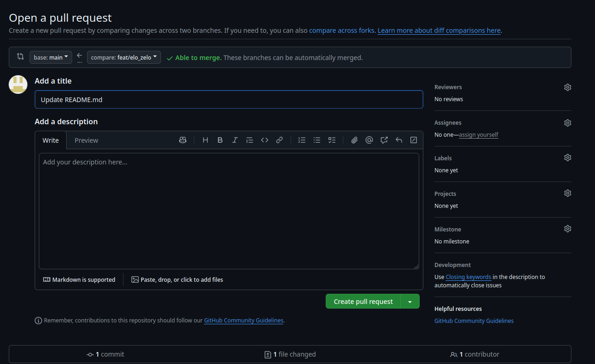

W tym wpisie zajmiemy się GitHubem. Zakładam, że umiesz już używać gita w lokalnym środowisku.
Teraz czas dodać do tego zdalne repo, będące centralną wersją projektu, łatwo dostępną dla każdej osoby z zespołu.

Jeżeli nie masz konta na GitHub, to załóż je [tutaj](https://github.com/signup).

### Uwierzytelnianie w git + ssh

Przy lokalnych projektach nie było to konieczne, ale jeżeli pracujesz ze zdalnym repozytorium musisz dać GitHubowi jakiś sposób na sprawdzenie twojej tożsamości
i uprawnień, które posiadasz w kontekście projektu, w którym używasz gita.

W tym celu dodaj swój nick oraz email w globalnej konfiguracji git:  
`git config --global user.name "twoj_nick"`  
`git config --global user.email "twoj@mail.com"`

GitHub wycofał się z uwierzytelniania za pomocą hasła, dlatego będziesz potrzebować Personal Access Token.
Możesz utworzyć go na stronie githuba (_settings -> developer settings -> personal access tokens -> tokens (classic)_).

Możesz również dodać do konta klucz SSH z waszej stacji roboczej i używać go w miejsce hasła. [Dodawanie klucza SSH do GitHuba](https://docs.github.com/en/authentication/connecting-to-github-with-ssh/adding-a-new-ssh-key-to-your-github-account).

### Tworzenie repozytorium na GitHub

Kiedy skonfigurowałeś już konto github, możesz stworzyć swoje pierwsze repozytorium na GitHubie.
Repozytoria mogą być publiczne i prywatne.

- Prywatne repozytoria może zobaczyć tylko twórca i uprawnione do tego osoby
- Publiczne repozytoria może zobaczyć każdy. Zależnie od licencji każdy może je również klonować, modyfikować i używać zawartego w nich kodu.

Tworząc repozytorium, możemy:

- sklonować repozytorium z GitHub do siebie:
  ```bash
    git clone https://github.com/username/repository-name.git
  ```
- podpiąć istniejące już lokalne repozytorium do repozytorium github _(używając np. git bash)_:
  ```bash
    git remote add origin https://github.com/username/repository-name.git
    git branch -M main
    git push -u origin main // 'popchnięcie' zmian do zdalnego repozytorium
  ```
- stworzyć nowe repozytorium i ustawić odpowiadające mu zdalne repozytorium z naszego githuba:
  ```bash
    git init
    git add {dowolny_plik} // zwyczajowo plik markdown o nazwie README.md
    git commit -m "chore: init repo" // pierwszy commit
    git branch -M main // opcjonalna zmiana nazwy głównej gałęzi na 'main'
    git remote add origin https://github.com/username/repository-name.git
    git push -u origin main
  ```

\*_jeżeli używasz SSH to linki będą wyglądać trochę inaczej, ale komendy funkcjonują w taki sam sposób_

GitHub przy tworzeniu nowego repo zawsze pokazuje powyższe opcje, także nie musisz pamiętać jak się to robi.

#### Słowniczek

- remote - zdalne repozytorium, w naszym przypadku bytujące na GitHub
- origin - zwyczajowa nazwa zdalnego repozytorium, do którego się odwołujemy z lokalnego terminala.
- README.md - pierwsze, co widzi osoba, która wejdzie na stronę repozytorium na GitHub. Powinno zawierać opis projektu oraz instrukcję instalacji, opcjonalnie zasady kontrybucji.
- fork - kopia repozytorium GitHub do innego repozytorium GitHub w celu np. rozwijania projektu zgodnie z inną wizją lub reanimowania projektu, który oryginalny twórca porzucił.
- pull - pobranie zmian ze zdalnego repozytorium do lokalnej kopii.
- push - wysłanie zmian z lokalnej kopii do zdalnego repozytorium.

### Zaciąganie modyfikacji do lokalnego repozytorium

#### git fetch

Jeżeli nie chcemy od razu scalać zmian z repo zdalnego do lokalnego, możemy użyć `git fetch`.  
`git fetch --all` pobiera wszystkie nowe gałęzie i zmiany ze zdalnego repozytorium.

#### git pull

`git pull` to połączenie `git fetch` z git merge`. Pobiera ono zmiany z aktualnej gałęzi.

### Pushowanie modyfikacji do repozytorium zdalnego

Załóżmy, że pracowaliśmy na lokalnej gałęzi i dodaliśmy tam pewne zmiany. Musimy je teraz wysłać do zdalnego repo.
Aby to zrobić, używamy `git push`. Jeżeli utworzyliśmy lokalną gałąź i pierwszy raz ją pushujemy - dodajemy flagę `--set-upstream`, aby połączyć ze sobą zdalną i lokalną wersję gałęzi.

```bash
git push --set-upstream origin nazwa_gałęzi
```

Zatem do naszego workflow dochodzi kolejny krok:
_git add -> git commit -> git push_

### Przykład pracy z GitHub

Pobieramy najnowszą wersję repo z pomocą `git pull`

```bash
git pull origin main
```

Zmieniamy gałąź, aby **nie** pracować na mainie.

```bash
git checkout -b feat/nazwa_funkcjonalnosci
```

Dodajemy potrzebne zmiany: `git add ... -> git commit ... -> git add ... -> git commit ...`
Dodanie zmian mogło zająć nam trochę czasu. W tym czasie stan zdalnego repo mógł się zmienić. Sprawdzamy to z pomocą `git fetch`:

```bash
git fetch origin main
```

Sprawdzamy, czy różni się on od lokalnej wersji main - tej, z której utworzyliśmy naszą gałąź do funkcjonalności:

```bash
git log main..origin/main --oneline
```

Jeżeli widzimy różnice to scalamy zdalny main z lokalnym main'em.

```bash
git checkout main
git merge origin/main
```

Wracamy na gałąź funkcjonalności i robimy rebase (potencjalnie mierząc się z konfliktami):

```bash
git checkout feat/nazwa_funkcjonalnosci
git rebase main
```

Pushujemy gałąź do zdalnego repo _(-u to alias dla --set-upstream)_.

```bash
git push -u origin feat/nazwa_funkcjonalnosci
```

Oczywiście, jeżeli gałęzią, z której przeskoczyliśmy na nową gałąź nie był main to workflow wygląda tak samo, nie licząc nazwy tej gałęzi.

### Tworzenie pull requestów

No dobrze, wysłaliśmy naszą gałąź do zdalnego repo, ale co dalej? Trzeba ją jakoś połączyć z main'em już zdalnie.

Na ogół nie scalamy jej od razu, tylko tworzymy PR (pull request).
Takie rozwiązanie pozwala na przedyskutowane zmiany i ogranicza liczbę bugów czy nieprzemyślanych rozwiązań dodanych do głównej gałęzi.

Kiedy wejdziemy w panel projektu na GitHub po wysłaniu zmian do zdalnego repo, wyświetli nam się opcja **compare & pull request**.
Po wejściu w nią zobaczymy pola na tytuł i opis requesta. Powinniśmy tu opisać, co dodajemy do projektu.  
Poniżej tych pól wyświetlą nam się do podglądu zmiany w kodzie.



Może zdarzyć się tak, że przy dodawaniu PR pojawią się konflikty. Możemy znów sfetchować repo do siebie i naprawić je lokalnie, po czym wysłać z powrotem na upstream,
ale do mniejszych PR w pełni wystarczający jest webowy edytor tekstowy GitHuba.


Kiedy już rozwiążemy konflikty, pojawi się nam opcja scalania gałęzi. Możemy tu wybrać metodę scalania (zwykłe, squash, rebase). Wystarczy zaznaczyć tę, która najbardziej
nam pasuje i już. Gotowe! Zmerge'owaliśmy nasze zmiany do main. Jeżeli jesteśmy pewni, że wszystko działa tak, jak powinno - a na tym etapie powinniśmy być - to możemy usunąć zbędną gałąź.

_Reminder: Nie zawsze mamy uprawnienia do samodzielnego dodawania zmian na main i merge'ować musi np. nasz tech-lead._

### I to już wszystko!

Mam nadzieję, że ten poradnik przedstawił Ci mniej więcej, jak pracować z git'em.  
Teraz możesz poukładać sobie tę wiedzę, pracując na prawdziwych repozytoriach.
Nie przejmuj się, jeśli na początku będziesz się mylić w pracy z gitem - każdy z nas popełniał błędy, gdy się uczył.

Dodatkowo: jeżeli nie przepadasz za terminalem to istnieją interfejsy graficzne dla GitHuba takie jak:

- [GitHub Desktop](https://desktop.github.com)
- [GitKraken](https://www.gitkraken.com/)
- [SourceTree](https://www.sourcetreeapp.com/)

Również VS Code i IDE od JetBrains posiadają obsługę gita.

### Further resources

GitHub ma własny krótki samouczek podstaw tego narzędzia: [Introduction to GitHub](https://github.com/skills/introduction-to-github).
